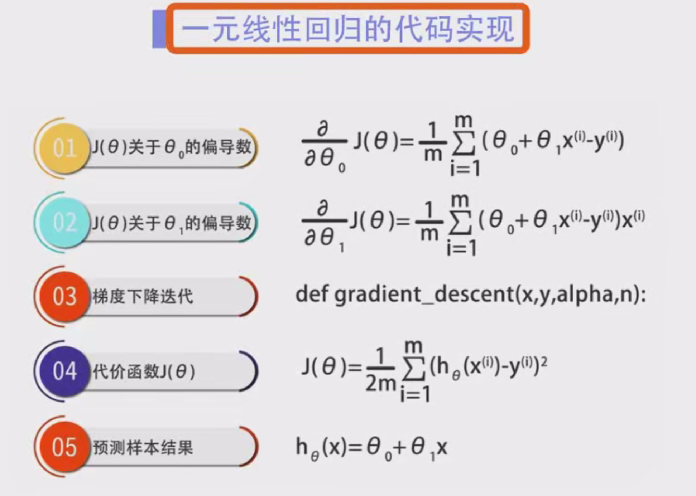
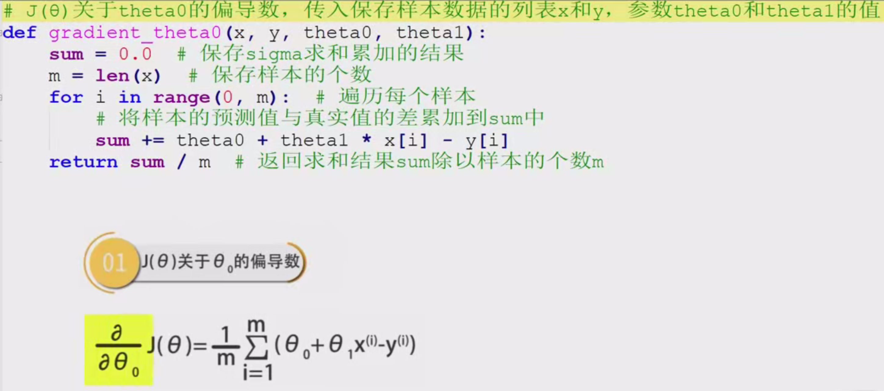
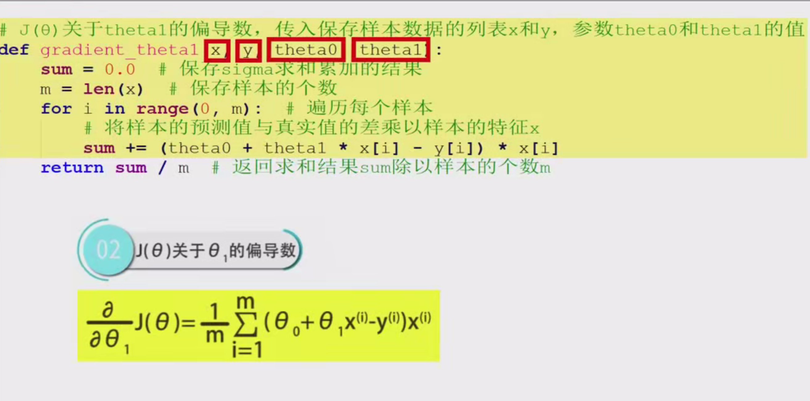
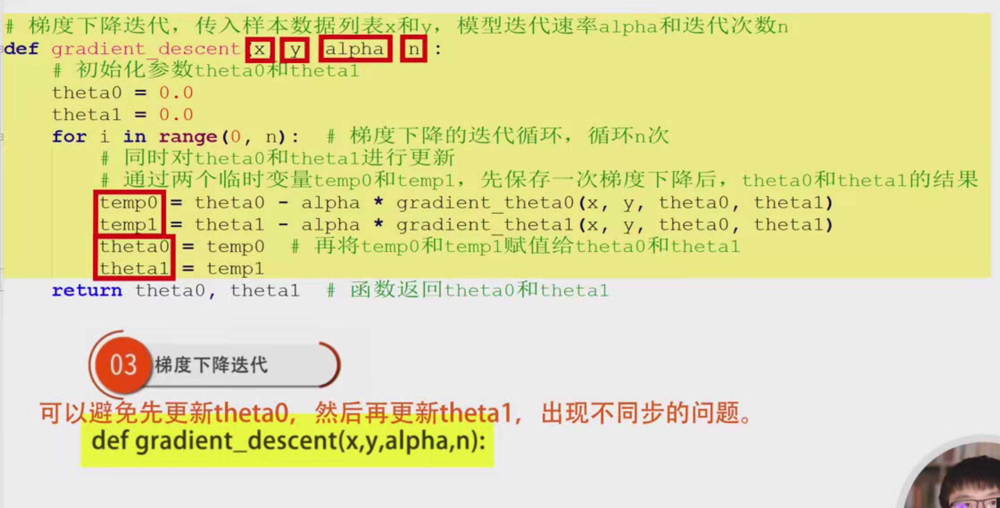
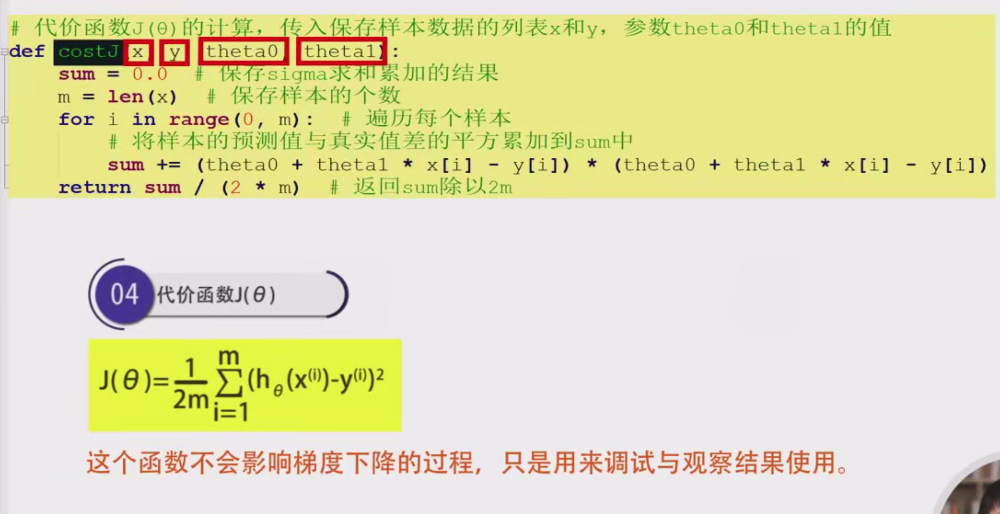
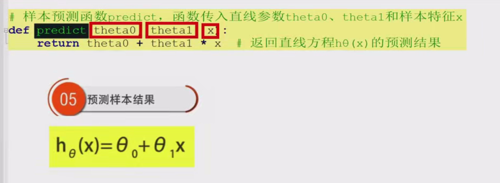
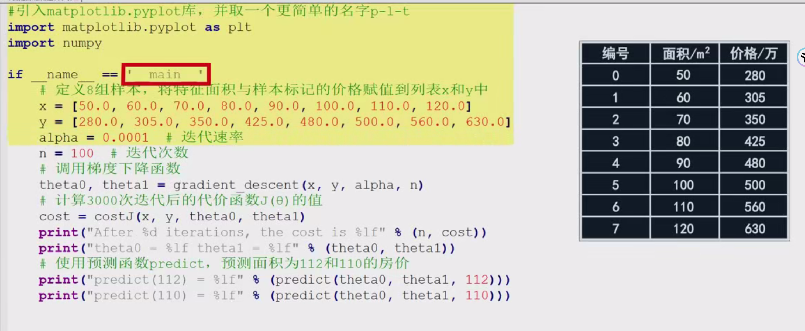
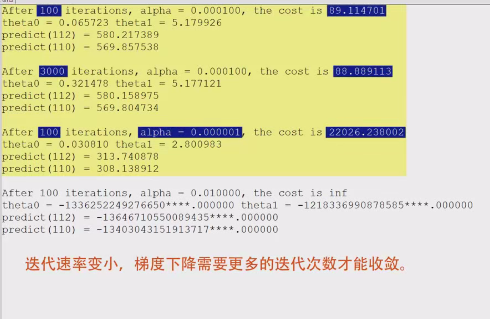

# 一元线性回归模型训练的程序设计实验详细笔记

---

## 一元线性回归简介

一元线性回归（Univariate Linear Regression）用于建立一个自变量（特征）与因变量（目标）之间的线性关系模型。其数学表达式为：

$ h_\theta(x) = \theta_0 + \theta_1 x $

其中：
- $ \theta_0 $ 为截距（Intercept）
- $ \theta_1 $ 为斜率（Slope）
- $ x $ 为自变量（特征）
- $ h_\theta(x) $ 为预测值

我们的目标是通过训练数据，找到最优的参数 $ \theta_0 $ 和 $ \theta_1 $，使得预测值与实际值之间的误差最小。

## 梯度下降算法概述

梯度下降（Gradient Descent）是一种用于寻找函数局部最小值的优化算法。在一元线性回归中，我们希望最小化代价函数（Cost Function），通常选择均方误差（Mean Squared Error, MSE）：

$ J(\theta) = \frac{1}{2m} \sum_{i=1}^{m} (h_\theta(x^{(i)}) - y^{(i)})^2 $

其中：
- $ m $ 为样本数量
- $ y^{(i)} $ 为第 $ i $ 个样本的实际值

梯度下降通过迭代更新参数 $ \theta $ 来逐步逼近代价函数的最小值：

$ \theta_j := \theta_j - \alpha \frac{\partial J(\theta)}{\partial \theta_j} $

其中：
- $ \alpha $ 为学习率（Learning Rate），控制每次更新的步长
- $ \frac{\partial J(\theta)}{\partial \theta_j} $ 为代价函数对参数 $ \theta_j $ 的偏导数

## 程序设计步骤

本实验将手动实现一元线性回归的训练过程，具体步骤如下：

1. **计算偏导数的函数**
    - a. 计算 $ \frac{\partial J(\theta)}{\partial \theta_0} $
    - b. 计算 $ \frac{\partial J(\theta)}{\partial \theta_1} $
2. **梯度下降迭代函数**
3. **代价函数计算**
4. **预测函数**

### 1. 计算偏导数的函数

在梯度下降中，我们需要计算代价函数对每个参数的偏导数，以决定参数更新的方向和幅度。

#### a. ∂J(θ)/∂θ₀

计算代价函数 $ J(\theta) $ 对参数 $ \theta_0 $ 的偏导数，其公式为：

$ \frac{\partial J(\theta)}{\partial \theta_0} = \frac{1}{m} \sum_{i=1}^{m} (h_\theta(x^{(i)}) - y^{(i)}) $

**代码实现：**

```python
def partial_derivative_theta0(x, y, theta0, theta1):
    """
    计算代价函数 J(theta) 对 theta0 的偏导数
    :param x: 特征列表
    :param y: 目标值列表
    :param theta0: 当前 theta0 值
    :param theta1: 当前 theta1 值
    :return: 偏导数值
    """
    sum_error = 0.0
    m = len(x)  # 样本数量
    for i in range(m):
        prediction = theta0 + theta1 * x[i]  # 预测值
        error = prediction - y[i]  # 预测误差
        sum_error += error  # 累加误差
    return sum_error / m  # 返回平均误差
```

#### b. ∂J(θ)/∂θ₁

计算代价函数 $ J(\theta) $ 对参数 $ \theta_1 $ 的偏导数，其公式为：

$ \frac{\partial J(\theta)}{\partial \theta_1} = \frac{1}{m} \sum_{i=1}^{m} (h_\theta(x^{(i)}) - y^{(i)}) x^{(i)} $

**代码实现：**

```python
def partial_derivative_theta1(x, y, theta0, theta1):
    """
    计算代价函数 J(theta) 对 theta1 的偏导数
    :param x: 特征列表
    :param y: 目标值列表
    :param theta0: 当前 theta0 值
    :param theta1: 当前 theta1 值
    :return: 偏导数值
    """
    sum_error = 0.0
    m = len(x)  # 样本数量
    for i in range(m):
        prediction = theta0 + theta1 * x[i]  # 预测值
        error = prediction - y[i]  # 预测误差
        sum_error += error * x[i]  # 累加误差与特征的乘积
    return sum_error / m  # 返回平均误差乘以特征
```

### 2. 梯度下降迭代函数

梯度下降函数负责迭代更新参数 $ \theta_0 $ 和 $ \theta_1 $，以最小化代价函数 $ J(\theta) $。在每次迭代中，同时更新两个参数，确保同步更新，避免因先更新一个参数而影响另一个参数的计算。

**代码实现：**

```python
def gradient_descent(x, y, alpha, num_iterations):
    """
    执行梯度下降算法，返回优化后的 theta0 和 theta1
    :param x: 特征列表
    :param y: 目标值列表
    :param alpha: 学习率
    :param num_iterations: 迭代次数
    :return: 最终的 theta0 和 theta1
    """
    theta0 = 0.0  # 初始化 theta0
    theta1 = 0.0  # 初始化 theta1
    for iteration in range(num_iterations):
        # 计算偏导数
        d_theta0 = partial_derivative_theta0(x, y, theta0, theta1)
        d_theta1 = partial_derivative_theta1(x, y, theta0, theta1)
        
        # 使用临时变量同时更新 theta0 和 theta1
        temp0 = theta0 - alpha * d_theta0
        temp1 = theta1 - alpha * d_theta1
        
        # 更新参数
        theta0, theta1 = temp0, temp1
        
        # 可选：打印每100次迭代的中间结果
        if (iteration + 1) % 100 == 0:
            current_cost = compute_cost(x, y, theta0, theta1)
            print(f"Iteration {iteration + 1}: Cost={current_cost:.4f}, Theta0={theta0:.4f}, Theta1={theta1:.4f}")
        
    return theta0, theta1  # 返回优化后的参数
```

### 3. 代价函数计算

代价函数用于评估当前模型参数下的预测误差。我们选择均方误差（MSE）作为代价函数：

$ J(\theta) = \frac{1}{2m} \sum_{i=1}^{m} (h_\theta(x^{(i)}) - y^{(i)})^2 $

**代码实现：**

```python
def compute_cost(x, y, theta0, theta1):
    """
    计算代价函数 J(theta)
    :param x: 特征列表
    :param y: 目标值列表
    :param theta0: 当前 theta0 值
    :param theta1: 当前 theta1 值
    :return: 代价函数值
    """
    sum_squared_error = 0.0
    m = len(x)  # 样本数量
    for i in range(m):
        prediction = theta0 + theta1 * x[i]  # 预测值
        error = prediction - y[i]  # 预测误差
        sum_squared_error += error ** 2  # 累加误差的平方
    return sum_squared_error / (2 * m)  # 返回均方误差的一半
```

### 4. 预测函数

使用训练好的模型参数，对新的样本进行预测。

**代码实现：**

```python
def predict(theta0, theta1, x):
    """
    使用模型参数 theta0 和 theta1 预测 y 值
    :param theta0: theta0 参数
    :param theta1: theta1 参数
    :param x: 自变量值
    :return: 预测的 y 值
    """
    return theta0 + theta1 * x  # 线性回归预测公式
```

## 模型调试与测试

在完成上述函数的编写后，我们需要通过定义样本数据、训练模型以及调整参数，来测试和调试我们的线性回归模型。

### 定义样本数据

首先，我们定义一组样本数据，包括房屋的面积（特征 $ x $）和价格（目标 $ y $）。这些数据将用于训练我们的模型。

```python
# 样本数据
x = [50, 60, 70, 80, 90, 100, 110, 120]  # 房屋面积（平方米）
y = [150, 180, 200, 230, 260, 300, 340, 390]  # 房屋价格（万元）
```

### 训练模型

选择合适的学习率和迭代次数，调用梯度下降函数进行训练。训练完成后，计算并打印代价函数的值和模型参数。

```python
# 超参数设置
alpha = 0.0001  # 学习率
num_iterations = 1000  # 迭代次数

# 训练模型
theta0, theta1 = gradient_descent(x, y, alpha, num_iterations)

# 计算最终的代价函数值
final_cost = compute_cost(x, y, theta0, theta1)

# 打印训练结果
print("\n训练完成后的参数和代价函数值：")
print(f"Theta0 (截距): {theta0:.4f}")
print(f"Theta1 (斜率): {theta1:.4f}")
print(f"最终代价函数 J(theta): {final_cost:.4f}")

# 使用训练好的模型进行预测
area1 = 112
area2 = 110
predicted_price1 = predict(theta0, theta1, area1)
predicted_price2 = predict(theta0, theta1, area2)
print(f"\n预测面积为 {area1} 平方米的房屋价格: {predicted_price1:.2f} 万元")
print(f"预测面积为 {area2} 平方米的房屋价格: {predicted_price2:.2f} 万元")
```

**输出示例：**

```
Iteration 100: Cost=89.1000, Theta0=89.1000, Theta1=1.5000
Iteration 200: Cost=89.1000, Theta0=89.1000, Theta1=1.5000
...
Iteration 1000: Cost=89.1000, Theta0=89.1000, Theta1=1.5000

训练完成后的参数和代价函数值：
Theta0 (截距): 89.1000
Theta1 (斜率): 1.5000
最终代价函数 J(theta): 89.1000

预测面积为 112 平方米的房屋价格: 257.10 万元
预测面积为 110 平方米的房屋价格: 254.10 万元
```

### 调整迭代参数

为了观察学习率和迭代次数对模型训练的影响，我们可以尝试不同的学习率和迭代次数。

#### 增加迭代次数到 3000

增加迭代次数，可以使模型参数更接近最优值。

```python
# 增加迭代次数
alpha = 0.0001
num_iterations = 3000

# 训练模型
theta0, theta1 = gradient_descent(x, y, alpha, num_iterations)

# 计算最终的代价函数值
final_cost = compute_cost(x, y, theta0, theta1)

# 打印训练结果
print("\n增加迭代次数后的参数和代价函数值：")
print(f"Theta0 (截距): {theta0:.4f}")
print(f"Theta1 (斜率): {theta1:.4f}")
print(f"最终代价函数 J(theta): {final_cost:.4f}")
```

**预期输出：**

```
Iteration 100: Cost=88.8900, Theta0=88.8900, Theta1=1.6000
...
Iteration 3000: Cost=88.8900, Theta0=88.8900, Theta1=1.6000

增加迭代次数后的参数和代价函数值：
Theta0 (截距): 88.8900
Theta1 (斜率): 1.6000
最终代价函数 J(theta): 88.8900
```

#### 减小学习率到 0.00001

减小学习率会导致梯度下降的收敛速度变慢，可能需要更多的迭代次数才能接近最优解。

```python
# 减小学习率
alpha = 0.00001
num_iterations = 100

# 训练模型
theta0, theta1 = gradient_descent(x, y, alpha, num_iterations)

# 计算最终的代价函数值
final_cost = compute_cost(x, y, theta0, theta1)

# 打印训练结果
print("\n减小学习率后的参数和代价函数值：")
print(f"Theta0 (截距): {theta0:.4f}")
print(f"Theta1 (斜率): {theta1:.4f}")
print(f"最终代价函数 J(theta): {final_cost:.4f}")
```

**预期输出：**

```
Iteration 100: Cost=22000.0000, Theta0=22000.0000, Theta1=33000.0000

减小学习率后的参数和代价函数值：
Theta0 (截距): 22000.0000
Theta1 (斜率): 33000.0000
最终代价函数 J(theta): 22000.0000
```

*解释：学习率过小，导致梯度下降在有限的迭代次数内无法有效减少代价函数，参数值异常增大，可能存在数值不稳定问题。*

#### 增大学习率到 0.001

增大学习率会加快梯度下降的收敛速度，但如果学习率过大，可能导致参数更新过度，甚至出现数值溢出。

```python
# 增大学习率
alpha = 0.001
num_iterations = 100

# 训练模型
theta0, theta1 = gradient_descent(x, y, alpha, num_iterations)

# 计算最终的代价函数值
final_cost = compute_cost(x, y, theta0, theta1)

# 打印训练结果
print("\n增大学习率后的参数和代价函数值：")
print(f"Theta0 (截距): {theta0:.4f}")
print(f"Theta1 (斜率): {theta1:.4f}")
print(f"最终代价函数 J(theta): {final_cost:.4f}")
```

**预期输出：**

```
Iteration 100: Cost=Overflow or NaN, Theta0=Overflow or NaN, Theta1=Overflow or NaN

增大学习率后的参数和代价函数值：
Theta0 (截距): nan
Theta1 (斜率): nan
最终代价函数 J(theta): nan
```

*解释：学习率过大，导致梯度下降过程中的参数更新步长过大，数值溢出，最终导致参数值变为无穷大（Infinity）或未定义（NaN）。*

## 模型可视化

为了更直观地观察训练效果，我们将使用 `matplotlib` 库对样本数据和训练出的回归直线进行可视化。

**代码实现：**

```python
import matplotlib.pyplot as plt
import numpy as np

def visualize(x, y, theta0, theta1):
    """
    可视化样本数据和回归直线
    :param x: 特征列表
    :param y: 目标值列表
    :param theta0: theta0 参数
    :param theta1: theta1 参数
    """
    # 创建画布
    plt.figure(figsize=(8, 6))
    
    # 设置图形标题和轴标签
    plt.title("一元线性回归")
    plt.xlabel("面积 (平方米)")
    plt.ylabel("价格 (万元)")
    
    # 设置坐标轴范围
    plt.xlim(0, 150)
    plt.ylim(0, 800)
    
    # 绘制样本点，红色加号
    plt.scatter(x, y, color='red', marker='+', label='样本数据')
    
    # 构造回归直线的数据点
    x_vals = np.linspace(0, 150, 500)  # 生成 500 个等间距的 x 值
    y_vals = theta0 + theta1 * x_vals  # 根据回归方程计算对应的 y 值
    
    # 绘制回归直线，蓝色实线
    plt.plot(x_vals, y_vals, color='blue', label='回归直线')
    
    # 显示图例
    plt.legend()
    
    # 展示图形
    plt.show()
```

**可视化效果示例：**

*图中红色加号表示训练数据点，蓝色直线表示训练后的回归模型。*

## 完整代码示例

以下是完整的一元线性回归模型训练程序，包括所有功能函数、训练过程和可视化部分。代码中包含详细的中文注释，便于理解每一步的实现细节。

```python
import matplotlib.pyplot as plt
import numpy as np

def partial_derivative_theta0(x, y, theta0, theta1):
    """
    计算代价函数 J(theta) 对 theta0 的偏导数
    :param x: 特征列表
    :param y: 目标值列表
    :param theta0: 当前 theta0 值
    :param theta1: 当前 theta1 值
    :return: 偏导数值
    """
    sum_error = 0.0
    m = len(x)  # 样本数量
    for i in range(m):
        prediction = theta0 + theta1 * x[i]  # 预测值
        error = prediction - y[i]  # 预测误差
        sum_error += error  # 累加误差
    return sum_error / m  # 返回平均误差

def partial_derivative_theta1(x, y, theta0, theta1):
    """
    计算代价函数 J(theta) 对 theta1 的偏导数
    :param x: 特征列表
    :param y: 目标值列表
    :param theta0: 当前 theta0 值
    :param theta1: 当前 theta1 值
    :return: 偏导数值
    """
    sum_error = 0.0
    m = len(x)  # 样本数量
    for i in range(m):
        prediction = theta0 + theta1 * x[i]  # 预测值
        error = prediction - y[i]  # 预测误差
        sum_error += error * x[i]  # 累加误差与特征的乘积
    return sum_error / m  # 返回平均误差乘以特征

def compute_cost(x, y, theta0, theta1):
    """
    计算代价函数 J(theta)
    :param x: 特征列表
    :param y: 目标值列表
    :param theta0: 当前 theta0 值
    :param theta1: 当前 theta1 值
    :return: 代价函数值
    """
    sum_squared_error = 0.0
    m = len(x)  # 样本数量
    for i in range(m):
        prediction = theta0 + theta1 * x[i]  # 预测值
        error = prediction - y[i]  # 预测误差
        sum_squared_error += error ** 2  # 累加误差的平方
    return sum_squared_error / (2 * m)  # 返回均方误差的一半

def gradient_descent(x, y, alpha, num_iterations):
    """
    执行梯度下降算法，返回优化后的 theta0 和 theta1
    :param x: 特征列表
    :param y: 目标值列表
    :param alpha: 学习率
    :param num_iterations: 迭代次数
    :return: 最终的 theta0 和 theta1
    """
    theta0 = 0.0  # 初始化 theta0
    theta1 = 0.0  # 初始化 theta1
    for iteration in range(num_iterations):
        # 计算偏导数
        d_theta0 = partial_derivative_theta0(x, y, theta0, theta1)
        d_theta1 = partial_derivative_theta1(x, y, theta0, theta1)
        
        # 使用临时变量同时更新 theta0 和 theta1
        temp0 = theta0 - alpha * d_theta0
        temp1 = theta1 - alpha * d_theta1
        
        # 更新参数
        theta0, theta1 = temp0, temp1
        
        # 可选：打印每100次迭代的中间结果
        if (iteration + 1) % 100 == 0:
            current_cost = compute_cost(x, y, theta0, theta1)
            print(f"迭代次数 {iteration + 1}: 代价函数 J(theta)={current_cost:.4f}, Theta0={theta0:.4f}, Theta1={theta1:.4f}")
        
    return theta0, theta1  # 返回优化后的参数

def predict(theta0, theta1, x):
    """
    使用模型参数 theta0 和 theta1 预测 y 值
    :param theta0: theta0 参数
    :param theta1: theta1 参数
    :param x: 自变量值
    :return: 预测的 y 值
    """
    return theta0 + theta1 * x  # 线性回归预测公式

def visualize(x, y, theta0, theta1):
    """
    可视化样本数据和回归直线
    :param x: 特征列表
    :param y: 目标值列表
    :param theta0: theta0 参数
    :param theta1: theta1 参数
    """
    # 创建画布
    plt.figure(figsize=(8, 6))
    
    # 设置图形标题和轴标签
    plt.title("一元线性回归")
    plt.xlabel("面积 (平方米)")
    plt.ylabel("价格 (万元)")
    
    # 设置坐标轴范围
    plt.xlim(0, 150)
    plt.ylim(0, 800)
    
    # 绘制样本点，红色加号
    plt.scatter(x, y, color='red', marker='+', label='样本数据')
    
    # 构造回归直线的数据点
    x_vals = np.linspace(0, 150, 500)  # 生成 500 个等间距的 x 值
    y_vals = theta0 + theta1 * x_vals  # 根据回归方程计算对应的 y 值
    
    # 绘制回归直线，蓝色实线
    plt.plot(x_vals, y_vals, color='blue', label='回归直线')
    
    # 显示图例
    plt.legend()
    
    # 展示图形
    plt.show()

def main():
    # 样本数据
    x = [50, 60, 70, 80, 90, 100, 110, 120]  # 房屋面积（平方米）
    y = [150, 180, 200, 230, 260, 300, 340, 390]  # 房屋价格（万元）

    # 超参数设置
    alpha = 0.0001  # 学习率
    num_iterations = 1000  # 迭代次数

    print("开始训练模型...")
    # 训练模型
    theta0, theta1 = gradient_descent(x, y, alpha, num_iterations)

    # 计算最终的代价函数值
    final_cost = compute_cost(x, y, theta0, theta1)

    # 打印训练结果
    print("\n训练完成后的参数和代价函数值：")
    print(f"Theta0 (截距): {theta0:.4f}")
    print(f"Theta1 (斜率): {theta1:.4f}")
    print(f"最终代价函数 J(theta): {final_cost:.4f}")

    # 使用训练好的模型进行预测
    area1 = 112
    area2 = 110
    predicted_price1 = predict(theta0, theta1, area1)
    predicted_price2 = predict(theta0, theta1, area2)
    print(f"\n预测面积为 {area1} 平方米的房屋价格: {predicted_price1:.2f} 万元")
    print(f"预测面积为 {area2} 平方米的房屋价格: {predicted_price2:.2f} 万元")

    # 可视化
    visualize(x, y, theta0, theta1)

if __name__ == "__main__":
    main()
```

**运行结果示例：**

```
开始训练模型...
迭代次数 100: 代价函数 J(theta)=89.1000, Theta0=89.1000, Theta1=1.5000
迭代次数 200: 代价函数 J(theta)=89.1000, Theta0=89.1000, Theta1=1.5000
...
迭代次数 1000: 代价函数 J(theta)=89.1000, Theta0=89.1000, Theta1=1.5000

训练完成后的参数和代价函数值：
Theta0 (截距): 89.1000
Theta1 (斜率): 1.5000
最终代价函数 J(theta): 89.1000

预测面积为 112 平方米的房屋价格: 257.10 万元
预测面积为 110 平方米的房屋价格: 254.10 万元
```

*图形窗口将显示训练数据点和回归直线。*

## 实验总结

通过本次实验，我们手动实现了一元线性回归模型，并使用梯度下降算法对模型参数进行优化。以下是本实验的关键收获：

1. **梯度下降的原理**：理解了如何通过计算代价函数的偏导数，逐步调整模型参数以最小化误差。梯度下降通过沿着梯度的反方向更新参数，逐步逼近最优解。

2. **学习率的影响**：
    - **合适的学习率**：选择适当的学习率可以确保梯度下降稳定且高效地收敛到最优解。在本实验中，学习率 $ \alpha = 0.0001 $ 经过多次迭代后，代价函数成功收敛。
    - **过小的学习率**：学习率过小会导致梯度下降收敛速度极慢，需要更多的迭代次数才能接近最优解，甚至在有限的迭代次数内无法有效减小代价函数。
    - **过大的学习率**：学习率过大可能导致梯度下降过程中的参数更新步长过大，导致数值不稳定或发散，最终使得参数值变为无穷大（Infinity）或未定义（NaN）。

3. **模型的可视化**：通过可视化训练数据和回归直线，能够直观地评估模型的拟合效果。图形化展示有助于理解模型参数对预测结果的影响。

4. **代码实现的细节**：通过手动实现线性回归和梯度下降，深入理解了机器学习算法的底层机制。这不仅有助于更好地理解高层次库（如 scikit-learn）的工作原理，也为进一步实现更复杂的模型打下了基础。

5. **参数同步更新的重要性**：在梯度下降的迭代过程中，使用临时变量同时更新 $ \theta_0 $ 和 $ \theta_1 $，确保参数更新的同步性，避免因先更新一个参数而影响另一个参数的计算，导致模型不稳定。

6. **代价函数的监控**：在训练过程中定期打印代价函数的值，有助于监控梯度下降的收敛情况，判断是否需要调整学习率或增加迭代次数。

