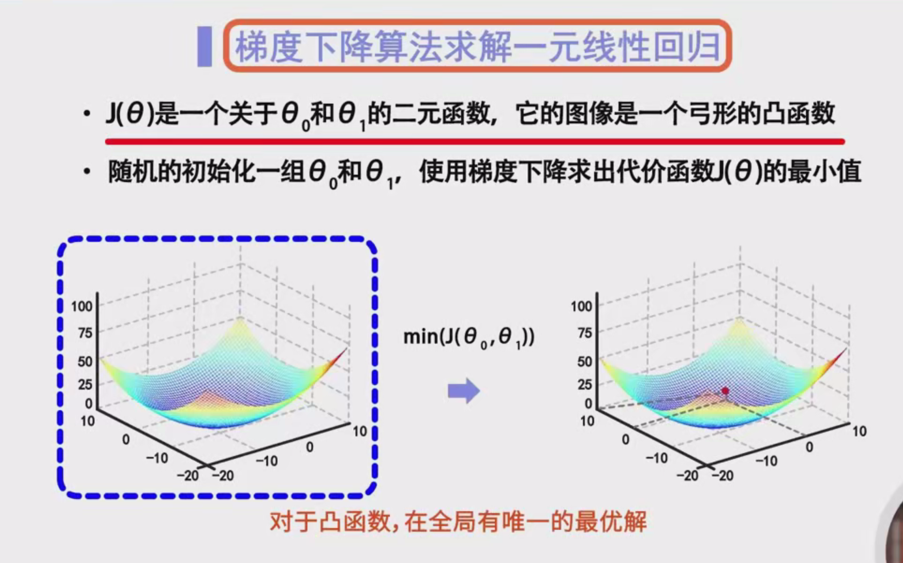

# 一元线性回归求解

## 一、什么是一元线性回归？

### 定义

**一元线性回归**是一种统计方法，用于建立自变量（特征）与因变量（目标变量）之间的线性关系模型。其目的是找到一条直线，使得这条直线能够最好地拟合给定的数据点。

### 直线方程

一元线性回归的直线方程表示为：

$
h_\theta(x) = \theta_0 + \theta_1 x
$

- $ h_\theta(x) $：预测值，即模型对输入 $ x $ 的预测结果。
- $ \theta_0 $：截距（y轴上的偏移量），表示当 $ x = 0 $ 时，预测值的大小。
- $ \theta_1 $：斜率，表示自变量 $ x $ 变化一个单位时，因变量 $ y $ 的变化量。

### 代价函数

为了衡量模型的好坏，我们引入**代价函数** $ J(\theta) $，通常使用**均方误差（Mean Squared Error, MSE）**作为代价函数：

$
J(\theta) = \frac{1}{2m} \sum_{i=1}^{m} (h_\theta(x^{(i)}) - y^{(i)})^2
$

- $ m $：样本数量。
- $ x^{(i)} $：第 $ i $ 个样本的特征值。
- $ y^{(i)} $：第 $ i $ 个样本的真实值。

我们的目标是找到参数 $ \theta_0 $ 和 $ \theta_1 $，使得代价函数 $ J(\theta) $ 达到最小值。

## 二、使用纯数学方法求解一元线性回归

### 示例问题

设平面上有三个样本数据点：

- 样本1：$ x_1 = 1 $, $ y_1 = 1 $
- 样本2：$ x_2 = 2 $, $ y_2 = 2 $
- 样本3：$ x_3 = 3 $, $ y_3 = 3 $

基于这三个样本，求出当代价函数 $ J(\theta) $ 达到最小值时，$ \theta_0 $ 和 $ \theta_1 $ 的具体取值。

### 步骤详解

#### 步骤1：表示预测值

首先，我们根据直线方程 $ h_\theta(x) = \theta_0 + \theta_1 x $ 表示每个样本的预测值。

对于三个样本，预测值分别为：

$
\begin{cases}
h_1 = \theta_0 + \theta_1 \cdot x_1 = \theta_0 + \theta_1 \cdot 1 \\
h_2 = \theta_0 + \theta_1 \cdot x_2 = \theta_0 + \theta_1 \cdot 2 \\
h_3 = \theta_0 + \theta_1 \cdot x_3 = \theta_0 + \theta_1 \cdot 3 \\
\end{cases}
$

#### 步骤2：代入代价函数

将预测值 $ h_1, h_2, h_3 $ 和真实值 $ y_1, y_2, y_3 $ 代入代价函数 $ J(\theta) $ 中：

$
J(\theta) = \frac{1}{2m} \left[(h_1 - y_1)^2 + (h_2 - y_2)^2 + (h_3 - y_3)^2\right]
$

由于 $ m = 3 $，代价函数具体为：

$
J(\theta) = \frac{1}{6} \left[(\theta_0 + \theta_1 \cdot 1 - 1)^2 + (\theta_0 + \theta_1 \cdot 2 - 2)^2 + (\theta_0 + \theta_1 \cdot 3 - 3)^2\right]
$

#### 步骤3：展开代价函数

展开上述表达式，可以得到关于 $ \theta_0 $ 和 $ \theta_1 $ 的二元二次函数。这一步骤涉及对每个平方项进行展开和简化。

$
J(\theta) = \frac{1}{6} \left[(\theta_0 + \theta_1 - 1)^2 + (\theta_0 + 2\theta_1 - 2)^2 + (\theta_0 + 3\theta_1 - 3)^2\right]
$

#### 步骤4：求极值点

为了找到 $ J(\theta) $ 的最小值，我们需要对 $ J(\theta) $ 关于 $ \theta_0 $ 和 $ \theta_1 $ 求偏导数，并令其等于零。

##### 1. 对 $ \theta_0 $ 求偏导

$
\frac{\partial J(\theta)}{\partial \theta_0} = \frac{1}{6} \cdot 2 \left[(\theta_0 + \theta_1 - 1) + (\theta_0 + 2\theta_1 - 2) + (\theta_0 + 3\theta_1 - 3)\right] = 0
$

化简：

$
\frac{1}{3} \left[3\theta_0 + 6\theta_1 - 6\right] = 0 \\
\Rightarrow 3\theta_0 + 6\theta_1 = 6 \\
\Rightarrow \theta_0 + 2\theta_1 = 2 \quad \text{（方程1）}
$

##### 2. 对 $ \theta_1 $ 求偏导

$
\frac{\partial J(\theta)}{\partial \theta_1} = \frac{1}{6} \cdot 2 \left[1(\theta_0 + \theta_1 - 1) + 2(\theta_0 + 2\theta_1 - 2) + 3(\theta_0 + 3\theta_1 - 3)\right] = 0
$

化简：

$
\frac{1}{3} \left[6\theta_0 + 14\theta_1 - 14\right] = 0 \\
\Rightarrow 6\theta_0 + 14\theta_1 = 14 \\
\Rightarrow 3\theta_0 + 7\theta_1 = 7 \quad \text{（方程2）}
$

##### 3. 联立方程求解

通过解方程1和方程2，可以得到：

$
\begin{cases}
\theta_0 + 2\theta_1 = 2 \quad \text{（方程1）} \\
3\theta_0 + 7\theta_1 = 7 \quad \text{（方程2）}
\end{cases}
$

**解法：**

- 由方程1，得到 $ \theta_0 = 2 - 2\theta_1 $。
- 将 $ \theta_0 = 2 - 2\theta_1 $ 代入方程2：

$
3(2 - 2\theta_1) + 7\theta_1 = 7 \\
6 - 6\theta_1 + 7\theta_1 = 7 \\
\theta_1 = 1
$

- 再代入 $ \theta_0 = 2 - 2\theta_1 = 2 - 2 = 0 $。

因此，解得：

$
\theta_0 = 0, \quad \theta_1 = 1
$

##### 4. 验证二阶偏导数

为了确认这是一个最小值点，我们需要计算代价函数的二阶偏导数，即 Hessian 矩阵，并判断其正定性。

- **二阶偏导数计算**：

$
\frac{\partial^2 J(\theta)}{\partial \theta_0^2} = \frac{1}{3} \cdot 3 = 1 \\
\frac{\partial^2 J(\theta)}{\partial \theta_1^2} = \frac{1}{3} \cdot 14 = \frac{14}{3} \\
\frac{\partial^2 J(\theta)}{\partial \theta_0 \partial \theta_1} = \frac{\partial^2 J(\theta)}{\partial \theta_1 \partial \theta_0} = \frac{1}{3} \cdot 6 = 2
$

- **Hessian 矩阵**：

$
H = \begin{bmatrix}
\frac{\partial^2 J(\theta)}{\partial \theta_0^2} & \frac{\partial^2 J(\theta)}{\partial \theta_0 \partial \theta_1} \\
\frac{\partial^2 J(\theta)}{\partial \theta_1 \partial \theta_0} & \frac{\partial^2 J(\theta)}{\partial \theta_1^2}
\end{bmatrix}
= \begin{bmatrix}
1 & 2 \\
2 & \frac{14}{3}
\end{bmatrix}
$

- **行列式**：

$
\text{det}(H) = \left(1 \times \frac{14}{3}\right) - (2 \times 2) = \frac{14}{3} - 4 = \frac{14 - 12}{3} = \frac{2}{3} > 0
$

- **主对角线元素**：

$
\frac{\partial^2 J(\theta)}{\partial \theta_0^2} = 1 > 0
$

因为 Hessian 矩阵的行列式大于零，且主对角线元素也大于零，说明 Hessian 矩阵是正定的。因此，该点 $ (\theta_0, \theta_1) = (0, 1) $ 是代价函数的极小值点。

#### 步骤5：结论

通过纯数学方法，我们得出了当代价函数 $ J(\theta) $ 取得最小值时，参数的取值为：

$
\theta_0 = 0, \quad \theta_1 = 1
$

即拟合直线方程为：

$
h_\theta(x) = 0 + 1 \cdot x = x
$

这意味着，对于给定的三个样本数据，最优的直线是 $ y = x $，完美拟合了所有数据点。

### 补充说明

- **为什么代价函数选择均方误差（MSE）？**

均方误差能够有效衡量预测值与真实值之间的差异，且其导数易于计算，适合用于优化算法中。

- **为什么需要计算二阶偏导数？**

通过计算二阶偏导数（Hessian 矩阵），我们可以判断极值点是极小值、极大值还是鞍点。在本例中，Hessian 矩阵为正定矩阵，说明该极值点是一个全局最小值。

## 三、使用梯度下降算法求解一元线性回归

### 梯度下降简介

**梯度下降（Gradient Descent）**是一种迭代优化算法，用于在多维空间中寻找函数的最小值。在一元线性回归中，我们使用梯度下降来最小化代价函数 $ J(\theta) $，从而找到最佳的参数 $ \theta_0 $ 和 $ \theta_1 $。

### 为什么选择梯度下降？

- **适用于大规模数据集**：当样本数量很大时，纯数学方法（解析法）可能计算量过大，而梯度下降在这种情况下更为高效。
- **适用于多元线性回归**：当特征数量增加时，解析法的复杂度急剧上升，而梯度下降仍能高效运作。
- **灵活性**：梯度下降可以扩展到更复杂的模型和非线性函数。

### 梯度下降的基本思想

梯度下降通过以下步骤逐步逼近函数的最小值：

1. **初始化参数**：随机选择初始的 $ \theta_0 $ 和 $ \theta_1 $。
2. **计算梯度**：计算代价函数 $ J(\theta) $ 关于 $ \theta_0 $ 和 $ \theta_1 $ 的偏导数，形成梯度向量。
3. **更新参数**：沿着梯度的反方向调整参数，以减少代价函数的值。
4. **迭代**：重复步骤2和3，直到代价函数收敛到最小值或达到预定的迭代次数。

### 梯度下降算法流程

以下是梯度下降算法的具体步骤：

#### 步骤1：初始化

选择一个初始的参数值 $ \theta_0 $ 和 $ \theta_1 $，通常可以随机选择。还需要设定一个学习率 $ \alpha $，它决定了每次迭代中参数更新的步长。学习率的选择非常重要：

- **学习率过大**：可能导致算法不稳定，甚至无法收敛。
- **学习率过小**：会使得收敛速度过慢，增加计算时间。

例如，我们可以选择 $ \theta_0 = 0.5 $、$ \theta_1 = 0.5 $ 和学习率 $ \alpha = 0.1 $。

#### 步骤2：计算梯度

计算代价函数 $ J(\theta) $ 关于每个参数的偏导数，得到梯度向量。

具体计算如下：

$
\frac{\partial J(\theta)}{\partial \theta_0} = \frac{1}{m} \sum_{i=1}^{m} (h_\theta(x^{(i)}) - y^{(i)})
$

$
\frac{\partial J(\theta)}{\partial \theta_1} = \frac{1}{m} \sum_{i=1}^{m} (h_\theta(x^{(i)}) - y^{(i)}) \cdot x^{(i)}
$

- **解释**：
  - $ \frac{\partial J(\theta)}{\partial \theta_0} $ 表示代价函数对 $ \theta_0 $ 的变化率。
  - $ \frac{\partial J(\theta)}{\partial \theta_1} $ 表示代价函数对 $ \theta_1 $ 的变化率。

#### 步骤3：更新参数

根据梯度向量和学习率，更新参数：

$
\theta_0 := \theta_0 - \alpha \cdot \frac{\partial J(\theta)}{\partial \theta_0}
$

$
\theta_1 := \theta_1 - \alpha \cdot \frac{\partial J(\theta)}{\partial \theta_1}
$

- **解释**：
  - 参数朝着梯度的反方向更新，因为梯度指向函数上升最快的方向，而我们希望找到函数的最小值。

#### 步骤4：重复迭代

重复步骤2和步骤3，直到满足停止条件。停止条件可以是：

- 代价函数的变化量低于某个阈值（如 $ 10^{-6} $）。
- 达到预定的最大迭代次数。

### 具体实现步骤

让我们通过具体的示例，详细描述梯度下降的计算过程。

#### 示例数据

- 样本1：$ x_1 = 1 $, $ y_1 = 1 $
- 样本2：$ x_2 = 2 $, $ y_2 = 2 $
- 样本3：$ x_3 = 3 $, $ y_3 = 3 $

#### 初始参数

假设初始值为 $ \theta_0 = 0.5 $、$ \theta_1 = 0.5 $，学习率 $ \alpha = 0.1 $。

#### 第一次迭代

1. **计算预测值**：

$
\begin{cases}
h_1 = 0.5 + 0.5 \times 1 = 1.0 \\
h_2 = 0.5 + 0.5 \times 2 = 1.5 \\
h_3 = 0.5 + 0.5 \times 3 = 2.0 \\
\end{cases}
$

2. **计算偏导数**：

$
\frac{\partial J(\theta)}{\partial \theta_0} = \frac{1}{3} \left[(1.0 - 1) + (1.5 - 2) + (2.0 - 3)\right] = \frac{1}{3} \left[0 - 0.5 - 1\right] = -0.5
$

$
\frac{\partial J(\theta)}{\partial \theta_1} = \frac{1}{3} \left[(1.0 - 1) \times 1 + (1.5 - 2) \times 2 + (2.0 - 3) \times 3\right] = \frac{1}{3} \left[0 - 1 - 3\right] = -\frac{4}{3} \approx -1.3333
$

3. **更新参数**：

$
\theta_0 \leftarrow 0.5 - 0.1 \times (-0.5) = 0.5 + 0.05 = 0.55
$

$
\theta_1 \leftarrow 0.5 - 0.1 \times \left(-\frac{4}{3}\right) = 0.5 + \frac{0.4}{3} \approx 0.5 + 0.1333 = 0.6333
$

#### 第二次迭代

1. **计算预测值**：

$
\begin{cases}
h_1 = 0.55 + 0.6333 \times 1 \approx 1.1833 \\
h_2 = 0.55 + 0.6333 \times 2 \approx 1.8166 \\
h_3 = 0.55 + 0.6333 \times 3 \approx 2.4833 \\
\end{cases}
$

2. **计算偏导数**：

$
\frac{\partial J(\theta)}{\partial \theta_0} = \frac{1}{3} \left[(1.1833 - 1) + (1.8166 - 2) + (2.4833 - 3)\right] \approx \frac{1}{3} \left[0.1833 - 0.1834 - 0.5167\right] \approx -0.1728
$

$
\frac{\partial J(\theta)}{\partial \theta_1} = \frac{1}{3} \left[(1.1833 - 1) \times 1 + (1.8166 - 2) \times 2 + (2.4833 - 3) \times 3\right] \approx \frac{1}{3} \left[0.1833 - 0.367 - 1.5501\right] \approx -0.9113
$

3. **更新参数**：

$
\theta_0 \leftarrow 0.55 - 0.1 \times (-0.1728) = 0.55 + 0.0173 \approx 0.5673
$

$
\theta_1 \leftarrow 0.6333 - 0.1 \times (-0.9113) = 0.6333 + 0.0911 \approx 0.7244
$

#### 重复迭代

继续上述过程，逐步更新 $ \theta_0 $ 和 $ \theta_1 $，直到参数收敛到最优值 $ \theta_0 = 0 $ 和 $ \theta_1 = 1 $，即拟合直线 $ y = x $。

### 梯度下降的类型

根据每次迭代使用的数据量不同，梯度下降算法可以分为以下几种类型：

1. **批量梯度下降（Batch Gradient Descent, BGD）**：
   - 每次迭代使用所有样本计算梯度。
   - **优点**：稳定收敛，适用于凸函数。
   - **缺点**：计算量大，尤其是当样本数量很大时。

2. **随机梯度下降（Stochastic Gradient Descent, SGD）**：
   - 每次迭代使用一个随机选择的样本计算梯度。
   - **优点**：计算速度快，能够跳出局部最优（适用于非凸函数）。
   - **缺点**：梯度更新存在较大波动，可能导致不稳定。

3. **小批量梯度下降（Mini-batch Gradient Descent）**：
   - 每次迭代使用一小部分样本（称为小批量）计算梯度。
   - **优点**：在批量和随机梯度下降之间取得平衡，既有较好的计算效率，又能减少梯度波动。

在本节课中，我们主要讨论**批量梯度下降**，即使用所有样本计算梯度。

### 代价函数的偏导数推导

为了实现梯度下降算法，我们需要明确代价函数 $ J(\theta) $ 关于参数 $ \theta_0 $ 和 $ \theta_1 $ 的偏导数。

#### 对 $ \theta_0 $ 求偏导

1. **代价函数**：

$
J(\theta) = \frac{1}{2m} \sum_{i=1}^{m} (h_\theta(x^{(i)}) - y^{(i)})^2
$

2. **对 $ \theta_0 $ 求导**：

$
\frac{\partial J(\theta)}{\partial \theta_0} = \frac{1}{2m} \cdot 2 \sum_{i=1}^{m} (h_\theta(x^{(i)}) - y^{(i)}) \cdot \frac{\partial h_\theta(x^{(i)})}{\partial \theta_0}
$

由于 $ h_\theta(x) = \theta_0 + \theta_1 x $，所以：

$
\frac{\partial h_\theta(x^{(i)})}{\partial \theta_0} = 1
$

因此：

$
\frac{\partial J(\theta)}{\partial \theta_0} = \frac{1}{m} \sum_{i=1}^{m} (h_\theta(x^{(i)}) - y^{(i)})
$

#### 对 $ \theta_1 $ 求偏导

1. **对 $ \theta_1 $ 求导**：

$
\frac{\partial J(\theta)}{\partial \theta_1} = \frac{1}{2m} \cdot 2 \sum_{i=1}^{m} (h_\theta(x^{(i)}) - y^{(i)}) \cdot \frac{\partial h_\theta(x^{(i)})}{\partial \theta_1}
$

由于 $ h_\theta(x) = \theta_0 + \theta_1 x $，所以：

$
\frac{\partial h_\theta(x^{(i)})}{\partial \theta_1} = x^{(i)}
$

因此：

$
\frac{\partial J(\theta)}{\partial \theta_1} = \frac{1}{m} \sum_{i=1}^{m} (h_\theta(x^{(i)}) - y^{(i)}) \cdot x^{(i)}
$

### 迭代更新公式

综合上述偏导数，梯度下降的参数更新公式为：

$
\theta_0 := \theta_0 - \alpha \cdot \frac{1}{m} \sum_{i=1}^{m} (h_\theta(x^{(i)}) - y^{(i)})
$

$
\theta_1 := \theta_1 - \alpha \cdot \frac{1}{m} \sum_{i=1}^{m} (h_\theta(x^{(i)}) - y^{(i)}) \cdot x^{(i)}
$

其中，$ \alpha $ 是学习率，决定了每次迭代更新的步长。

### 梯度下降算法的特点

- **收敛性**：
  - 对于凸函数，梯度下降保证收敛到全局最优解。
  - 对于非凸函数，可能收敛到局部最优解。
  
- **学习率的选择**：
  - 过大的学习率可能导致算法发散，无法收敛。
  - 过小的学习率会使得收敛速度过慢，增加计算时间。
  - 通常需要通过实验选择合适的学习率，或者使用自适应学习率算法。

- **计算复杂度**：
  - 每次迭代需要计算所有样本的梯度，计算量与样本数量成正比。
  - 对于大规模数据集，批量梯度下降的计算量较大，此时可以考虑使用小批量梯度下降或随机梯度下降。

## 四、梯度下降算法详细实例

为了更好地理解梯度下降算法，以下通过具体的迭代过程详细说明。

### 示例数据回顾

- 样本1：$ x_1 = 1 $, $ y_1 = 1 $
- 样本2：$ x_2 = 2 $, $ y_2 = 2 $
- 样本3：$ x_3 = 3 $, $ y_3 = 3 $

### 初始参数

假设初始参数为：

$
\theta_0 = 0.5, \quad \theta_1 = 0.5
$

学习率：

$
\alpha = 0.1
$

### 第一次迭代

1. **计算预测值**：

$
\begin{cases}
h_1 = 0.5 + 0.5 \times 1 = 1.0 \\
h_2 = 0.5 + 0.5 \times 2 = 1.5 \\
h_3 = 0.5 + 0.5 \times 3 = 2.0 \\
\end{cases}
$

2. **计算偏导数**：

$
\frac{\partial J(\theta)}{\partial \theta_0} = \frac{1}{3} \left[(1.0 - 1) + (1.5 - 2) + (2.0 - 3)\right] = \frac{1}{3} \left[0 - 0.5 - 1\right] = -0.5
$

$
\frac{\partial J(\theta)}{\partial \theta_1} = \frac{1}{3} \left[(1.0 - 1) \times 1 + (1.5 - 2) \times 2 + (2.0 - 3) \times 3\right] = \frac{1}{3} \left[0 - 1 - 3\right] = -\frac{4}{3} \approx -1.3333
$

3. **更新参数**：

$
\theta_0 \leftarrow 0.5 - 0.1 \times (-0.5) = 0.5 + 0.05 = 0.55
$

$
\theta_1 \leftarrow 0.5 - 0.1 \times \left(-\frac{4}{3}\right) = 0.5 + \frac{0.4}{3} \approx 0.6333
$

### 第二次迭代

1. **计算预测值**：

$
\begin{cases}
h_1 = 0.55 + 0.6333 \times 1 \approx 1.1833 \\
h_2 = 0.55 + 0.6333 \times 2 \approx 1.8166 \\
h_3 = 0.55 + 0.6333 \times 3 \approx 2.4833 \\
\end{cases}
$

2. **计算偏导数**：

$
\frac{\partial J(\theta)}{\partial \theta_0} = \frac{1}{3} \left[(1.1833 - 1) + (1.8166 - 2) + (2.4833 - 3)\right] \approx \frac{1}{3} \left[0.1833 - 0.1834 - 0.5167\right] \approx -0.1728
$

$
\frac{\partial J(\theta)}{\partial \theta_1} = \frac{1}{3} \left[(1.1833 - 1) \times 1 + (1.8166 - 2) \times 2 + (2.4833 - 3) \times 3\right] \approx \frac{1}{3} \left[0.1833 - 0.367 - 1.5501\right] \approx -0.9113
$

3. **更新参数**：

$
\theta_0 \leftarrow 0.55 - 0.1 \times (-0.1728) = 0.55 + 0.0173 \approx 0.5673
$

$
\theta_1 \leftarrow 0.6333 - 0.1 \times (-0.9113) = 0.6333 + 0.0911 \approx 0.7244
$

### 第三次迭代

1. **计算预测值**：

$
\begin{cases}
h_1 = 0.5673 + 0.7244 \times 1 \approx 1.2917 \\
h_2 = 0.5673 + 0.7244 \times 2 \approx 2.0161 \\
h_3 = 0.5673 + 0.7244 \times 3 \approx 2.7405 \\
\end{cases}
$

2. **计算偏导数**：

$
\frac{\partial J(\theta)}{\partial \theta_0} = \frac{1}{3} \left[(1.2917 - 1) + (2.0161 - 2) + (2.7405 - 3)\right] \approx \frac{1}{3} \left[0.2917 + 0.0161 - 0.2595\right] \approx 0.0161
$

$
\frac{\partial J(\theta)}{\partial \theta_1} = \frac{1}{3} \left[(1.2917 - 1) \times 1 + (2.0161 - 2) \times 2 + (2.7405 - 3) \times 3\right] \approx \frac{1}{3} \left[0.2917 + 0.0322 - 0.7815\right] \approx -0.1525
$

3. **更新参数**：

$
\theta_0 \leftarrow 0.5673 - 0.1 \times 0.0161 \approx 0.5673 - 0.0016 \approx 0.5657
$

$
\theta_1 \leftarrow 0.7244 - 0.1 \times (-0.1525) \approx 0.7244 + 0.0153 \approx 0.7397
$

### 继续迭代

继续上述过程，不断更新 $ \theta_0 $ 和 $ \theta_1 $，每次迭代都会使参数更接近最优值 $ \theta_0 = 0 $ 和 $ \theta_1 = 1 $，最终拟合出直线 $ y = x $。

### 收敛性示意

梯度下降算法的收敛过程可以类比为在山谷中寻找最低点。每一步，算法根据当前的位置（参数值）和斜率（梯度）决定下一步的方向和步长，逐步逼近最低点（最优解）。

## 五、总结

在本节课中，我们系统地学习了一元线性回归的两种求解方法：

1. **纯数学方法（解析法）**：
   - **步骤**：
     1. 建立代价函数。
     2. 对代价函数求偏导数。
     3. 解方程组，找到使代价函数最小的参数值。
   - **优点**：
     - 对于小规模数据集和简单模型，计算效率高，结果精确。
   - **缺点**：
     - 随着数据量和特征数量的增加，计算复杂度急剧上升，难以处理大规模问题。

2. **梯度下降算法**：
   - **步骤**：
     1. 初始化参数。
     2. 计算梯度。
     3. 更新参数。
     4. 重复迭代，直到收敛。
   - **优点**：
     - 适用于大规模数据集和多元线性回归。
     - 灵活性强，易于扩展到更复杂的模型。
   - **缺点**：
     - 需要选择合适的学习率。
     - 可能陷入局部最优（对于非凸函数）。

### 选择合适的方法

- **小规模、简单模型**：可以选择纯数学方法，快速得到精确解。
- **大规模、复杂模型**：推荐使用梯度下降算法，具有更好的扩展性和计算效率。

### 学习建议

- **理解基本概念**：确保理解线性回归、代价函数、偏导数、梯度等基本概念。
- **动手实践**：通过编程实现梯度下降算法，加深理解。
- **调试学习率**：尝试不同的学习率，观察其对收敛速度和稳定性的影响。
- **扩展学习**：学习多元线性回归、正则化方法以及其他优化算法（如随机梯度下降、小批量梯度下降等）。

