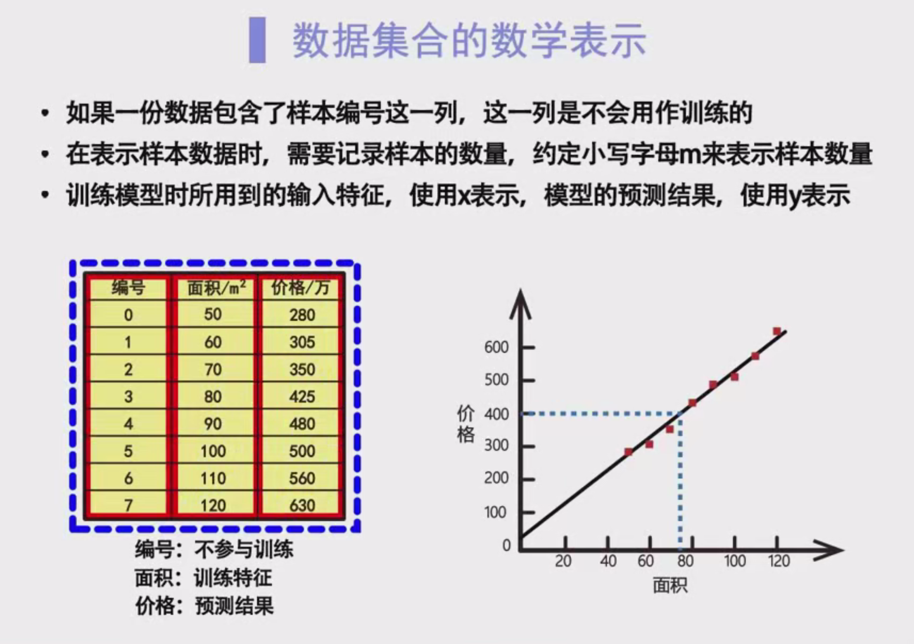

# 数据集和特征的表示

在监督学习中，根据已知的数据对自变量（特征）和因变量（目标）之间的关系建立数学模型，需要先对数据和模型进行规范的数学表示。以下内容将详细介绍数据集的表示方法及特征的表示方式。

## 1. 数据表示

### 1.1 监督学习中的数据集

- **训练集**：用于模型训练的数据集。
  - 例如，在线性回归中，训练集包含房屋的出售数据，用于训练房价预测模型。

### 1.2 训练集的组成

- **样本数量**：用变量 $ m $ 表示，表示训练集中样本的总数。
  - 例如，若 $ m = 8 $，表示训练集中有八个样本。

- **数据列**：
  - **样本编号**：用于标记样本，不参与模型训练。
    - 通常情况下，不将样本编号直接表示在数据集中。
    - 如果数据集中包含样本编号，该列不会参与模型训练。

  - **自变量（特征）**：模型训练时使用的输入特征。
    - 例如，面积使用 $ x $ 表示。

  - **因变量（目标）**：模型的输出变量，即预测结果。
    - 例如，价格使用 $ y $ 表示。
    - 在线性回归中，训练样本中的 $ y $ 值是手工标记的，而未知输入样本的 $ y $ 表示模型的预测结果。

## 2. 特征表示

### 2.1 一元线性回归

- 仅包含一个输入特征 $ x $。
  - 直接使用 $ x $ 表示单一特征。

### 2.2 多元线性回归

- 包含多个输入特征 $ x_i $。
  - 使用 $ x_i $ 表示第 $ i $ 个特征，例如：
    - $ x_1 $ 表示面积
    - $ x_2 $ 表示位置
    - $ x_3 $ 表示楼层
  - 数字下标 $ i $ 写在字母的右下方，表示特征的编号。

### 2.3 样本表示

- **单个训练样本**：使用括号 $ (x, y) $ 表示。
  - 例如，若训练集中有 $ m $ 个样本，表示为 $ (x_0, y_0), (x_1, y_1), \ldots, (x_{m-1}, y_{m-1}) $。
  - 索引 $ i $ 写在字母的右上方，并加上小括号，表示样本的编号。
    - 例如，第三个样本记作 $ (x_3, y_3) $。

## 3. 线性回归示例

### 3.1 房价预测模型

- **数据集示例**：
  - 包含三列：样本编号、面积、价格。
  - 样本编号不参与训练，仅用于标记。

- **模型训练**：
  - 使用面积 $ x $ 作为自变量，价格 $ y $ 作为因变量。
  - 通过训练集训练出线性模型，用于预测房价。

### 3.2 银行信用卡额度预测模型

- **问题描述**：
  - 根据客户的工资和年龄两个特征预测信用卡额度。

- **数据集组成**：
  - 五行三列，每行代表一个样本。
  - 三列分别对应：工资、年龄、额度。

- **特征表示**：
  - 工资使用 $ x_1 $ 表示。
  - 年龄使用 $ x_2 $ 表示。
  - 额度使用 $ y $ 表示。

- **模型类型**：
  - 二元线性回归（包含两个特征）。

- **样本表示**：
  - 五个样本表示为五个三元组 $ (x_1, x_2, y) $。
  - 例如，第零个样本表示为 $ (x_0, y_0) = (4000, 23200) $。

## 4. 注意事项

- **样本编号**：
  - 不参与模型训练，仅用于标记。
  - 不应直接表示在数据集中用于训练。

- **特征编号**：
  - 在多元线性回归中，特征编号 $ i $ 应写在字母的右下方，如 $ x_i $。

- **样本索引**：
  - 索引 $ i $ 应写在字母的右上方，并加上小括号，表示样本的编号。

## 5. 结语

通过以上内容，介绍了数据集和特征的表示方法，涵盖了一元和多元线性回归的特征表示方式及具体示例。这些基础知识对于建立和理解监督学习中的数学模型至关重要。

感谢大家的观看，我们下节课再会。