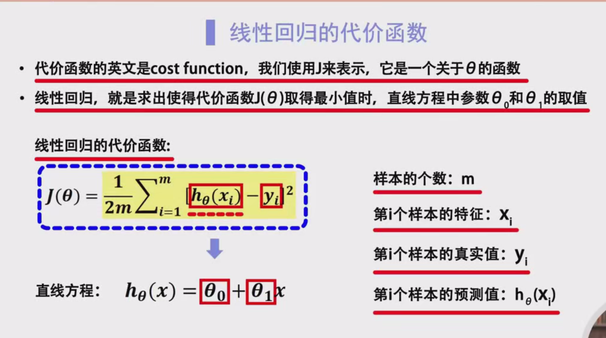
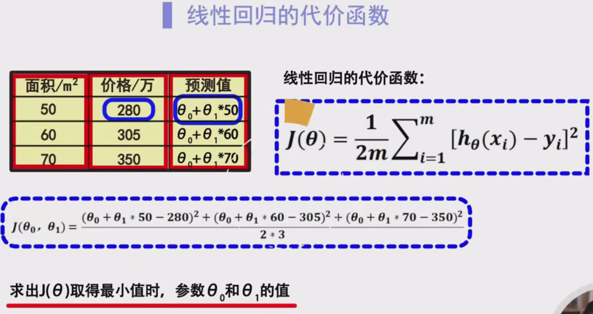
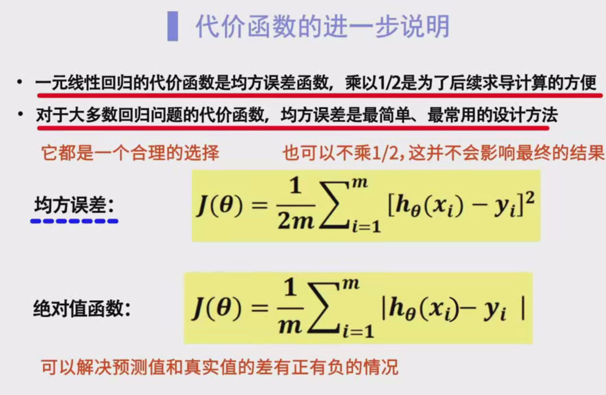
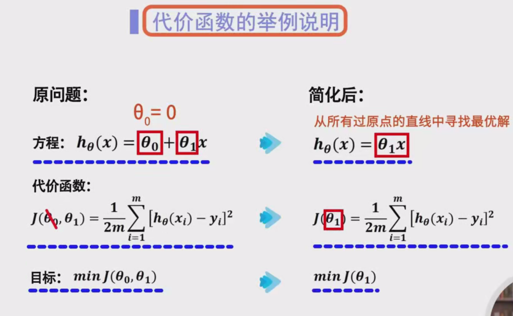
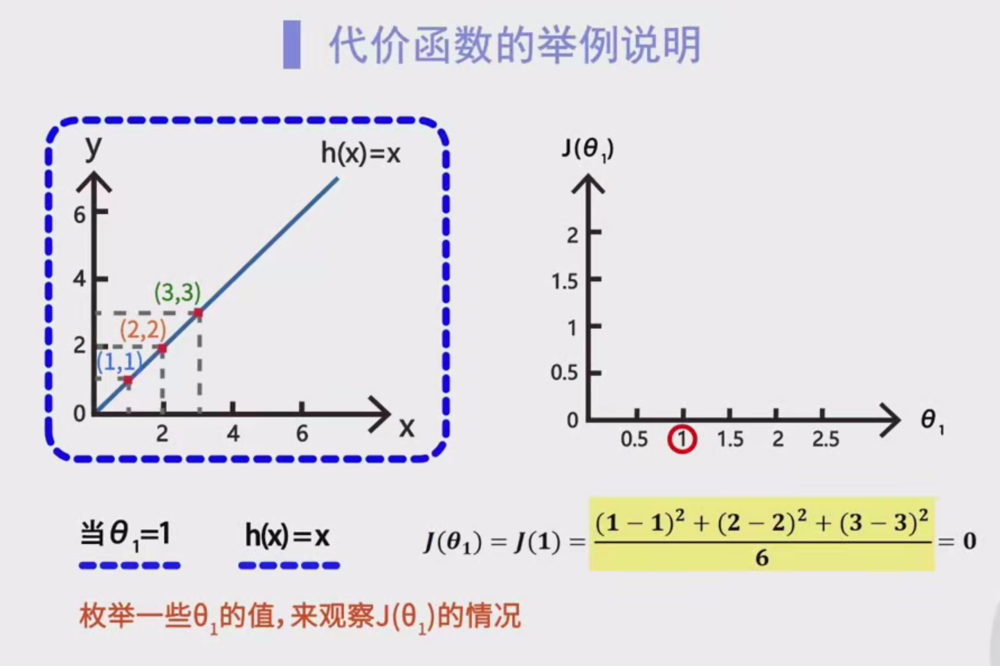
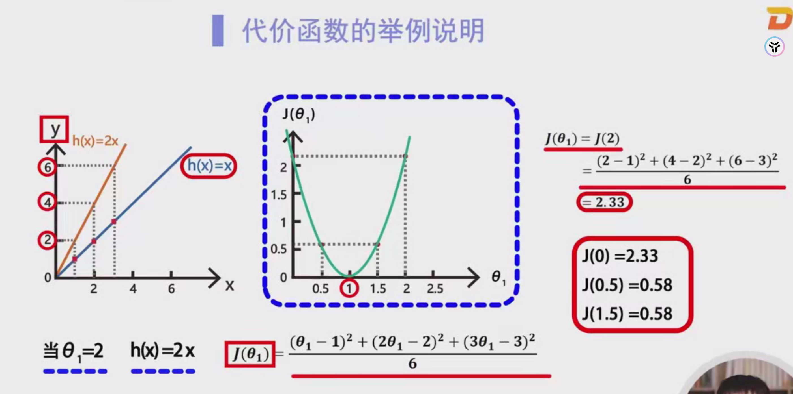
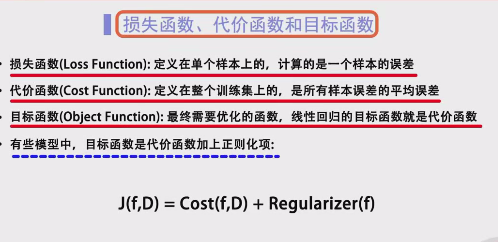

# 线性回归代价函数

## 2. 线性回归概述

线性回归旨在找到一条最佳拟合直线，使得所有样本点到这条直线的距离（误差）最小。其基本形式为：

$
h_\theta(x) = \theta_0 + \theta_1 x
$

其中：
- $ h_\theta(x) $ 是模型的预测值。
- $ \theta_0 $ 是截距（y轴上的偏移量）。
- $ \theta_1 $ 是斜率（表示特征变量与目标变量之间的关系强度）。

当涉及多个特征变量时，模型扩展为多元线性回归：

$
h_\theta(x) = \theta_0 + \theta_1 x_1 + \theta_2 x_2 + \dots + \theta_n x_n
$

## 3. 代价函数的定义

**代价函数（Cost Function）**是用于衡量模型预测值与真实值之间差异的函数。在监督学习中，代价函数是模型训练的核心，通过最小化代价函数来优化模型参数。

在线性回归中，常用的代价函数是**均方误差（Mean Squared Error, MSE）**的二分之一倍，公式如下：

$
J(\theta) = \frac{1}{2m} \sum_{i=1}^{m} \left( h_\theta(x^{(i)}) - y^{(i)} \right)^2
$

其中：
- $ J(\theta) $ 表示代价函数。
- $ m $ 是训练集中样本的总数。
- $ x^{(i)} $ 是第 $ i $ 个样本的特征值。
- $ y^{(i)} $ 是第 $ i $ 个样本的真实值。
- $ h_\theta(x^{(i)}) $ 是模型对第 $ i $ 个样本的预测值。

**注意**：在某些教材或文献中，代价函数不一定乘以 $ \frac{1}{2} $，但在优化过程中引入 $ \frac{1}{2} $ 可以简化导数计算。

## 4. 代价函数的推导与计算

### 4.1 单变量线性回归

考虑单变量线性回归，即只有一个特征变量 $ x $。假设有三个样本点：

| 样本 | $ x^{(i)} $ | $ y^{(i)} $ |
|------|-------------|-------------|
| 1    | 1           | 2           |
| 2    | 2           | 2           |
| 3    | 3           | 3           |

假设模型为：

$
h_\theta(x) = \theta_0 + \theta_1 x
$

代价函数为：

$
J(\theta) = \frac{1}{2 \times 3} \left[ (h_\theta(1) - 2)^2 + (h_\theta(2) - 2)^2 + (h_\theta(3) - 3)^2 \right]
$

将 $ \theta_0 = 0 $ 固定，模型简化为 $ h_\theta(x) = \theta_1 x $，代价函数变为：

$
J(\theta_1) = \frac{1}{6} \left[ (\theta_1 \times 1 - 2)^2 + (\theta_1 \times 2 - 2)^2 + (\theta_1 \times 3 - 3)^2 \right]
$

**示例计算**：

- 当 $ \theta_1 = 1 $ 时：
  $
  J(1) = \frac{1}{6} \left[ (1 - 2)^2 + (2 - 2)^2 + (3 - 3)^2 \right] = \frac{1}{6} (1 + 0 + 0) = \frac{1}{6} \approx 0.1667
  $
  
- 当 $ \theta_1 = 2 $ 时：
  $
  J(2) = \frac{1}{6} \left[ (2 - 2)^2 + (4 - 2)^2 + (6 - 3)^2 \right] = \frac{1}{6} (0 + 4 + 9) = \frac{13}{6} \approx 2.1667
  $

通过不同 $ \theta_1 $ 值的计算，可以观察到 $ \theta_1 = 1 $ 时代价函数取得最小值，表明此时模型参数最优。

### 4.2 多变量线性回归

当特征变量不止一个时，模型扩展为：

$
h_\theta(x) = \theta_0 + \theta_1 x_1 + \theta_2 x_2 + \dots + \theta_n x_n
$

对应的代价函数为：

$
J(\theta) = \frac{1}{2m} \sum_{i=1}^{m} \left( h_\theta(x^{(i)}) - y^{(i)} \right)^2
$

此时，代价函数是一个关于多个参数 $ \theta = (\theta_0, \theta_1, \dots, \theta_n) $ 的函数，优化目标是找到使 $ J(\theta) $ 最小的参数组合。

## 5. 代价函数的几何解释

在单变量线性回归中，代价函数 $ J(\theta_1) $ 是关于 $ \theta_1 $ 的二次函数，其图像为一条抛物线。抛物线的最低点对应于代价函数的最小值，表示最优的 $ \theta_1 $ 值。

当涉及多变量时，代价函数 $ J(\theta) $ 是关于多个参数的高维函数。以双变量线性回归为例，$ J(\theta_0, \theta_1) $ 在三维空间中形成一个抛物面。优化的目标是找到这个抛物面上的最低点，即最优的参数组合。

**图示**：

- **单变量**：二维图，横轴为 $ \theta_1 $，纵轴为 $ J(\theta_1) $。
  
- **双变量**：三维图，横轴为 $ \theta_0 $，纵轴为 $ \theta_1 $，垂直轴为 $ J(\theta_0, \theta_1) $。

## 6. 优化代价函数的方法

为了找到使代价函数 $ J(\theta) $ 最小的参数 $ \theta $，需要采用优化算法。常用的方法包括梯度下降法和正规方程。

### 6.1 梯度下降法

**梯度下降法（Gradient Descent）**是一种迭代优化算法，通过逐步调整参数，朝着代价函数下降最快的方向移动，最终收敛到最小值点。

**步骤**：

1. **初始化参数**：随机选择初始参数值 $ \theta $。
2. **计算梯度**：计算代价函数相对于参数的偏导数（梯度）。
3. **更新参数**：
   $
   \theta_j := \theta_j - \alpha \frac{\partial J(\theta)}{\partial \theta_j}
   $
   其中，$ \alpha $ 是学习率，决定了每次更新的步长。
4. **重复步骤 2 和 3**，直到参数收敛或达到预设的迭代次数。

**梯度计算**：

对于线性回归的代价函数，梯度为：

$
\frac{\partial J(\theta)}{\partial \theta_j} = \frac{1}{m} \sum_{i=1}^{m} \left( h_\theta(x^{(i)}) - y^{(i)} \right) x_j^{(i)}
$

**优点**：

- 适用于大规模数据集。
- 易于实现和扩展。

**缺点**：

- 需要选择合适的学习率。
- 可能陷入局部最小值（但对于凸函数如线性回归，只有一个全局最小值）。

### 6.2 正规方程

**正规方程（Normal Equation）**是一种解析解方法，直接通过矩阵运算找到最优参数，无需迭代。

**公式**：

$
\theta = (X^T X)^{-1} X^T y
$

其中：
- $ X $ 是特征矩阵，包含所有样本的特征。
- $ y $ 是目标变量向量。
- $ \theta $ 是参数向量。

**步骤**：

1. **构建特征矩阵**：包括所有样本的特征和截距项。
2. **计算 $ X^T X $**。
3. **计算 $ (X^T X)^{-1} $**。
4. **计算 $ X^T y $**。
5. **求解 $ \theta $**。

**优点**：

- 不需要选择学习率。
- 一次性计算出最优参数。

**缺点**：

- 对于大规模数据集计算成本高（矩阵求逆复杂度为 $ O(n^3) $）。
- 可能存在 $ X^T X $ 不可逆的情况。

## 7. 损失函数、代价函数与目标函数的区别

在机器学习中，**损失函数（Loss Function）**、**代价函数（Cost Function）**和**目标函数（Objective Function）**是三个相关但不同的概念。

### 7.1 损失函数（Loss Function）

- **定义**：衡量单个训练样本预测值与真实值之间差异的函数。
- **用途**：用于评估模型对单个样本的表现。
- **常见形式**：平方误差、绝对误差、交叉熵等。
- **符号表示**：通常用 $ L $ 表示，如 $ L(h_\theta(x), y) $。

### 7.2 代价函数（Cost Function）

- **定义**：衡量整个训练集上所有样本的平均损失。
- **用途**：用于评估模型在整个训练集上的表现。
- **常见形式**：均方误差（MSE）、平均绝对误差（MAE）等。
- **符号表示**：通常用 $ J(\theta) $ 表示。
- **关系**：代价函数是损失函数在训练集上的平均值，即：
  $
  J(\theta) = \frac{1}{m} \sum_{i=1}^{m} L(h_\theta(x^{(i)}), y^{(i)} )
  $

### 7.3 目标函数（Objective Function）

- **定义**：在机器学习中，目标函数通常指需要优化的函数，可以是代价函数，也可以包含其他项（如正则化项）。
- **用途**：指导模型参数的优化过程。
- **符号表示**：通常用 $ J(\theta) $ 或其他符号表示。
- **关系**：在简单的线性回归中，目标函数即为代价函数；在复杂模型中，目标函数可能包含多个部分，如代价函数加上正则化项。

**总结**：

- **损失函数**：评估单个样本的误差。
- **代价函数**：评估整个训练集的平均误差。
- **目标函数**：指导模型优化的函数，通常包括代价函数及其他约束或正则化项。

## 8. 代价函数的选择

选择合适的代价函数对于模型性能和优化效果至关重要。不同的代价函数在不同的应用场景下具有不同的优势和劣势。

### 8.1 均方误差（MSE）

**定义**：

$
\text{MSE} = \frac{1}{m} \sum_{i=1}^{m} \left( h_\theta(x^{(i)}) - y^{(i)} \right)^2
$

**特点**：

- 对异常值敏感，因为误差被平方放大。
- 数学性质良好，易于导数计算，适合梯度下降法。
- 凸函数，保证全局最小值的存在。

**应用场景**：

- 数据分布接近正态分布。
- 需要对较大误差进行惩罚。

### 8.2 平均绝对误差（MAE）

**定义**：

$
\text{MAE} = \frac{1}{m} \sum_{i=1}^{m} \left| h_\theta(x^{(i)}) - y^{(i)} \right|
$

**特点**：

- 对异常值不如MSE敏感。
- 导数在零点不可导，优化过程较为复杂。
- 表示误差的平均绝对值，更直观理解。

**应用场景**：

- 数据存在异常值或噪声。
- 需要对所有误差赋予相同的权重。

### 8.3 其他误差函数

- **Huber损失函数**：
  结合了MSE和MAE的优点，对小误差使用MSE，对大误差使用MAE，具有鲁棒性。
  
- **对数损失函数（Log Loss）**：
  常用于分类问题，尤其是二分类问题。

- **交叉熵损失函数（Cross-Entropy Loss）**：
  广泛应用于分类任务，尤其是多分类问题。

**选择考虑因素**：

- 数据分布特点。
- 对异常值的敏感性。
- 优化算法的兼容性。

## 9. 实例分析

通过具体的例子，深入理解代价函数的计算和参数优化过程。

### 9.1 实例背景

假设有以下三个样本数据：

| 样本 | $ x^{(i)} $ | $ y^{(i)} $ |
|------|-------------|-------------|
| 1    | 1           | 2           |
| 2    | 2           | 2           |
| 3    | 3           | 3           |

目标：通过线性回归模型 $ h_\theta(x) = \theta_0 + \theta_1 x $ 拟合这些数据，找到最优的 $ \theta_0 $ 和 $ \theta_1 $。

### 9.2 计算代价函数

#### 9.2.1 固定 $ \theta_0 = 0 $ 的情况

模型简化为 $ h_\theta(x) = \theta_1 x $。

代价函数：

$
J(\theta_1) = \frac{1}{6} \left[ (\theta_1 \times 1 - 2)^2 + (\theta_1 \times 2 - 2)^2 + (\theta_1 \times 3 - 3)^2 \right]
$

**计算示例**：

| $ \theta_1 $ | $ h_\theta(x) $ | 误差平方和 | $ J(\theta_1) $ |
|---------------|-------------------|-----------|-------------------|
| 0             | 0, 0, 0           | $4 + 4 + 9 = 17$ | $ \frac{17}{6} \approx 2.8333 $ |
| 0.5           | 0.5, 1, 1.5       | $ (0.5-2)^2 + (1-2)^2 + (1.5-3)^2 = 2.25 + 1 + 2.25 = 5.5 $ | $ \frac{5.5}{6} \approx 0.9167 $ |
| 1             | 1, 2, 3           | $ (1-2)^2 + (2-2)^2 + (3-3)^2 = 1 + 0 + 0 = 1 $ | $ \frac{1}{6} \approx 0.1667 $ |
| 1.5           | 1.5, 3, 4.5       | $ (1.5-2)^2 + (3-2)^2 + (4.5-3)^2 = 0.25 + 1 + 2.25 = 3.5 $ | $ \frac{3.5}{6} \approx 0.5833 $ |
| 2             | 2, 4, 6           | $ (2-2)^2 + (4-2)^2 + (6-3)^2 = 0 + 4 + 9 = 13 $ | $ \frac{13}{6} \approx 2.1667 $ |

**观察**：

当 $ \theta_1 = 1 $ 时，代价函数 $ J(\theta_1) $ 取得最小值 $ \approx 0.1667 $，表明此时模型最优。

#### 9.2.2 不固定 $ \theta_0 $ 的情况

模型为 $ h_\theta(x) = \theta_0 + \theta_1 x $。

代价函数：

$
J(\theta_0, \theta_1) = \frac{1}{6} \left[ (\theta_0 + \theta_1 \times 1 - 2)^2 + (\theta_0 + \theta_1 \times 2 - 2)^2 + (\theta_0 + \theta_1 \times 3 - 3)^2 \right]
$

**示例计算**：

假设 $ \theta_0 = 0 $ 和 $ \theta_1 = 1 $：

$
J(0, 1) = \frac{1}{6} \left[ (0 + 1 \times 1 - 2)^2 + (0 + 1 \times 2 - 2)^2 + (0 + 1 \times 3 - 3)^2 \right] = \frac{1}{6} (1 + 0 + 0) = \frac{1}{6} \approx 0.1667
$

进一步，通过梯度下降法或正规方程，可以找到更优的 $ \theta_0 $ 和 $ \theta_1 $ 组合。

### 9.3 优化参数

采用梯度下降法优化参数。

**步骤**：

1. **初始化参数**：设 $ \theta_0 = 0 $，$ \theta_1 = 0 $。
2. **计算梯度**：
   $
   \frac{\partial J}{\partial \theta_0} = \frac{1}{3} \sum_{i=1}^{3} \left( h_\theta(x^{(i)}) - y^{(i)} \right)
   $
   $
   \frac{\partial J}{\partial \theta_1} = \frac{1}{3} \sum_{i=1}^{3} \left( h_\theta(x^{(i)}) - y^{(i)} \right) x^{(i)}
   $
3. **更新参数**：
   $
   \theta_j := \theta_j - \alpha \frac{\partial J}{\partial \theta_j}
   $
   选择合适的学习率 $ \alpha $（如 0.01）。
4. **迭代**，直到参数收敛。

通过迭代，最终可以得到最优的 $ \theta_0 $ 和 $ \theta_1 $ 值，使得代价函数达到最小。

## 10. 常见问题解答（FAQ）

### 问1：为什么代价函数要乘以 $ \frac{1}{2} $？

**答**：乘以 $ \frac{1}{2} $ 的主要目的是为了在求导时简化公式。具体来说，在计算梯度时，平方项的导数会带来一个因子 2，乘以 $ \frac{1}{2} $ 后，2 被抵消，简化了梯度的表达式。例如：

$
\frac{\partial}{\partial \theta_j} \left( \frac{1}{2} \left( h_\theta(x) - y \right)^2 \right) = \left( h_\theta(x) - y \right) \cdot x_j
$

如果不乘以 $ \frac{1}{2} $，导数将包含额外的因子 2，需额外处理。

### 问2：为什么选择均方误差作为代价函数？

**答**：均方误差（MSE）具有以下优点：

1. **数学性质良好**：MSE 是凸函数，确保优化过程中只有一个全局最小值，避免陷入局部最小值。
2. **可导性**：MSE 对参数连续可导，适合使用梯度下降等优化算法。
3. **放大误差**：通过平方，MSE 对较大误差给予更高的权重，有助于减少大误差的影响。

尽管 MSE 对异常值敏感，但其简洁性和良好的数学特性使其成为最常用的代价函数之一。

### 问3：什么是正则化，为什么需要在目标函数中加入正则项？

**答**：**正则化（Regularization）**是一种防止模型过拟合的方法，通过在目标函数中加入正则项，约束模型参数的大小或复杂度，从而提高模型的泛化能力。

常见的正则化方法包括：

- **L1正则化（Lasso）**：
  $
  J(\theta) = \frac{1}{2m} \sum_{i=1}^{m} \left( h_\theta(x^{(i)}) - y^{(i)} \right)^2 + \lambda \sum_{j=1}^{n} |\theta_j|
  $
  
- **L2正则化（Ridge）**：
  $
  J(\theta) = \frac{1}{2m} \sum_{i=1}^{m} \left( h_\theta(x^{(i)}) - y^{(i)} \right)^2 + \lambda \sum_{j=1}^{n} \theta_j^2
  $

**作用**：

- **防止过拟合**：限制参数过大，降低模型复杂度。
- **特征选择**：L1正则化可以使部分参数趋于零，实现特征选择。
- **提高模型稳定性**：减少模型对训练数据噪声的敏感性。

**注意**：正则化项的权重由超参数 $ \lambda $ 控制，需通过交叉验证等方法选择合适的 $ \lambda $ 值。

### 问4：代价函数的最小值一定对应于最优模型吗？

**答**：在理论上，当代价函数达到最小值时，模型在训练集上的表现最佳。然而，若训练数据存在噪声或模型过于复杂，可能导致过拟合，此时模型在未见数据上的表现可能较差。因此，除了最小化代价函数外，还需关注模型的泛化能力，通过交叉验证、正则化等方法提升模型的整体性能。

## 11. 总结

本文系统地讲解了线性回归中的代价函数，涵盖了以下内容：

- **线性回归概述**：理解线性回归模型的基本形式及其应用场景。
- **代价函数定义**：明确代价函数的作用及其在模型优化中的地位。
- **代价函数的推导与计算**：通过单变量和多变量线性回归示例，展示代价函数的具体计算过程。
- **代价函数的几何解释**：通过图形化理解代价函数的形状及其最小值点。
- **优化方法**：详细介绍梯度下降法和正规方程两种优化代价函数的方法。
- **关键术语区别**：澄清损失函数、代价函数与目标函数的区别与联系。
- **代价函数的选择**：探讨不同代价函数的特点及适用场景。
- **实例分析**：通过具体数据示例，展示代价函数的计算和参数优化过程。
- **常见问题解答**：解答代价函数相关的常见疑问。

---

## 附录

### 公式总结

- **线性回归模型**：
  $
  h_\theta(x) = \theta_0 + \theta_1 x
  $
  
- **代价函数（单变量）**：
  $
  J(\theta_0, \theta_1) = \frac{1}{2m} \sum_{i=1}^{m} \left( \theta_0 + \theta_1 x^{(i)} - y^{(i)} \right)^2
  $
  
- **梯度下降更新规则**：
  $
  \theta_j := \theta_j - \alpha \frac{\partial J(\theta)}{\partial \theta_j}
  $
  
- **正规方程**：
  $
  \theta = (X^T X)^{-1} X^T y
  $

### 示例计算

**假设**：

- 样本数据：
  
  | 样本 | $ x^{(i)} $ | $ y^{(i)} $ |
  |------|-------------|-------------|
  | 1    | 1           | 2           |
  | 2    | 2           | 2           |
  | 3    | 3           | 3           |
  
- 模型：$ h_\theta(x) = \theta_0 + \theta_1 x $
- 初始参数：$ \theta_0 = 0 $，$ \theta_1 = 0 $
- 学习率：$ \alpha = 0.01 $

**第一步迭代**：

1. 计算预测值：
   $
   h_\theta(x) = 0 + 0 \times x = 0
   $
   
2. 计算误差：
   $
   e^{(i)} = h_\theta(x^{(i)}) - y^{(i)} = 0 - y^{(i)}
   $
   
3. 计算梯度：
   $
   \frac{\partial J}{\partial \theta_0} = \frac{1}{3} \sum_{i=1}^{3} e^{(i)} = \frac{1}{3} (-2 -2 -3) = -\frac{7}{3}
   $
   $
   \frac{\partial J}{\partial \theta_1} = \frac{1}{3} \sum_{i=1}^{3} e^{(i)} x^{(i)} = \frac{1}{3} (-2 \times 1 -2 \times 2 -3 \times 3) = -\frac{13}{3}
   $
   
4. 更新参数：
   $
   \theta_0 := 0 - 0.01 \times \left( -\frac{7}{3} \right) = 0.0233
   $
   $
   \theta_1 := 0 - 0.01 \times \left( -\frac{13}{3} \right) = 0.0433
   $

