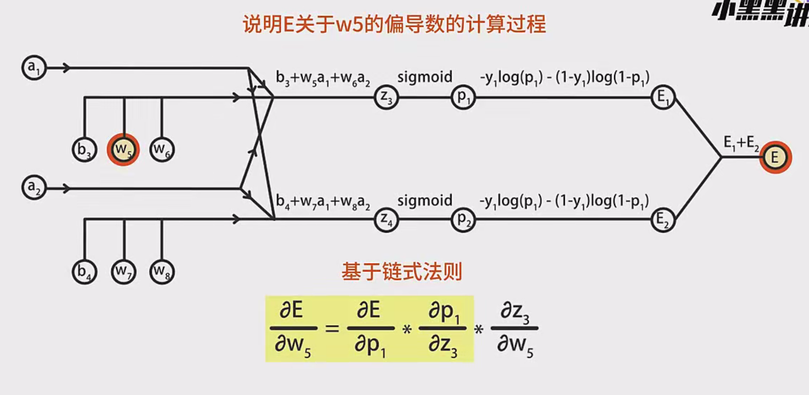

# 基于链式法则的梯度计算

---

## 一、神经网络结构与符号约定
**三层神经网络结构**：
```
输入层 → 隐藏层 → 输出层（2个神经元）
```
**关键参数**：
- 权重矩阵：W1~W8
- 偏置项：b1~b4
- 激活函数：sigmoid（σ）
- 代价函数：交叉熵损失E = -Σ[y ln p + (1-y)ln(1-p)]

**符号说明**：
- a1, a2：隐藏层输出
- z3, z4：输出层输入
- p1, p2：输出层预测值（经sigmoid处理）

---

## 二、输出层参数梯度计算（以W5为例）

### 1. 计算路径分解
$$
\frac{∂E}{∂W5} = \frac{∂E}{∂p_1} \cdot \frac{∂p_1}{∂z_3} \cdot \frac{∂z_3}{∂W5}
$$

### 2. 分步推导
**(1) 输出层误差项**：
$$
\frac{∂E}{∂p_1} = -\frac{y_1}{p_1} + \frac{1-y_1}{1-p_1}
$$

**(2) Sigmoid导数**：
$$
\frac{∂p_1}{∂z_3} = σ(z_3)(1-σ(z_3)) = p_1(1-p_1)
$$

**(3) 线性层导数**：
$$
\frac{∂z_3}{∂W5} = a_1
$$

**综合结果**：
$$
\frac{∂E}{∂W5} = (p_1 - y_1) \cdot a_1
$$

### 3. 结果分析
- **与逻辑回归的一致性**：结果形式与单层逻辑回归的梯度公式相同
- **偏置项梯度**：
  $$
  \frac{∂E}{∂b_3} = p_1 - y_1
  $$
- **其他参数**：
  - W6梯度：$\frac{∂E}{∂W6} = (p_1 - y_1) \cdot a_2$
  - W7/W8梯度同理

---

## 三、隐藏层参数梯度计算（以W1为例）

### 1. 梯度传播路径分析
```
E → a1 → z3/z4 → W5/W7
        ↘ z1 → W1
```

### 2. 关键中间梯度计算
**(1) a1对E的贡献**：
$$
\frac{∂E}{∂a_1} = \sum_{k=3,4} \frac{∂E}{∂z_k} \cdot \frac{∂z_k}{∂a_1} = (p_1 - y_1)W5 + (p_2 - y_2)W7
$$

**(2) 激活函数导数**：
$$
\frac{∂a_1}{∂z_1} = σ(z_1)(1-σ(z_1)) = a_1(1-a_1)
$$

**(3) 线性层导数**：
$$
\frac{∂z_1}{∂W1} = x_1
$$

**综合结果**：
$$
\frac{∂E}{∂W1} = [ (p_1 - y_1)W5 + (p_2 - y_2)W7 ] \cdot a_1(1-a_1) \cdot x_1
$$

### 3. 通用公式
**对于任意隐藏层参数**：
$$
\frac{∂E}{∂W_{ij}} = \delta_j \cdot a_i
$$
其中：
$$
\delta_j = a_j(1-a_j) \sum_{k} W_{jk} \delta_k
$$

---

## 四、反向传播算法流程

### 1. 前向传播
- 计算各层输出：
  ```
  z1 = W1x1 + W2x2 + b1 → a1 = σ(z1)
  z3 = W5a1 + W6a2 + b3 → p1 = σ(z3)
  ```

### 2. 反向传播
**步骤**：
1. 计算输出层δ：
   $$
   δ_3 = p1 - y1,\quad δ_4 = p2 - y2
   $$

2. 传播到隐藏层：
   $$
   δ_1 = a1(1-a1)(W5δ3 + W7δ4)
   $$

3. 计算参数梯度：
   $$
   \frac{∂E}{∂W5} = δ3 \cdot a1,\quad \frac{∂E}{∂W1} = δ1 \cdot x1
   $$

---

## 五、关键点总结

1. **链式法则分解**：
   - 梯度计算必须沿计算图逆向传播
   - 每个节点的局部梯度只与直接连接相关

2. **梯度累积现象**：
   - 当节点存在多条反向路径时（如a1影响z3和z4），需进行梯度累加

3. **参数更新规律**：
   - 权重梯度 = 上游梯度 × 输入特征值
   - 偏置梯度 = 上游梯度 × 1

4. **算法优势**：
   - 避免重复计算中间梯度
   - 时间复杂度从O(n²)降为O(n)

---

## 六、计算图示

```
输入层        隐藏层         输出层
x1 → (W1,b1) → a1 ↘
           ↘        → (W5,W6,b3) → p1
x2 → (W2,b1) → a2 ↗
           ↗        → (W7,W8,b4) → p2
```

**反向传播路径**：
```
E ← p1 ← z3 ← a1 ← z1 ← W1
          ↑       ↑
          W5      x1
```

