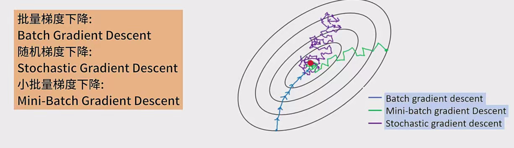

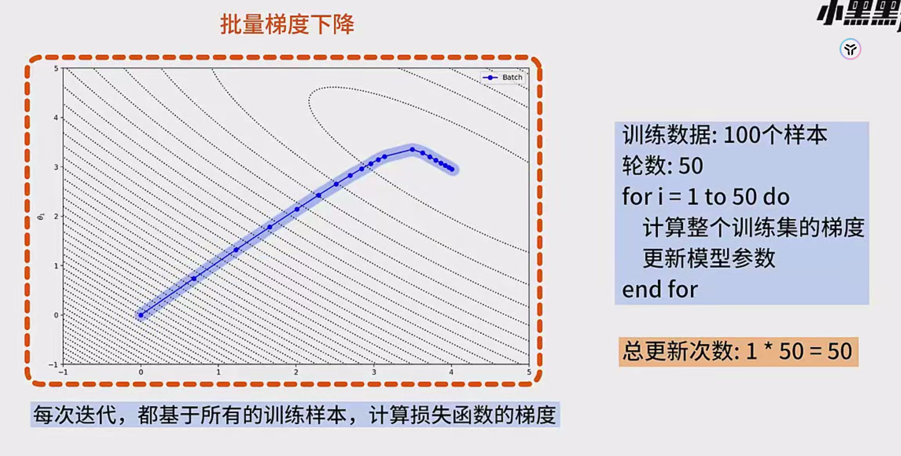

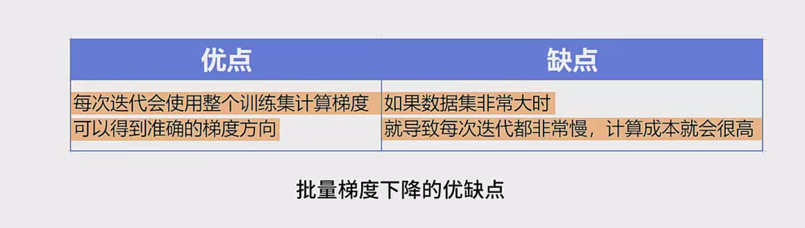

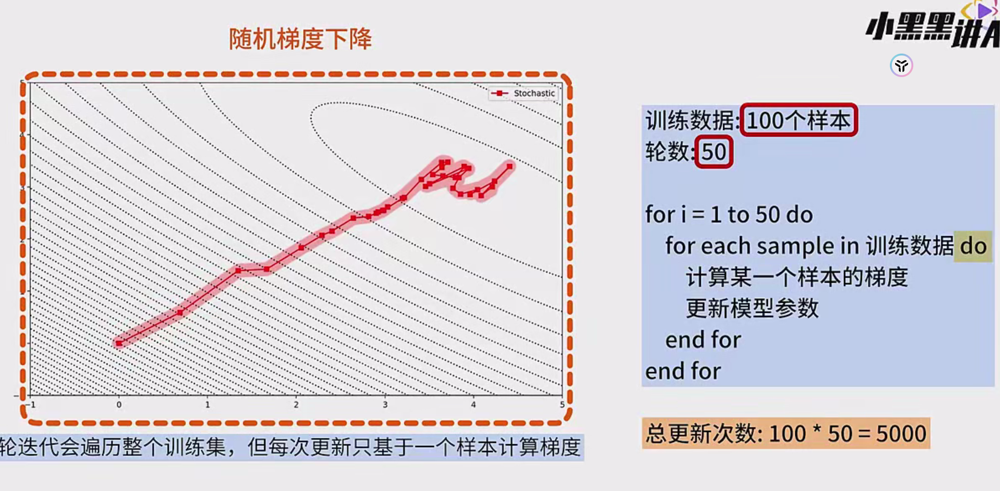

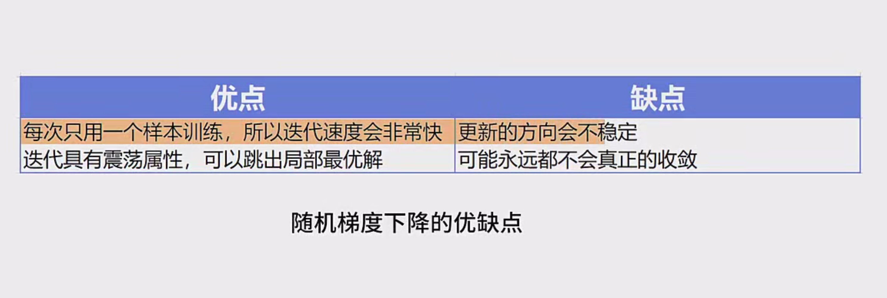

 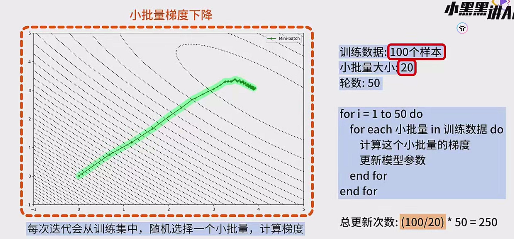

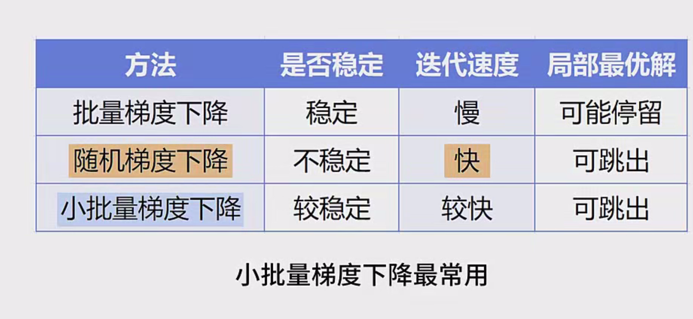

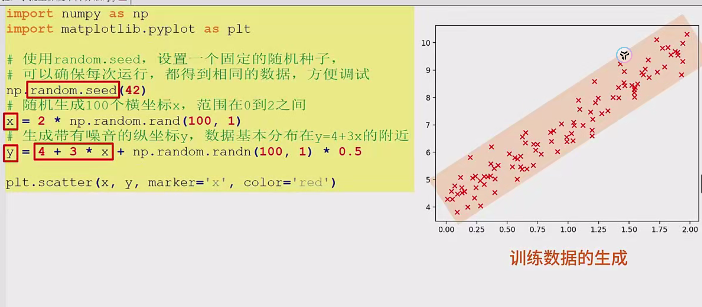

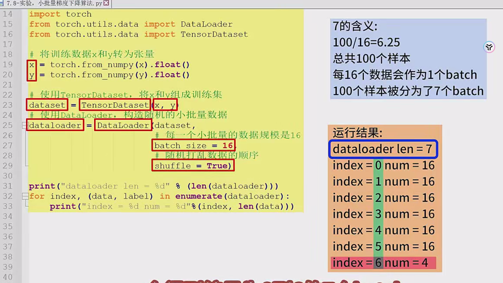

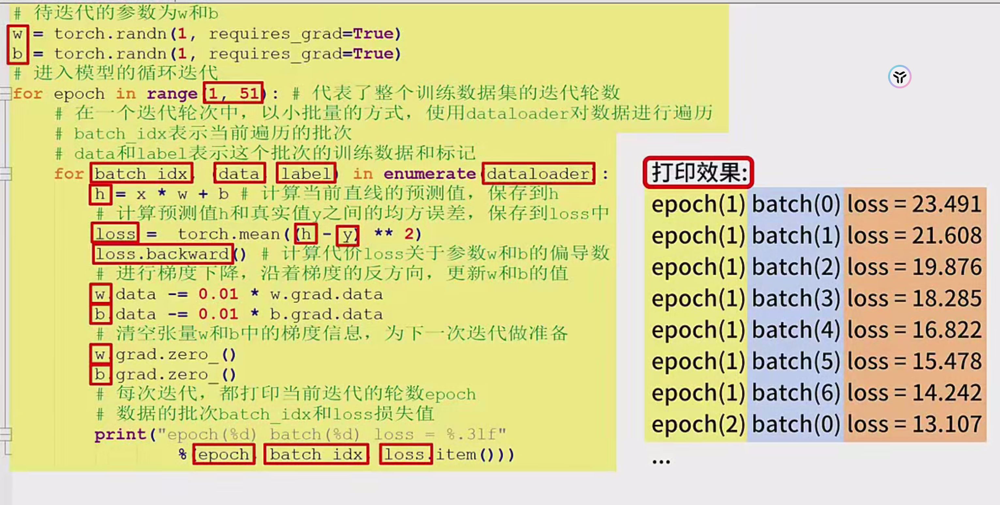

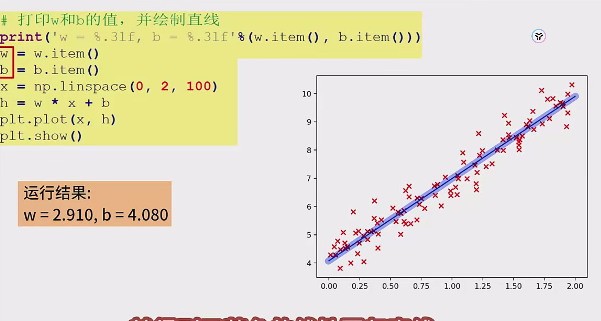

# 小批量梯度下降

---

## **梯度下降算法概述**
梯度下降是优化神经网络和机器学习模型的核心算法，通过迭代调整参数以最小化损失函数。主要分为三种形式：

### **1. 批量梯度下降（Batch Gradient Descent, BGD）**
- **原理**：每次迭代使用**全部训练样本**计算损失函数的梯度。
- **特点**：
  - 梯度方向准确，收敛曲线平滑。
  - 计算成本高，尤其在大数据集上效率低。
- **示例**：
  - 数据集：100个样本，迭代50轮（epoch）。
  - 每轮更新1次梯度（总更新次数：50次）。

### **2. 随机梯度下降（Stochastic Gradient Descent, SGD）**
- **原理**：每次迭代使用**单个样本**计算梯度并更新参数。
- **特点**：
  - 更新频繁，收敛速度快但方向不稳定（震荡）。
  - 可能无法收敛到最优解，但能跳出局部极小值。
- **示例**：
  - 数据集：100个样本，迭代50轮。
  - 总更新次数：100 × 50 = 5000次。

### **3. 小批量梯度下降（Mini-Batch Gradient Descent, MBGD）**
- **原理**：每次迭代使用**随机小批量样本**（如16、32个）计算梯度。
- **特点**：
  - 平衡BGD的稳定性和SGD的速度。
  - 小批量的随机性有助于避免局部最优。
- **示例**：
  - 数据集：100个样本，batch size=20，迭代50轮。
  - 每轮分5个小批量（总更新次数：50 × 5 = 250次）。

---

## **小批量梯度下降的优势**
1. **计算效率**：相比BGD，减少了单次迭代的计算量。
2. **收敛稳定性**：相比SGD，梯度方向更稳定。
3. **泛化能力**：随机采样的小批量数据可提升模型泛化性能。

---

## **实现步骤：基于一元线性回归的示例**

### **1. 数据准备**
- **生成数据**：
  ```python
  import torch
  from torch.utils.data import Dataset, DataLoader
  
  # 固定随机种子（确保可复现）
  torch.manual_seed(42)
  
  # 生成100个样本
  x = 2 * torch.rand(100, 1)          # x ∈ [0, 2)
  y = 4 + 3 * x + torch.randn(100, 1) # y ≈ 4 + 3x + 噪声
  ```
- **转换为数据集**：
  ```python
  dataset = torch.utils.data.TensorDataset(x, y)
  dataloader = DataLoader(
      dataset, 
      batch_size=16, 
      shuffle=True  # 打乱数据顺序
  )
  ```
  - **Batch分配**：100个样本按batch size=16分为7个batch（前6个各16样本，第7个4样本）。

---

### **2. 模型参数初始化**
```python
# 初始化参数（权重w和偏置b）
w = torch.randn(1, requires_grad=True)  # 随机初始化
b = torch.randn(1, requires_grad=True)
```

---

### **3. 训练循环**
```python
learning_rate = 0.1  # 学习率
n_epochs = 50        # 迭代轮数

for epoch in range(n_epochs):
    for batch_idx, (data, label) in enumerate(dataloader):
        # 前向传播：计算预测值
        h = w * data + b
        
        # 计算均方误差损失（MSE）
        loss = torch.mean((h - label) ** 2)
        
        # 反向传播：计算梯度
        loss.backward()
        
        # 梯度下降：更新参数（手动实现，无优化器）
        with torch.no_grad():
            w -= learning_rate * w.grad
            b -= learning_rate * b.grad
        
        # 清空梯度（防止累加）
        w.grad.zero_()
        b.grad.zero_()
        
        # 打印训练信息
        print(f"Epoch: {epoch}, Batch: {batch_idx}, Loss: {loss.item():.4f}")
```

---

### **4. 关键代码解释**
- **前向传播**：计算预测值 `h = w * x + b`。
- **损失计算**：均方误差（MSE）衡量预测值与真实值的差距。
- **反向传播**：`loss.backward()` 自动计算 `w` 和 `b` 的梯度。
- **参数更新**：沿梯度反方向更新参数，学习率控制步长。
- **梯度清零**：避免梯度在不同batch间累积。

---

## **结果分析**
- **输出**：最终参数接近真实值（`w≈3`, `b≈4`）。
- **收敛曲线**：损失值随迭代逐渐下降，可能存在小幅度震荡（由小批量随机性导致）。

