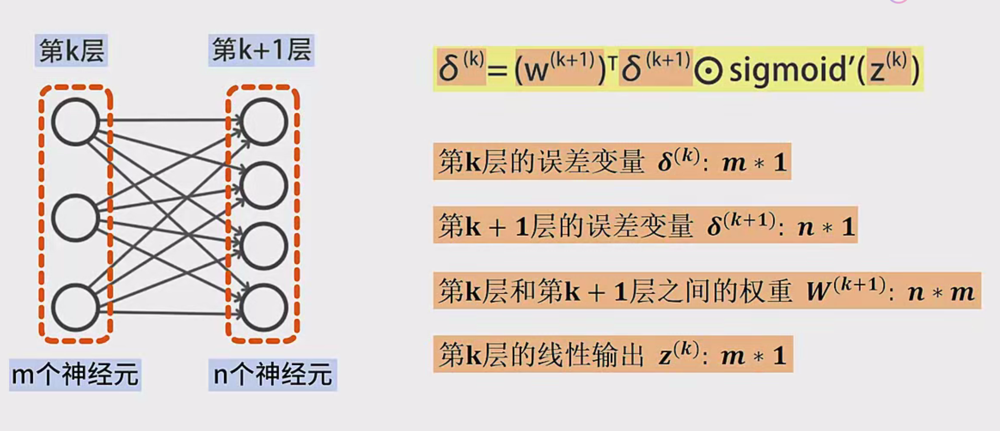

# 矩阵表示反向传播算法详解

## 一、核心公式推导
### 1. 误差变量δ的矩阵表示
设第k层有m个神经元，第k+1层有n个神经元：
- δ^(k): m×1列向量（当前层误差）
- δ^(k+1): n×1列向量（下一层误差）
- W^(k+1): n×m权重矩阵
- z^(k): m×1列向量（线性输出）
- g'(z^(k)): 激活函数导数向量

误差反向传播公式：
$$
\delta^{(k)} = \left( (W^{(k+1)})^T \delta^{(k+1)} \right) \odot g'(z^{(k)})
$$

> **维度验证**：
> - $(W^(k+1))^T: m×n$
> - $δ^(k+1): n×1$
> - 乘积结果: m×1
> - 与$g'(z^(k))$逐元素相乘保持m×1维度

### 2. 权重梯度计算
前一层输出a^(k-1)为p×1列向量时：
$$
\frac{\partial e}{\partial W^{(k)}} = \delta^{(k)} \cdot (a^{(k-1)})^T
$$

> **维度分析**：
>
> - $δ^(k): m×1$
> - $(a^(k-1))^T: 1×p$
> - 结果矩阵: m×p（与W^(k)维度一致）

### 3. 偏置梯度计算
$$
\frac{\partial e}{\partial b^{(k)}} = \delta^{(k)}
$$

## 二、实例解析（3层神经网络）
### 网络结构
- 输入层（第0层）：3个神经元
- 隐藏层（第1层）：4个神经元
- 输出层（第2层）：1个神经元

### 前向传播过程
1. 输入层：
   $$
   a^{(0)} = x
   $$

2. 隐藏层：
   $$
   z^{(1)} = W^{(1)}a^{(0)} + b^{(1)} \\
   a^{(1)} = g(z^{(1)})
   $$

3. 输出层（恒等函数）：
   $$
   z^{(2)} = W^{(2)}a^{(1)} + b^{(2)} \\
   a^{(2)} = z^{(2)}
   $$

### 反向传播过程
1. 计算输出层误差：
   $$
   \delta^{(2)} = a^{(2)} - y
   $$

2. 隐藏层误差计算：
   $$
   \delta^{(1)} = \left( (W^{(2)})^T \delta^{(2)} \right) \odot g'(z^{(1)})
   $$

3. 梯度计算：
   - 权重梯度：
   $$
   \frac{\partial e}{\partial W^{(2)}} = \delta^{(2)} \cdot (a^{(1)})^T \\
   \frac{\partial e}{\partial W^{(1)}} = \delta^{(1)} \cdot (a^{(0)})^T
   $$
   
   - 偏置梯度：
   
   $$
   \frac{\partial e}{\partial b^{(2)}} = \delta^{(2)} \\
   \frac{\partial e}{\partial b^{(1)}} = \delta^{(1)}
   $$

## 三、矩阵运算示例
假设：
- W^(2)为1×4矩阵
- δ^(2)为1×1标量
- a^(1)为4×1列向量

则：
$$
\frac{\partial e}{\partial W^{(2)}} = 
\begin{bmatrix}
\delta_1^{(2)}a_1^{(1)} & \delta_1^{(2)}a_2^{(1)} & \delta_1^{(2)}a_3^{(1)} & \delta_1^{(2)}a_4^{(1)}
\end{bmatrix}
$$

## 四、关键概念说明
1. **哈达玛积（Hadamard Product）**：
   - 符号：⊙
   - 定义：同维度矩阵对应元素相乘
   
   $$
   (A \odot B)_{ij} = A_{ij} \times B_{ij}
   $$
   
2. **维度对齐原则**：
   - 矩阵相乘需满足(m×n)(n×p) = m×p
   - 转置操作实现误差的反向流动

3. **激活函数选择**：
   - 输出层使用恒等函数时，g'(z)=1
   - 隐藏层常用sigmoid/tanh/ReLU及其导数

## 五、算法优势分析
1. **计算效率**：矩阵运算可利用GPU并行加速
2. **代码简洁性**：避免显式循环，实现更简洁
3. **数学一致性**：保持张量维度统一，降低出错概率

## 六、实现注意事项
1. **梯度检查**：通过数值梯度验证实现正确性
2. **矩阵初始化**：使用Xavier/He初始化保证数值稳定性
3. **批量处理**：扩展为批量数据时的维度处理（增加batch维度）

> 附：典型反向传播流程伪代码
```
for l in reversed(layers):
    if output_layer:
        delta = (a - y) * g'(z)
    else:
        delta = (W_next.T @ delta_next) * g'(z)
    dW = delta @ a_prev.T
    db = delta
    update_parameters(dW, db)
```

