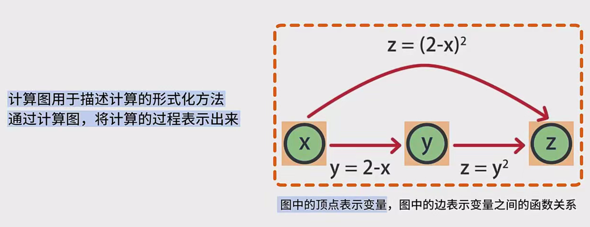
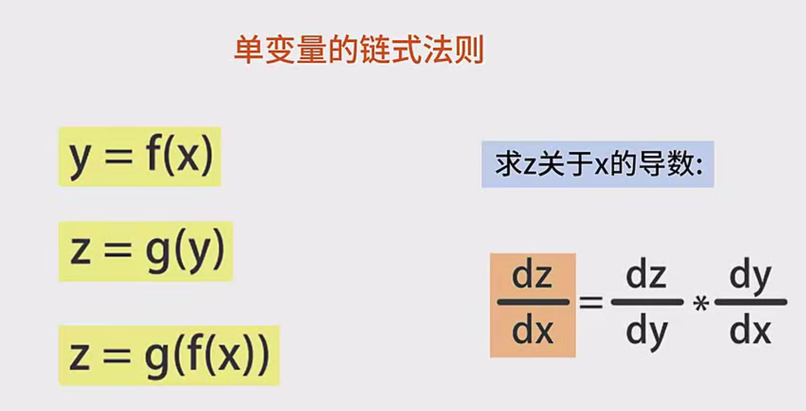
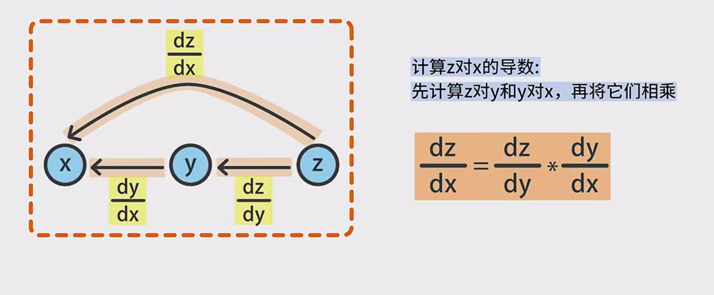
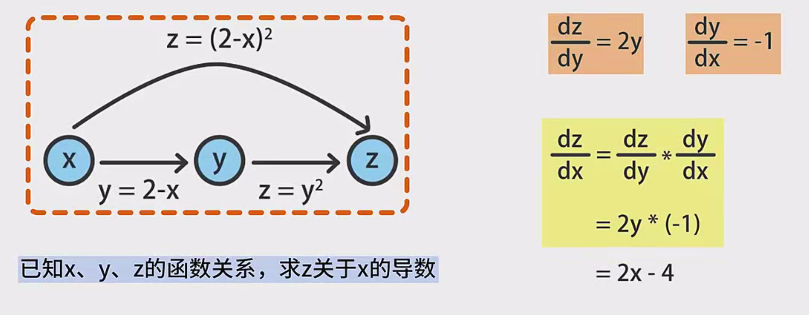
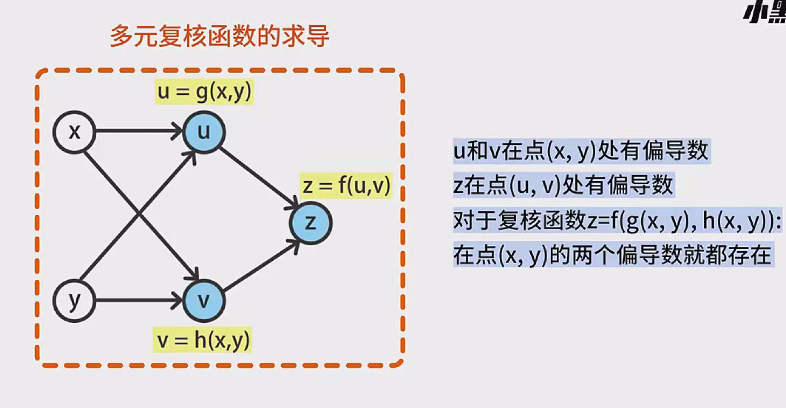
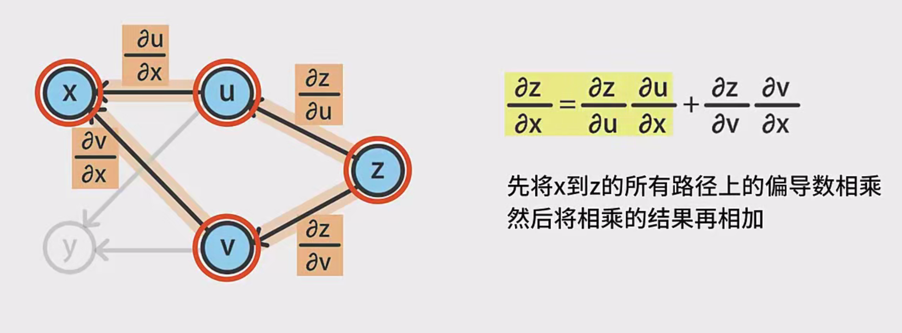
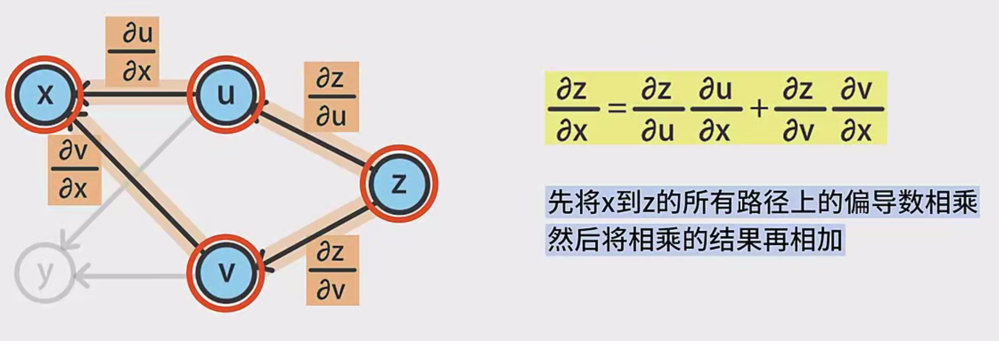
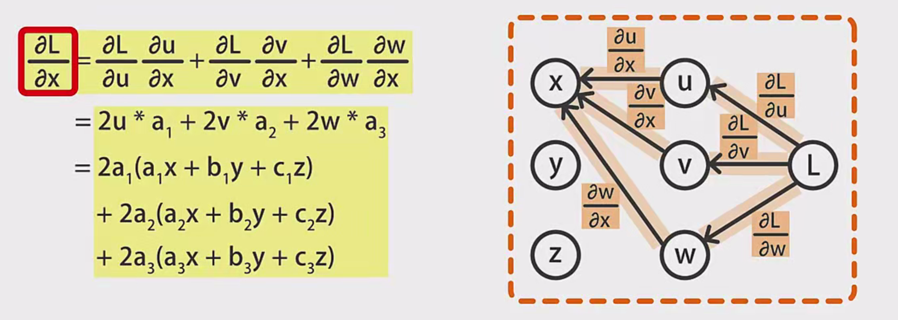

# 计算图与求导的链式法则

---

## 一、计算图的基本概念

### 1.1 定义与结构
计算图（Computational Graph）是一种用图结构表示数学运算的形式化工具。其核心要素包括：
- **节点（Vertices）**：代表**变量**（如输入x、中间变量y、输出z）或**运算操作**（如加法、乘法）。
- **边（Edges）**：表示**数据流动方向**与**函数依赖关系**，例如边`x → y`表示`y = f(x)`。
- **方向性**：构成有向无环图（DAG），确保计算顺序明确，无循环依赖。

#### 示例：简单运算的图表示
```
        +
       / \
      *   \
     / \   \
    x   y   z
```
对应计算式：`(x * y) + z`

### 1.2 特性与优势
- **可视化计算流程**：清晰展示变量间的依赖路径。
- **自动微分基础**：通过反向遍历计算梯度。
- **并行计算优化**：识别独立子图以并行执行。

---

## 二、单变量链式法则的深度解析

### 2.1 数学原理
设存在函数链：
$
y = f(x),\quad z = g(y)
$
复合函数为：
$
z = g(f(x))
$
根据链式法则：
$
\frac{dz}{dx} = \frac{dz}{dy} \cdot \frac{dy}{dx}
$

### 2.2 分步推导示例
**已知**：
$
y = \sin(x^2 + 3x),\quad z = e^y
$
**求**：$\frac{dz}{dx}$

**步骤**：
1. **中间变量导数**：
   $
   \frac{dy}{dx} = \cos(x^2 + 3x) \cdot (2x + 3)
   $
   $
   \frac{dz}{dy} = e^y = e^{\sin(x^2 + 3x)}
   $
2. **链式法则应用**：
   $
   \frac{dz}{dx} = e^{\sin(x^2 + 3x)} \cdot \cos(x^2 + 3x) \cdot (2x + 3)
   $

### 2.3 计算图表示
```
x → [平方] → x² → [加3x] → x²+3x → [sin] → y → [exp] → z
```
- **路径标注**：
  - `x → x²`边：导数 $2x$
  - `x² → x²+3x`边：导数 $1$（对x²求导）和 $3$（对3x求导）

---

## 三、多元复合函数链式法则的全面剖析

### 3.1 多变量链式法则公式
设存在函数链：
$
u = u(x,y),\quad v = v(x,y),\quad z = z(u,v)
$
则对x的偏导数为：
$
\frac{\partial z}{\partial x} = \frac{\partial z}{\partial u} \cdot \frac{\partial u}{\partial x} + \frac{\partial z}{\partial v} \cdot \frac{\partial v}{\partial x}
$

### 3.2 路径法则的详细应用
**计算图结构**：
```
        u
       ↗ ↘
      /   \
x → y → z
      \   /
       ↘ ↗
        v
```
**路径分析**：
- **路径1**：x → u → z
  - 导数乘积：$\frac{\partial u}{\partial x} \cdot \frac{\partial z}{\partial u}$
- **路径2**：x → v → z
  - 导数乘积：$\frac{\partial v}{\partial x} \cdot \frac{\partial z}{\partial v}$

**总导数**：两条路径结果相加。

### 3.3 复杂示例：多变量函数求导
**已知**：
$
u = x^2 + y,\quad v = xy,\quad z = u \cdot v
$
**求**：$\frac{\partial z}{\partial x}$

**分步计算**：
1. **中间导数**：
   $
   \frac{\partial u}{\partial x} = 2x,\quad \frac{\partial v}{\partial x} = y
   $
   $
   \frac{\partial z}{\partial u} = v = xy,\quad \frac{\partial z}{\partial v} = u = x^2 + y
   $
2. **链式法则应用**：
   $
   \frac{\partial z}{\partial x} = (xy)(2x) + (x^2 + y)(y) = 2x^2y + x^2y + y^2 = 3x^2y + y^2
   $

---

## 四、反向传播与计算图的结合

### 4.1 反向传播算法步骤
1. **前向传播**：沿计算图计算各节点值。
2. **反向累积梯度**：
   - 从输出层开始，计算损失函数对各参数的偏导数。
   - 利用链式法则将梯度逐层反向传递。

### 4.2 神经网络中的具体应用
**简单神经网络结构**：
```
输入层 → 隐藏层（权重W, 偏置b）→ 输出层（激活函数σ）→ 损失函数L
```
**梯度计算过程**：
$
\frac{\partial L}{\partial W} = \frac{\partial L}{\partial \sigma} \cdot \frac{\partial \sigma}{\partial (Wx+b)} \cdot \frac{\partial (Wx+b)}{\partial W}
$

### 4.3 自动微分的两种模式
| 模式     | 方向      | 适用场景               | 计算复杂度 |
| -------- | --------- | ---------------------- | ---------- |
| 前向模式 | 输入→输出 | 输入维度低，输出维度高 | O(n)       |
| 反向模式 | 输出→输入 | 输入维度高，输出维度低 | O(m)       |

---

## 五、综合应用：线性回归的梯度计算

### 5.1 问题描述
模型：$ \hat{y} = w \cdot x + b $  
损失函数：$ L = \frac{1}{2N}\sum_{i=1}^N (\hat{y}_i - y_i)^2 $

### 5.2 计算图构建
```
x → [乘w] → wx → [加b] → ŷ → [减y] →误差→ [平方]→ L
```

### 5.3 梯度推导
1. **对权重w的偏导**：
   $
   \frac{\partial L}{\partial w} = \frac{1}{N}\sum_{i=1}^N (\hat{y}_i - y_i) \cdot x_i
   $
2. **对偏置b的偏导**：
   $
   \frac{\partial L}{\partial b} = \frac{1}{N}\sum_{i=1}^N (\hat{y}_i - y_i)
   $

---

## 六、常见误区与注意事项

### 6.1 易错点分析
1. **路径遗漏**：在复杂计算图中忽略某些影响路径。
   - 例：计算$ z = u \cdot v $时，需同时考虑u和v对x的依赖。
2. **符号混淆**：错误使用全导数（d）与偏导数（∂）符号。
3. **隐函数处理**：当变量间存在隐式关系时，需使用隐函数求导法。

### 6.2 调试技巧
- **数值梯度检验**：比较解析梯度与数值梯度的差异。
  $
  \frac{\partial L}{\partial w} \approx \frac{L(w+\epsilon) - L(w-\epsilon)}{2\epsilon}
  $
- **计算图可视化工具**：使用TensorBoard等工具检查计算路径。

