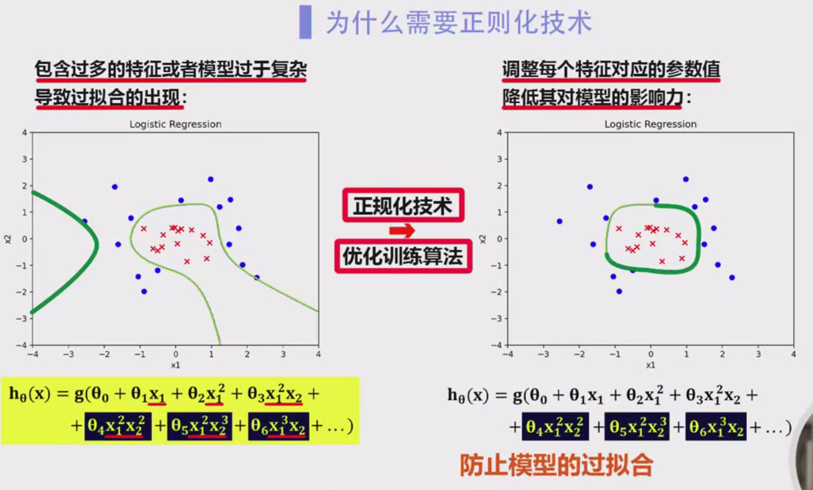
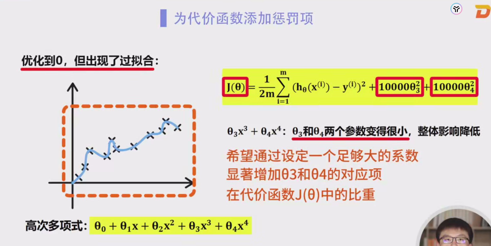
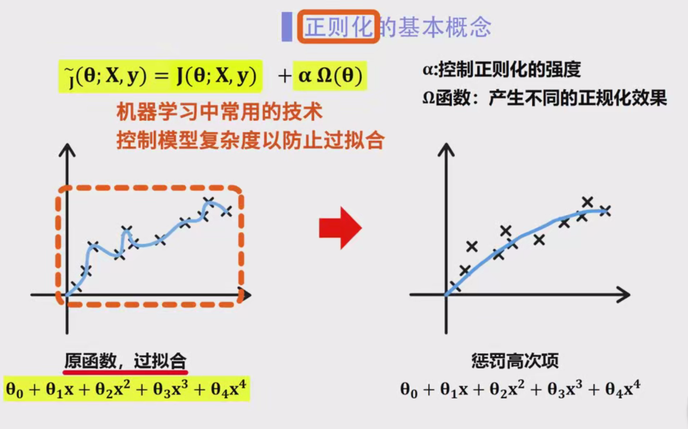
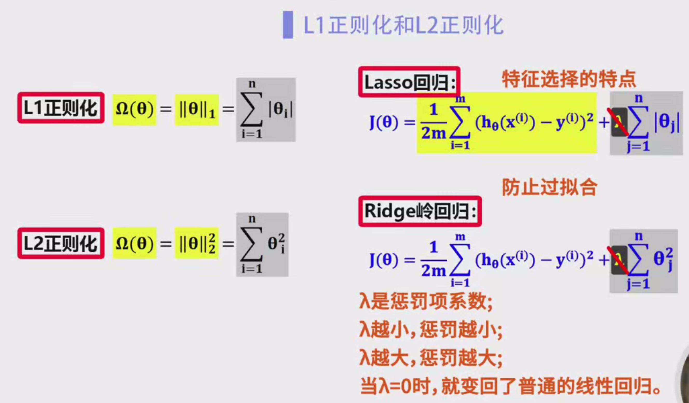
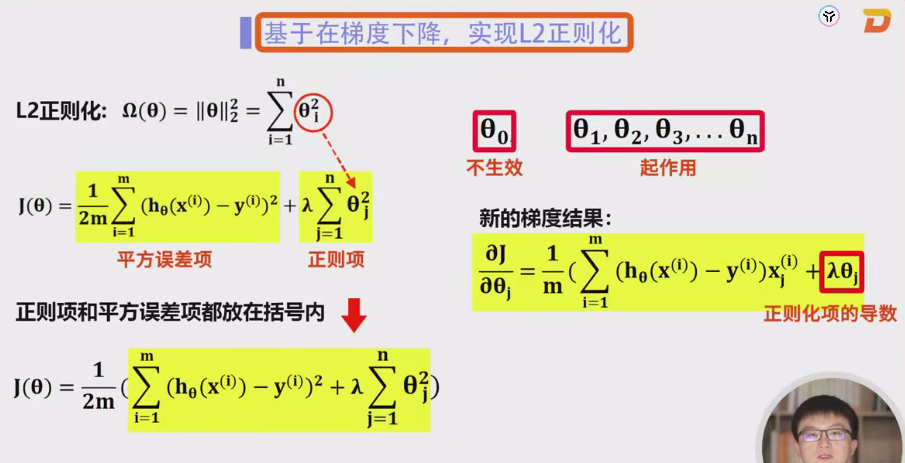
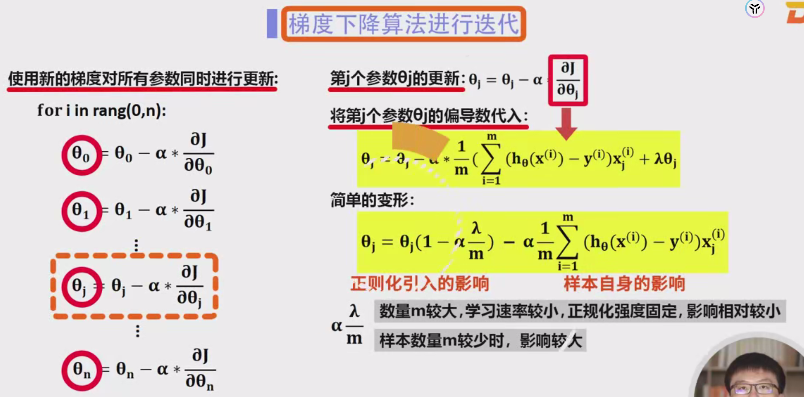

# L1和L2正则化详细笔记

### 1. 正则化的背景

在机器学习中，我们通常希望构建一个能够很好地拟合训练数据并且具有良好泛化能力的模型。过拟合（Overfitting）是机器学习中常见的问题，尤其在训练数据较少或模型过于复杂时尤为突出。

#### 1.1 过拟合的定义
过拟合指的是模型在训练集上表现得非常好，但在测试集或新数据上的表现不佳。过拟合的原因通常是模型过于复杂，过多的特征导致模型不仅学习到数据中的实际规律，还学习到训练集中的噪声。

例如，假设我们使用一个多项式回归模型进行数据拟合。如果模型的阶数过高（例如使用了高次多项式），它可能会非常精确地拟合训练数据，甚至过分贴合训练数据中的随机波动。然而，这种过度拟合会导致模型在面对新的数据时表现较差。图示来看，过拟合的模型在训练集上非常准确，但它的决策边界复杂且不适用于新数据。

#### 1.2 解决过拟合的方法

解决过拟合的一种常见方法是使用**正则化**。正则化通过向损失函数添加惩罚项，控制模型的复杂度，防止其在训练集上学习到过多的细节和噪声，从而提高模型的泛化能力。

### 2. 正则化的基本概念

正则化的基本思想是在训练过程中引入一种对模型复杂度的控制手段。具体来说，正则化在代价函数（损失函数）中添加了一个惩罚项，这个惩罚项与模型的参数有关。

假设我们有一个线性回归模型，其代价函数（无正则化）为：

$
J(\theta) = \frac{1}{2m} \sum_{i=1}^{m} (h_{\theta}(x^{(i)}) - y^{(i)})^2
$

其中，$h_{\theta}(x^{(i)}) = \theta_0 + \theta_1 x^{(i)}_1 + \theta_2 x^{(i)}_2 + \dots$ 是模型的预测结果，$y^{(i)}$是实际的输出。

为了减少过拟合，我们可以在代价函数中加入惩罚项。加入正则化后的代价函数变为：

$
J_{\text{reg}}(\theta) = \frac{1}{2m} \sum_{i=1}^{m} (h_{\theta}(x^{(i)}) - y^{(i)})^2 + \alpha \cdot \Omega(\theta)
$

其中，$\Omega(\theta)$是惩罚项，$\alpha$是正则化强度的控制参数。

### 3. L1正则化与L2正则化

常见的正则化方法有**L1正则化**和**L2正则化**，这两者都能够有效地控制模型复杂度，但它们的性质和效果不同。

#### 3.1 L1正则化
L1正则化的惩罚项是向量$\theta$的L1范数，即所有参数的绝对值之和：

$
\Omega(\theta) = \sum_{i=1}^{n} |\theta_i|
$

L1正则化的一个重要特点是，它能够自动**进行特征选择**。当某些特征对模型没有贡献时，L1正则化会将它们的参数缩小为零，从而“丢弃”这些不重要的特征，达到简化模型的效果。具体来说，L1正则化通过引入“稀疏性”，使得某些参数完全为零，从而形成稀疏解。

例如，在高维数据中，L1正则化能够有效地选择最重要的特征，忽略那些不重要的特征，这对于高维特征选择非常有用。

#### 3.2 L2正则化

L2正则化的惩罚项是向量$\theta$的L2范数，即所有参数的平方和：

$
\Omega(\theta) = \sum_{i=1}^{n} \theta_i^2
$

L2正则化通过惩罚模型中参数的大小，使得模型的参数不会过大。与L1正则化不同，L2正则化不会使参数完全为零，而是将参数缩小到较小的值。这种方式避免了模型的过拟合，但不会丢弃特征。

L2正则化在解决高多重共线性（多个特征高度相关）的问题时表现得特别好，因为它会使得相关性较强的特征的参数趋向相同的数值。

#### 3.3 L1和L2正则化的区别与结合
- **L1正则化**（Lasso回归）：具有特征选择功能，能使一些特征的系数为零，适合特征稀疏的场景。
- **L2正则化**（Ridge回归）：适合大规模数据集，可以有效地防止模型的过拟合，但不会完全剔除特征。
- **Elastic Net**：结合了L1和L2正则化的优点，既能进行特征选择，又能控制参数的大小。

### 4. 如何得到正则化的结论

正则化的引入，源于对模型复杂度的控制。为了理解为何正则化能够有效防止过拟合，我们可以从以下几个方面进行推导。

#### 4.1 在代价函数中添加惩罚项的逻辑
添加正则化惩罚项的目标是通过控制参数大小来限制模型的复杂度。当模型参数过大时，模型就可能会过度拟合训练数据；而通过惩罚项，特别是L2惩罚项，可以使得模型的参数不至于过大，避免过拟合。

#### 4.2 梯度下降中的正则化
在使用梯度下降算法优化代价函数时，我们不仅仅需要最小化模型误差，还需要控制参数的大小。正则化项使得梯度下降在每次更新时，不仅仅依据样本数据的梯度，还要考虑正则化项对参数的影响，从而有效避免过拟合。

对于L2正则化，更新规则变为：

$
\theta_j := \theta_j - \alpha \left[ \frac{1}{m} \sum_{i=1}^{m} \left( h_{\theta}(x^{(i)}) - y^{(i)} \right) x_j^{(i)} + \lambda \theta_j \right]
$

其中，$\lambda$是正则化系数，$\theta_j$是第$j$个参数，$\alpha$是学习率。

#### 4.3 正则化对过拟合的抑制作用
通过引入正则化，我们在代价函数中加入了对模型复杂度的惩罚。惩罚项控制了模型对训练数据中噪声的敏感度，从而减少了过拟合现象。具体来说，L2正则化通过减小所有参数的值来降低模型复杂度，而L1正则化则通过将不重要的特征的参数压缩为零，从而降低特征空间的维度。

### 5. 正则化的实际应用
在实际应用中，我们需要根据任务的特点选择适合的正则化方法。如果特征较多且我们怀疑一些特征是不必要的，可以考虑使用L1正则化。如果特征之间可能存在共线性问题，则L2正则化会是更好的选择。对于大多数问题，**Elastic Net**（结合了L1和L2的正则化）会是一种更为灵活的选择。

### 6. 总结
正则化是防止模型过拟合的重要手段，L1正则化和L2正则化各有特点。L1正则化能够进行特征选择，而L2正则化则能够减少参数值过大的问题。通过合理地选择正则化方法，我们能够有效地控制模型复杂度，从而提高模型的泛化能力，避免过拟合的现象。

L1正则化产生稀疏解的关键在于它对参数的“惩罚”方式，特别是它使用的是参数$\theta_i$的**绝对值**，而不是平方，这导致了不同的优化效果。让我们一步步详细解释L1正则化的特征选择作用以及为什么它会产生稀疏解。

### 1. L1正则化的惩罚项

L1正则化的惩罚项是所有模型参数绝对值的和，具体为：

$
\Omega(\theta) = \sum_{i=1}^{n} |\theta_i|
$

这个正则化项的作用是限制每个参数$\theta_i$的大小，试图将某些参数推向零。L1正则化的目标是使得代价函数最小化，而最小化的过程中会“压缩”一些不重要的参数到零，这就实现了**特征选择**。

### 2. 为什么L1正则化会产生稀疏解？

L1正则化通过对参数的绝对值进行惩罚，导致某些参数的值变为零。我们可以通过L1正则化的几何性质来理解这一现象。

- **L2正则化**（平方项）惩罚的是参数的平方，它不会使任何参数为零。相反，它倾向于缩小参数值，但它不能完全将参数压缩到零。
- **L1正则化**（绝对值项）则具有不同的几何特性。在梯度下降的过程中，L1正则化会倾向于让某些参数直接归零，因为其梯度的“角度”是不同的，参数$\theta_i$的梯度在接近零时的变化更大。

通过L1正则化，优化算法会倾向于将一些参数的值缩小到零，特别是当这些特征在预测中没有贡献时，这就是**特征选择**的过程。

### 3. 如何理解特征选择？

特征选择的核心是：L1正则化会让不重要的特征的系数变为零，因此模型不再依赖这些特征。在高维数据中，特征可能非常多，而一些特征可能对预测结果没有贡献，甚至可能是噪声。L1正则化通过将这些特征的系数推向零，从而“自动”选择了模型中最重要的特征。

例如，假设我们有10个特征，在使用L1正则化时，模型的某些特征对应的参数可能会被压缩为零。这意味着这些特征就不再对模型的预测结果产生影响，实际模型只依赖于那些参数非零的特征。这样，我们就完成了特征选择。

### 4. 代价函数的变化

如果我们在原代价函数中加入L1正则化项，那么新的代价函数会变为：

$
J_{\text{reg}}(\theta) = \frac{1}{2m} \sum_{i=1}^{m} (h_{\theta}(x^{(i)}) - y^{(i)})^2 + \alpha \sum_{i=1}^{n} |\theta_i|
$

- 在这个公式中，$\alpha$是正则化强度的控制参数，控制L1正则化项对代价函数的影响。
- 当$\alpha$较大时，惩罚项的影响较强，会迫使更多的参数趋向零；当$\alpha$较小时，模型的复杂度较高，可能会出现过拟合。

### 5. 如何理解L1正则化中的“θ=1”

你提到的“L1代价θ如果为1就是参数θ1码”可能是在询问如何理解L1正则化时，某些参数是如何被推向零的。

这里的“参数θ1码”可以理解为“参数$\theta_1$”的大小。当L1正则化作用于参数时，它会试图通过“惩罚”将不重要的参数推向零。如果某个参数对最终预测结果的影响较小，L1正则化会通过增加惩罚项的方式促使它变为零，从而去除对应特征。

假设我们有两个特征（$x_1$和$x_2$），并且在代价函数优化时，L1正则化会调整系数$\theta_1$和$\theta_2$的值。如果$x_2$对模型的预测影响很小，L1正则化会让$\theta_2$变为零，最终模型会忽略$x_2$这个特征，只依赖$x_1$。

### 6. 直观理解

- **L1正则化的稀疏性**：因为L1正则化的惩罚是基于参数绝对值的和，这使得它在优化过程中更倾向于将一些参数压缩为零，从而实现特征选择。
- **参数与特征的关系**：当某些特征在预测中无用时，L1正则化会使得它们对应的参数变为零，这样模型会自动选择那些对输出有影响的特征。

### 7. 总结

L1正则化通过对模型参数施加绝对值惩罚，使得一些参数趋近于零。这种“压缩”作用不仅有助于防止过拟合，还起到了特征选择的作用。L1正则化通过使一些不重要的特征的系数变为零，从而去除这些特征，对模型的复杂度进行控制。在高维数据中，L1正则化可以显著减少不相关特征的数量，提升模型的泛化能力。