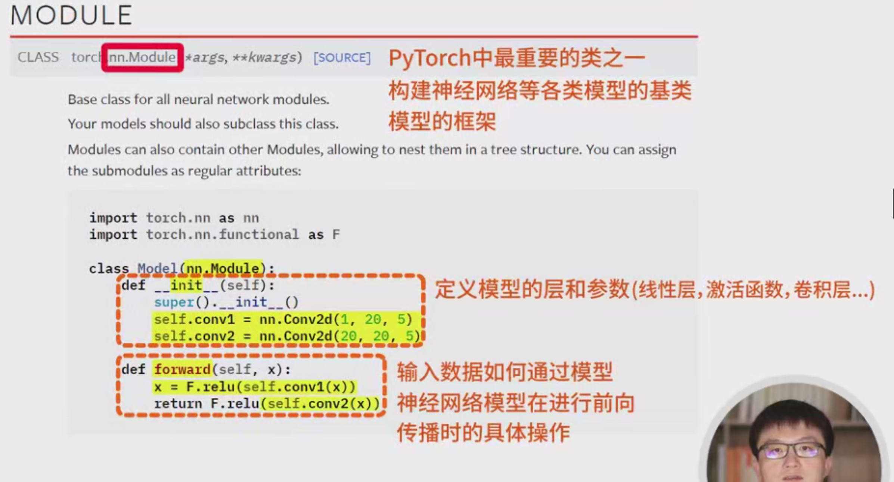
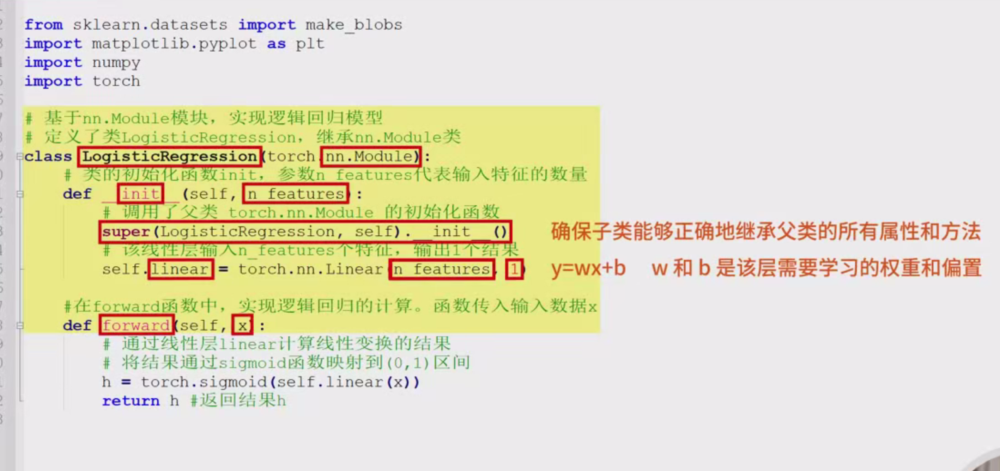
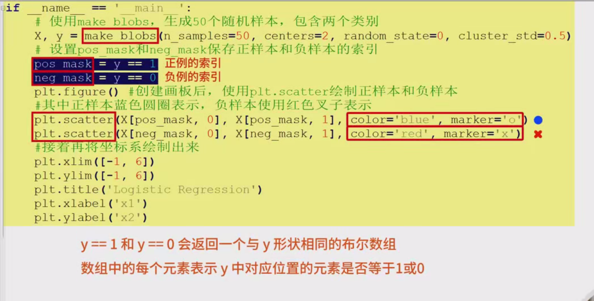
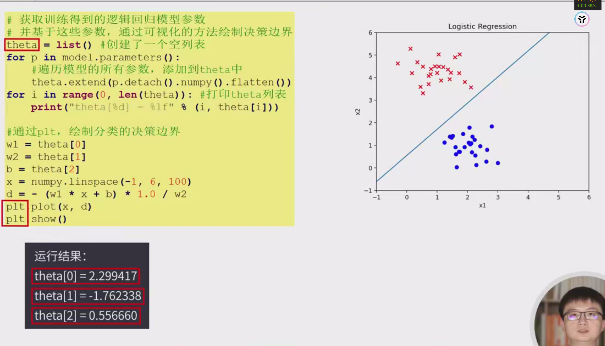

下面是Pytorch实现逻辑回归分类的详细流程笔记，适合入门学习。

### 1. **环境准备**

首先，确保你已安装了Pytorch库。如果没有安装，可以通过以下命令安装：

```bash
pip install torch torchvision
```

### 2. **导入必要的库**

```python
import torch
import torch.nn as nn
import torch.optim as optim
from sklearn.datasets import make_classification
from sklearn.model_selection import train_test_split
from sklearn.preprocessing import StandardScaler
import numpy as np
```

### 3. **数据准备**

我们使用`sklearn`生成一个简单的二分类数据集。

```python
# 生成一个简单的二分类数据集
X, y = make_classification(n_samples=1000, n_features=2, n_informative=2, n_redundant=0, random_state=42)

# 划分训练集和测试集
X_train, X_test, y_train, y_test = train_test_split(X, y, test_size=0.2, random_state=42)

# 标准化数据
scaler = StandardScaler()
X_train = scaler.fit_transform(X_train)
X_test = scaler.transform(X_test)

# 将数据转换为torch张量
X_train_tensor = torch.tensor(X_train, dtype=torch.float32)
X_test_tensor = torch.tensor(X_test, dtype=torch.float32)
y_train_tensor = torch.tensor(y_train, dtype=torch.float32).view(-1, 1)  # 转换为列向量
y_test_tensor = torch.tensor(y_test, dtype=torch.float32).view(-1, 1)
```

### 4. **定义逻辑回归模型**

逻辑回归模型其实就是一个线性模型，输出经过sigmoid函数进行二分类。

```python
class LogisticRegression(nn.Module):
    def __init__(self, input_dim):
        super(LogisticRegression, self).__init__()
        self.linear = nn.Linear(input_dim, 1)  # 输入维度到输出1维

    def forward(self, x):
        return torch.sigmoid(self.linear(x))  # Sigmoid激活函数用于二分类
```

### 5. **模型训练**

在训练过程中，我们需要定义损失函数（`Binary Cross Entropy`）和优化器（`SGD`或`Adam`）。

```python
# 定义模型
input_dim = X_train.shape[1]
model = LogisticRegression(input_dim)

# 损失函数（Binary Cross Entropy）和优化器（使用SGD）
criterion = nn.BCELoss()
optimizer = optim.SGD(model.parameters(), lr=0.01)

# 训练模型
num_epochs = 1000
for epoch in range(num_epochs):
    # 前向传播
    y_pred = model(X_train_tensor)

    # 计算损失
    loss = criterion(y_pred, y_train_tensor)

    # 反向传播
    optimizer.zero_grad()  # 清除之前的梯度
    loss.backward()

    # 更新权重
    optimizer.step()

    if (epoch+1) % 100 == 0:
        print(f'Epoch [{epoch+1}/{num_epochs}], Loss: {loss.item():.4f}')
```

### 6. **模型评估**

训练完成后，我们使用测试集来评估模型的性能。

```python
# 模型评估
with torch.no_grad():  # 评估时不需要计算梯度
    y_pred_test = model(X_test_tensor)
    y_pred_test = (y_pred_test >= 0.5).float()  # 将预测结果转为0或1

    # 计算准确率
    accuracy = (y_pred_test == y_test_tensor).float().mean()
    print(f'Accuracy: {accuracy.item():.4f}')
```

### 7. **总结与优化**

- 本文中实现了一个简单的逻辑回归模型，采用了Pytorch的神经网络模块。
- 训练过程采用了常见的交叉熵损失函数和梯度下降优化器。
- 在实际应用中，可能需要进一步优化模型（如调整学习率、采用其他优化器等）。

### 8. **扩展**

- 可以根据实际需求调整模型的输入特征数量、增加数据预处理（如正则化、归一化等）。
- 可尝试使用不同的优化器（如Adam）来提高收敛速度和性能。

