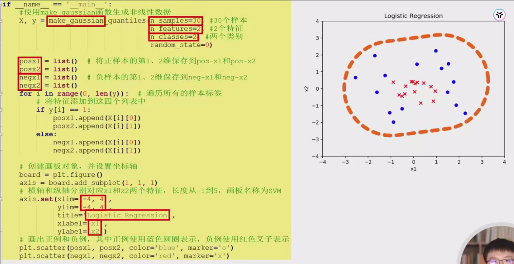
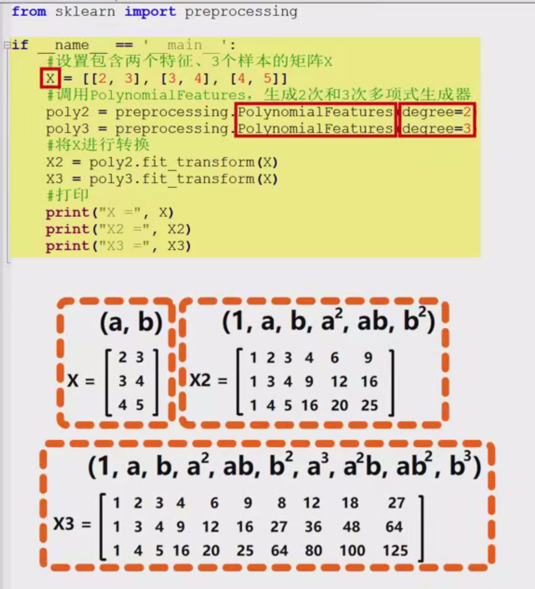
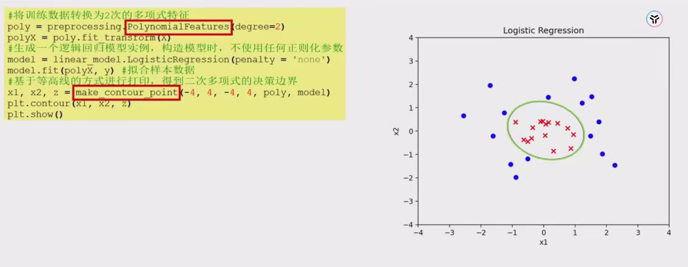
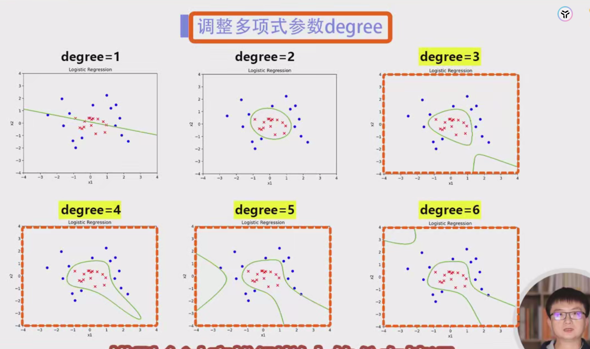
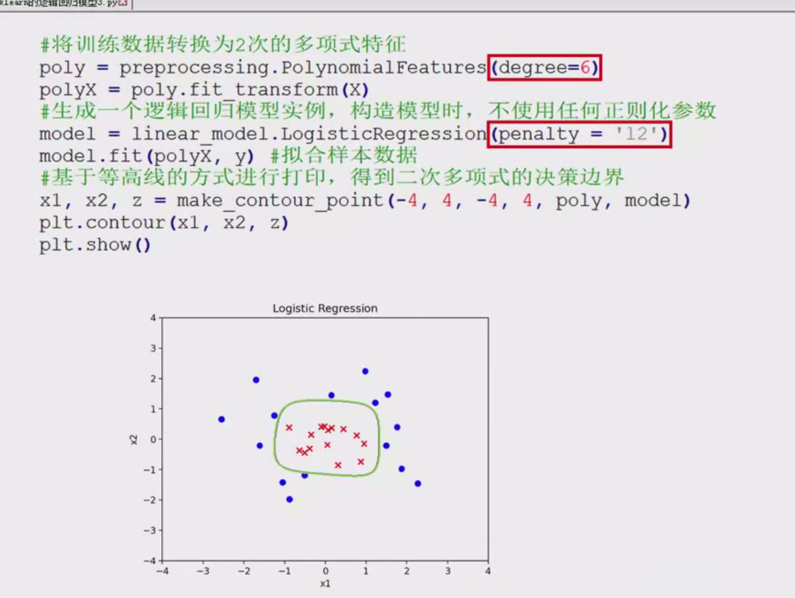
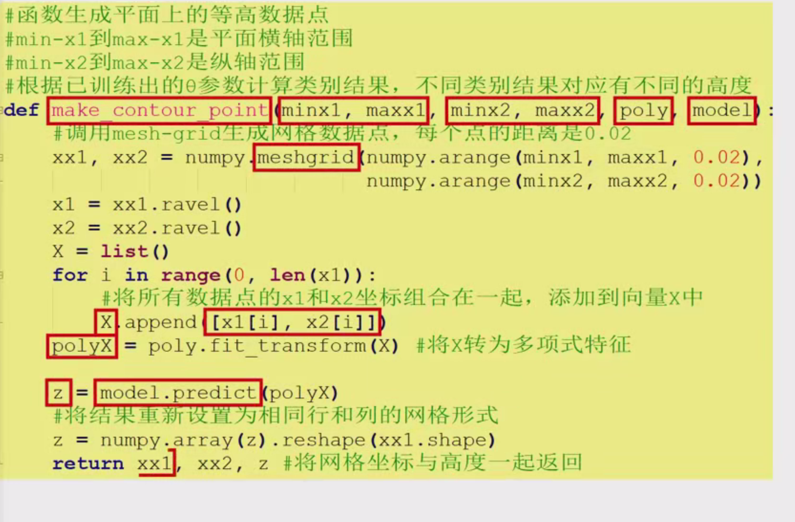

### 实验内容与步骤

#### 1. **生成训练数据**

- 首先，使用 `make_gaussian` 函数生成模拟的非线性数据。数据包括30个样本，每个样本有两个特征，分为两个类别。

  - `x`：训练数据特征矩阵。
  - `y`：训练数据标签，值为0或1，代表两个类别。
  - 通过生成的数据，你可以获得散布在二维平面上的样本点，呈现出明显的非线性分布。

  **代码示例：**

  ```python
  from sklearn.datasets import make_classification
  
  # 生成模拟的二分类数据
  x, y = make_classification(n_samples=30, n_features=2, n_informative=2, n_clusters_per_class=1)
  ```

#### 2. **可视化数据分布**

- 使用 `matplotlib` 来绘制数据点。

- 设置横轴和纵轴分别对应 `x1` 和 `x2` 特征，绘制正类样本和负类样本。

  - 正样本用蓝色圆圈表示，负样本用红色叉表示。

  **代码示例：**

  ```python
  import matplotlib.pyplot as plt
  
  plt.scatter(x[:, 0], x[:, 1], c=y, cmap=plt.cm.Paired)
  plt.xlabel('Feature 1 (x1)')
  plt.ylabel('Feature 2 (x2)')
  plt.title('Data Distribution')
  plt.show()
  ```

  观察数据时，会发现数据点呈现出非线性分布，符合实验设计的目标。

#### 3. **构造多项式特征**

- 为了更好地拟合非线性数据，我们使用 `PolynomialFeatures` 来扩展特征，将数据从二维特征扩展到更高维度的多项式特征。具体来说，可以选择不同的多项式次数（degree），从而生成更复杂的特征。

  - **二次多项式（degree=2）** 会生成6项特征（包括常数项、线性项、二次项）。
  - **三次多项式（degree=3）** 会生成10项特征。

  **代码示例：**

  ```python
  from sklearn.preprocessing import PolynomialFeatures
  
  # 生成二次多项式特征
  poly = PolynomialFeatures(degree=2)
  x_poly_2 = poly.fit_transform(x)
  print(x_poly_2)
  
  # 生成三次多项式特征
  poly = PolynomialFeatures(degree=3)
  x_poly_3 = poly.fit_transform(x)
  print(x_poly_3)
  ```

  - `x_poly_2` 为经过二次多项式特征转换后的数据，`x_poly_3` 为经过三次多项式特征转换后的数据。
  - 可以看到，数据维度增加，并且多项式特征中包含了高次项。

#### 4. **训练逻辑回归模型**

- 使用 **逻辑回归** 来拟合数据，并通过训练得到模型。

  - 这里，我们在没有正则化的情况下，先进行简单的逻辑回归拟合。
  - 创建逻辑回归模型时，设置 `max_iter` 参数来保证收敛。

  **代码示例：**

  ```python
  from sklearn.linear_model import LogisticRegression
  
  # 创建逻辑回归模型
  model = LogisticRegression(max_iter=1000)
  
  # 拟合数据
  model.fit(x_poly_2, y)
  ```

#### 5. **绘制决策边界**

- 为了更好地理解模型的分类效果，我们需要绘制 **决策边界**。可以通过 `make_control_point` 函数来实现，该函数利用等高线图显示不同区域的分类结果。

  **生成等高线决策边界的步骤**：

  1. 使用 `meshgrid` 生成一个网格范围的数据点。
  2. 将网格数据点转换为多项式特征。
  3. 使用训练好的逻辑回归模型对网格数据点进行预测。
  4. 绘制等高线图，显示不同类别的区域。

  **代码示例：**

  ```python
  import numpy as np
  from matplotlib.colors import ListedColormap
  
  # 创建网格数据点
  x_min, x_max = x[:, 0].min() - 1, x[:, 0].max() + 1
  y_min, y_max = x[:, 1].min() - 1, x[:, 1].max() + 1
  xx, yy = np.meshgrid(np.arange(x_min, x_max, 0.1), np.arange(y_min, y_max, 0.1))
  
  # 将网格数据转为多项式特征
  Z = model.predict(poly.transform(np.c_[xx.ravel(), yy.ravel()]))
  Z = Z.reshape(xx.shape)
  
  # 绘制决策边界
  plt.contourf(xx, yy, Z, alpha=0.75, cmap=ListedColormap(['blue', 'red']))
  plt.scatter(x[:, 0], x[:, 1], c=y, edgecolors='k', marker='o')
  plt.title('Decision Boundary')
  plt.show()
  ```

#### 6. **调整多项式特征的次数**

- 我们通过调整多项式的次数（degree）来观察模型的拟合情况。

  - **degree = 1**：模型仅使用原始特征进行训练，无法有效拟合非线性数据。
  - **degree ≥ 3**：模型会开始过拟合训练数据，决策边界会变得过于复杂，甚至会偏离样本分布。

  观察不同 `degree` 值时，决策边界的变化：

  - `degree = 1`：决策边界呈现线性形状，未能充分拟合数据。
  - `degree = 3`：决策边界开始呈现复杂的非线性形状，出现过拟合。
  - `degree = 50`：过度复杂的决策边界，与样本数据不匹配，模型出现严重过拟合。

#### 7. **引入正则化**

- 为了避免过拟合问题，可以引入 **L2 正则化**。在逻辑回归模型中，L2 正则化通过 `penalty='l2'` 来实现，限制模型的复杂度，使其不至于过度拟合训练数据。

- 调整 `C` 参数来控制正则化强度，`C` 值越小，正则化效果越强。

  **代码示例：**

  ```python
  model = LogisticRegression(penalty='l2', C=1, max_iter=1000)
  model.fit(x_poly_2, y)
  ```

  - 在使用 L2 正则化后，即使将多项式次数设置为较高值（如 `degree=6`），模型依然能够避免过拟合，生成合理的决策边界。

#### 8. **优化决策边界绘制**

- 再次使用 `make_control_point` 函数绘制带有 L2 正则化的决策边界。

  - 通过正则化，模型生成的决策边界会相对平滑，不再出现过度拟合的现象。

  **代码示例：**

  ```python
  model = LogisticRegression(penalty='l2', C=1, max_iter=1000)
  model.fit(x_poly_2, y)
  
  Z = model.predict(poly.transform(np.c_[xx.ravel(), yy.ravel()]))
  Z = Z.reshape(xx.shape)
  
  plt.contourf(xx, yy, Z, alpha=0.75, cmap=ListedColormap(['blue', 'red']))
  plt.scatter(x[:, 0], x[:, 1], c=y, edgecolors='k', marker='o')
  plt.title('Regularized Decision Boundary')
  plt.show()
  ```

### 实验总结

1. **多项式特征扩展**：
   - 使用 `PolynomialFeatures` 可以将原始数据扩展为更高维的特征，从而捕捉到非线性关系。
   - 高次多项式特征可能导致过拟合，需谨慎使用。
2. **过拟合问题**：
   - 随着多项式次数增加，模型容易产生过拟合。通过正则化（L2正则化）可以有效防止过拟合，提高模型泛化能力。
3. **正则化的作用**：
   - L2 正则化通过 `penalty='l2'` 和调整 `C` 参数控制正则化强度，避免过拟合，生成平滑的决策边界。

1. 决策边界可视化
   - 通过等高线图展示不同参数下的决策边界，有助于理解模型的分类效果及其变化。

