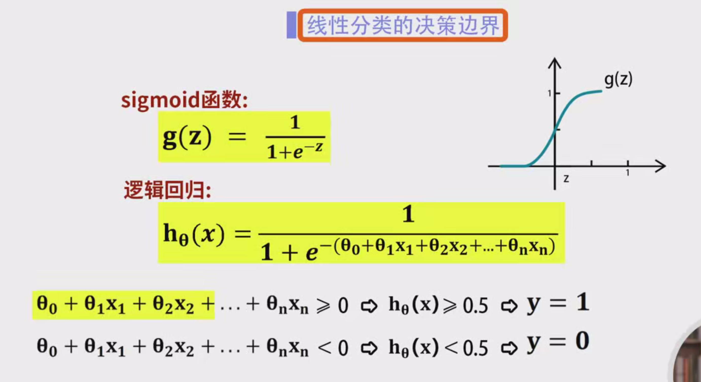
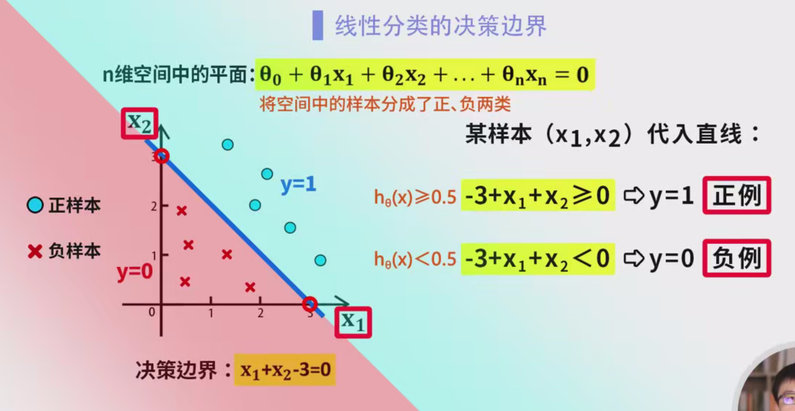
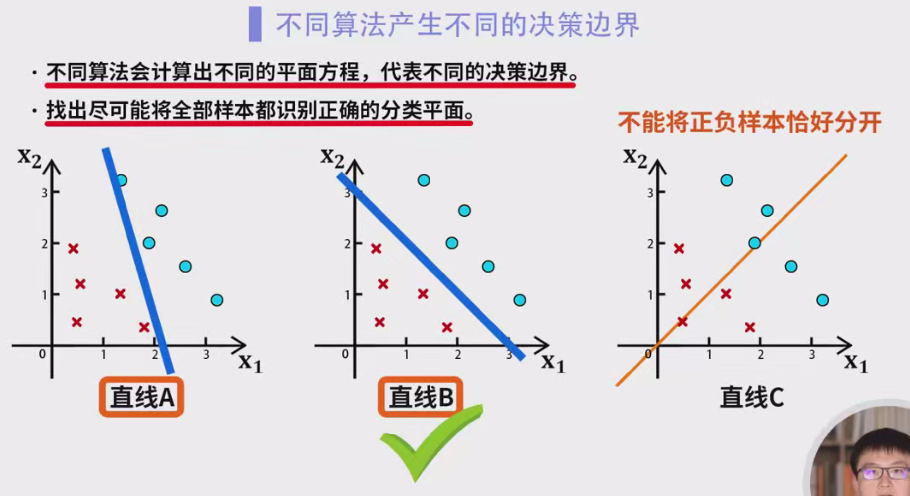
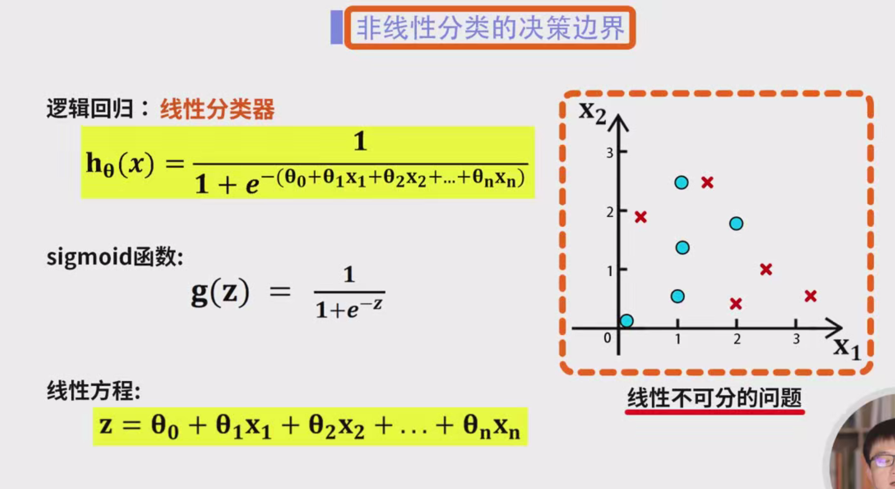
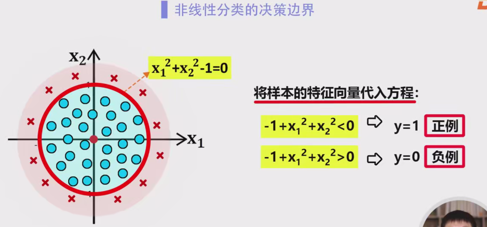
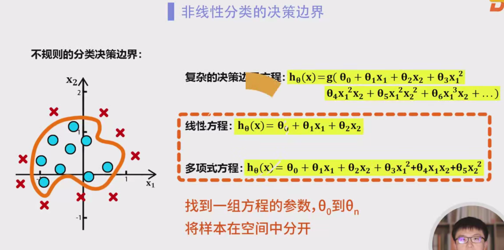

### 分类问题的决策边界

#### 1. **什么是决策边界（Decision Boundary）？**

   **决策边界**是机器学习分类模型中一个至关重要的概念。它定义了哪些输入数据属于某个类别，哪些属于另一个类别。在分类任务中，决策边界将特征空间划分为不同的区域，每个区域对应一个类别。分类模型通过学习决策边界来预测新样本的类别。

   - **线性决策边界**：表示通过一个简单的线性方程（例如直线、平面）来分割数据。
   - **非线性决策边界**：表示通过更复杂的曲线或其他非线性形式来分割数据。

#### 2. **线性分类的决策边界**

   **线性分类问题**的决策边界通常是一个直线（在二维空间）或超平面（在多维空间）。我们用一个线性方程来表示这种决策边界。

   例如，逻辑回归模型的假设函数是：
   $
   h_\theta(x) = \frac{1}{1 + e^{-\theta^T x}}
   $
   其中，$ x = [x_1, x_2, ..., x_n] $ 是特征向量，$ \theta $ 是模型的参数向量。模型的目标是通过调整 $ \theta $ 来找到最佳的决策边界。

   **决策边界**是使得假设函数 $ h_\theta(x) = 0.5 $ 的点，即：
   $
   \theta_0 + \theta_1 x_1 + \theta_2 x_2 + \dots + \theta_n x_n = 0
   $
   这个方程描述了一个 **超平面**，在二维空间中，超平面变成了一条 **直线**。

   #### 2.1 **二维线性分类的例子**

   假设我们有两个特征 $ x_1 $ 和 $ x_2 $，并且我们希望用直线来分隔数据。我们可以构造以下的线性决策边界方程：
   $
   x_1 - x_2 = 0
   $
   这表示一条直线，所有样本点位于这条直线的两侧。具体地：
   - 如果 $ x_1 - x_2 > 0 $，则预测为类别 1（正样本）。
   - 如果 $ x_1 - x_2 < 0 $，则预测为类别 0（负样本）。

   **图示：**

   ```
   x2 ^
       |
       |    o       o       o   
       | o     o     o    o
       |________________________> x1
             x   x   x  x
   ```

   在这个图中：
   - 圆圈 (`o`) 表示正样本，叉号 (`x`) 表示负样本。
   - 直线 $ x_1 - x_2 = 0 $ 将数据分成了两类。这个决策边界将正负样本分开。

   **关键点**：
   - **线性决策边界**：是由方程 $ \theta^T x = 0 $ 定义的，在二维空间中是直线，在三维空间中是平面，维度更高时是超平面。
   - **直线的性质**：在二维空间中，线性决策边界会是直线，任何线性分类问题都可以用直线来描述。

   #### 2.2 **决策边界的最优选择**

   即使可以通过直线分开正负样本，决策边界的选择也并非唯一。不同的线性方程可以产生不同的直线，而一些直线可能更好地将正负样本分开，减少误分类。

   **例子**：
   - 假设我们有两条直线 $ L_a $ 和 $ L_b $，虽然它们都能够分开正负样本，但它们的效果不同：
     - 直线 $ L_a $ 将正负样本分开，但与样本的距离较近，容易受到噪音数据的影响。
     - 直线 $ L_b $ 距离正负样本的边缘更远，意味着它对新数据点的判断更稳定，具有更好的泛化能力。

   **图示：**

   ```
   x2 ^
       |
       |    o    L_a    o
       |    o    |    o
       |-------------------------> x1
             L_b
   ```

   这里，直线 $ L_b $ 较 $ L_a $ 更远离样本，更稳定，通常更理想。

#### 3. **非线性分类的决策边界**







   对于一些线性不可分的数据，我们需要使用 **非线性决策边界**。这时，分类器通过更复杂的方程来区分不同的类别，决策边界不再是直线，而可能是曲线或其他不规则的形状。

   **非线性决策边界的例子**：

   假设我们有一组数据，其中正样本位于圆形区域内，负样本位于圆外。我们可以通过圆的方程来定义决策边界：
   $
   x_1^2 + x_2^2 - 1 = 0
   $
   该方程描述了一个圆形，圆心在原点，半径为 1。

   **图示：**

   ```
   x2 ^
       |
       |          o    o     o
       |     o               o    o
       |  o                       o
       |     o               o    o
       |          o    o     o
       |________________________> x1
   ```

   - 这里，正样本位于圆内，负样本位于圆外。
   - 圆的方程 $ x_1^2 + x_2^2 - 1 = 0 $ 作为决策边界，将正负样本准确分开。

   **决策规则**：
   - 如果 $ x_1^2 + x_2^2 - 1 < 0 $，则预测为正样本。
   - 如果 $ x_1^2 + x_2^2 - 1 > 0 $，则预测为负样本。

#### 4. **高维空间中的非线性决策边界**

   对于复杂的数据集，决策边界可能变得更加复杂，超出圆形或简单曲线的范围。对于这些复杂问题，可以使用更高次的多项式方程，甚至使用 **神经网络**、**支持向量机** 等方法来学习复杂的决策边界。

   **图示**：
   - 在三维空间中，决策边界不再是直线，而是平面或复杂曲面。
   - 在更高维空间中，决策边界可以是一个复杂的超曲面。

#### 5. **总结**

   - **线性决策边界**：在二维空间中是直线，在更高维空间中是超平面，适用于线性可分的分类问题。
   - **非线性决策边界**：适用于线性不可分的问题，可以是圆形、椭圆、曲线等复杂形状。
   - **最优决策边界**：在分类问题中，目标是找到能够最大化分类准确度的决策边界，通常通过优化算法（如梯度下降）来寻找最佳参数。
