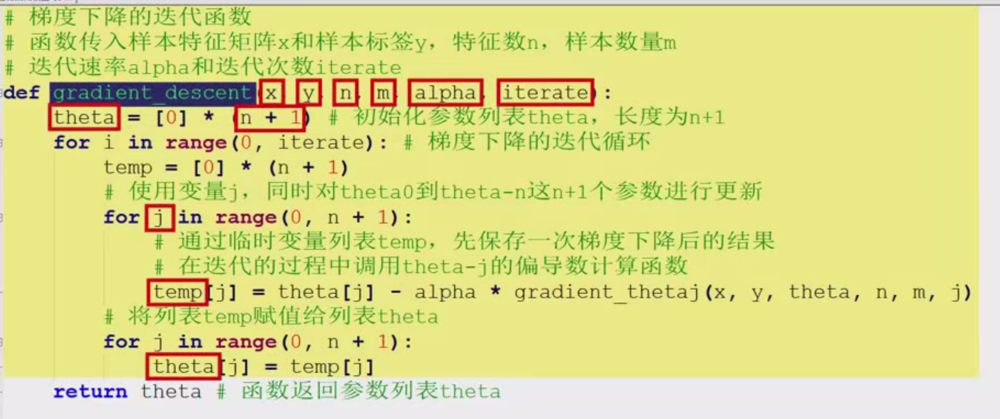
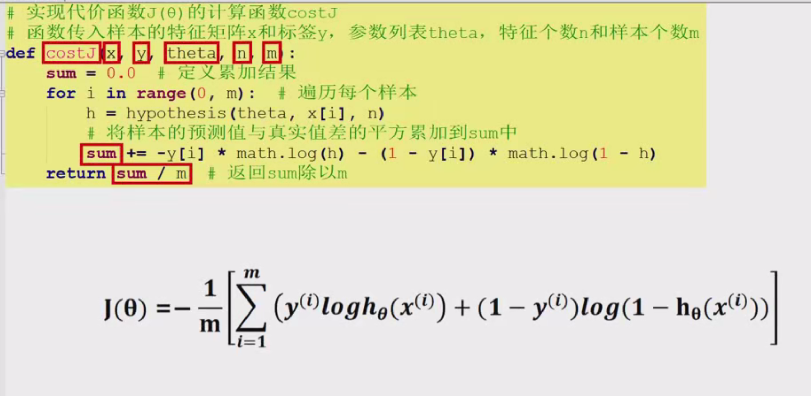

### 一、实验目的

- 理解逻辑回归算法原理，掌握逻辑回归算法框架。
- 理解逻辑回归的sigmoid函数。
- 理解逻辑回归的损失函数。
- 针对特定应用场景及数据，能应用逻辑回归算法解决实际分类问题。

### 二、实验内容

#### 1. 编写假设函数h_theta的计算函数

Python复制

```python
import numpy as np

def hypothesis(theta, x, n):
    h = 0
    for i in range(n):
        h += theta[i] * x[i]
    return 1 / (1 + np.exp(-h))
```

该函数传入参数theta、样本特征向量x和特征的个数n，在函数中定义h保存预测结果，通过循环将theta[i]和x[i]的乘积累加到h中，最后返回sigmoid(h)的计算结果。

#### 2. 实现j_theta关于theta_j的偏导数计算函数

Python复制

```python
def gradient(theta, x, y, j, n, m):
    sum = 0
    for i in range(m):
        h = hypothesis(theta, x[i], n)
        sum += (h - y[i]) * x[i][j]
    return sum / m
```

函数传入样本特征矩阵x、标记y、特征的参数列表theta、特征数n、样本数量m和带求偏导数的参数下标j。在函数中，定义变量sum保存求和累加的结果，遍历每个样本，调用hypothesis函数求出样本的预测值h，然后计算预测值与真实值的差，再乘以第i个样本的第j个特征值x[i][j]，将结果累加到sum，最后函数返回累加结果sum除以样本的个数m。

#### 3. 实现梯度下降的迭代函数gradient_descent

Python复制

```python
def gradient_descent(x, y, n, m, alpha, iterate):
    theta = np.zeros(n + 1)
    for _ in range(iterate):
        temp = np.zeros(n + 1)
        for j in range(n + 1):
            temp[j] = theta[j] - alpha * gradient(theta, x, y, j, n, m)
        theta = temp
    return theta
```

函数传入样本特征矩阵x、样本标签y、特征数n、样本数量m、迭代速率alpha和迭代次数iterate。在迭代前，初始化参数列表theta长度为n+1，然后进入梯度下降的迭代循环，每次都使用变量j同时对theta[0]到theta[n]这n+1个参数进行更新。在同时更新的过程中，需要通过临时变量列表temp先保存一次梯度下降后的结果，然后再将列表temp赋值给列表theta，在迭代的过程中，需要调用gradient函数计算theta[j]的偏导数，完成计算后，函数返回参数列表theta。

#### 4. 实现代价函数的计算函数cost_j

Python复制

```python
def cost_j(x, y, theta, n, m):
    sum = 0
    for i in range(m):
        h = hypothesis(theta, x[i], n)
        sum += y[i] * np.log(h) + (1 - y[i]) * np.log(1 - h)
    return -sum / m
```

函数传入样本的特征矩阵x和标签y、参数列表theta、特征个数n和样本个数m。在函数中遍历每个样本，先计算出样本的预测值，然后代入公式，将结果累加到sum中，最后，返回sum÷m。

### 三、逻辑回归迭代的可视化实验

#### 1. 生成数据并绘制样本

Python复制

```python
from sklearn.datasets import make_blobs
import matplotlib.pyplot as plt

# 生成数据
x, y = make_blobs(n_samples=50, centers=2, random_state=0, cluster_std=0.5)
pos_ex1, pos_ex2 = [], []
neg_ex1, neg_ex2 = [], []
for i in range(len(y)):
    if y[i] == 0:
        neg_ex1.append(x[i][0])
        neg_ex2.append(x[i][1])
    else:
        pos_ex1.append(x[i][0])
        pos_ex2.append(x[i][1])

# 绘制样本
plt.scatter(pos_ex1, pos_ex2, marker='o', c='b', label='Positive')
plt.scatter(neg_ex1, neg_ex2, marker='x', c='r', label='Negative')
plt.xlabel('Feature 1')
plt.ylabel('Feature 2')
plt.title('Logistic Regression')
plt.legend()
plt.show()
```

在make_blobs函数中，n_samples代表样本数量设置为50，centers代表聚类中心点的个数即类别标签的数量设置为2，random_state是随机种子将其固定为零，这样每次运行都会生成相同的数据，clusters_std是每个类别中样本的方差，方差越大，说明样本越离散，这里设置为0.5。然后将正样本的第一、二位保存到pos_ex1、pos_ex2，负样本的第一、二位保存到neg_ex1、neg_ex2，遍历所有的样本标签，将特征添加到这四个列表中。接着创建画板对象并设置坐标轴，横轴和纵轴分别对应x1、x2两个特征，长度从负一到六，画板名为logistic regression，调用plt.scatter画出正例和负例，其中正例使用蓝色圆圈表示，负例使用红色叉子表示。

#### 2. 进行模型迭代并绘制决策边界

Python复制

```python
# 设置参数
m = len(y)
n = 2
alpha = 0.1
iterate = 1000

# 添加偏移特征
x = np.c_[np.ones((m, 1)), x]

# 调用梯度下降算法
theta = gradient_descent(x, y, n, m, alpha, iterate)

# 计算代价值
cost = cost_j(x, y, theta, n, m)
print("Cost:", cost)

# 绘制决策边界
x1 = np.linspace(-1, 6, 100)
x2 = -(theta[0] + theta[1] * x1) / theta[2]
plt.scatter(pos_ex1, pos_ex2, marker='o', c='b', label='Positive')
plt.scatter(neg_ex1, neg_ex2, marker='x', c='r', label='Negative')
plt.plot(x1, x2, 'g', label='Decision Boundary')
plt.xlabel('Feature 1')
plt.ylabel('Feature 2')
plt.title('Logistic Regression with Decision Boundary')
plt.legend()
plt.show()
```

设置m保存样本个数，n保存特征个数，alpha为迭代速率，iterate是迭代次数，然后将生成的特征向量x添加一列1作为偏移特征。调用梯度下降算法迭代出分界平面并计算代价值，运行程序后可以看到迭代得到的theta与cost的值。最后，根据迭代出的模型参数，使用linspace在负一到六之间构建间隔相同的100个点，将这100个点带入到分类的决策边界中计算纵坐标x2并进行绘制，运行程序后，会画出正负样本的蓝色分界线。

