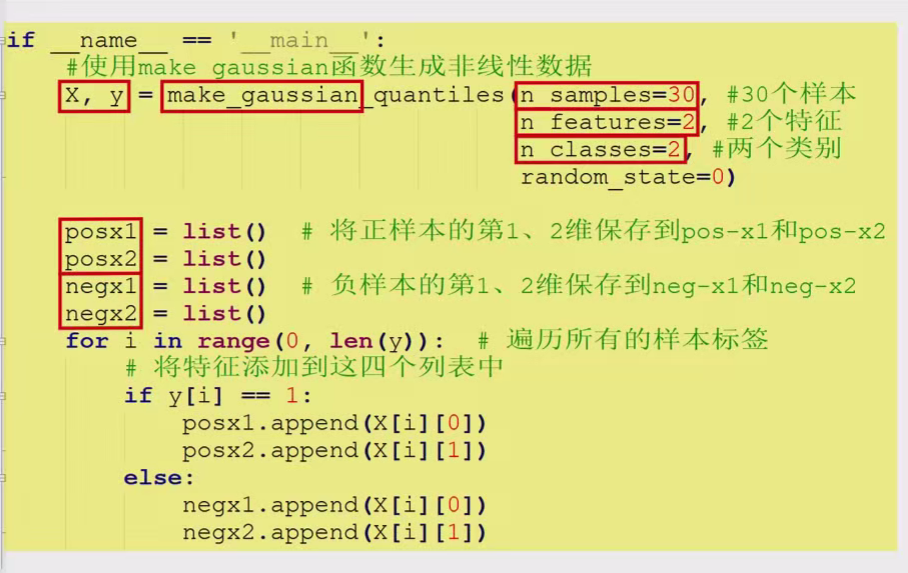
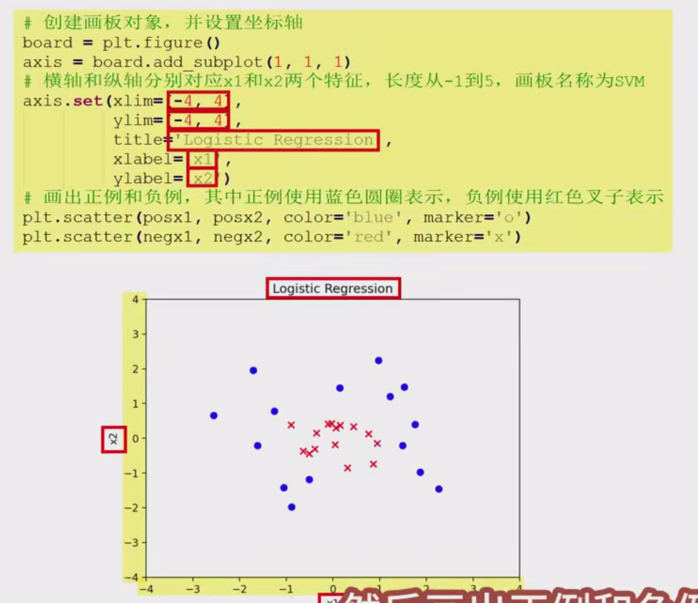
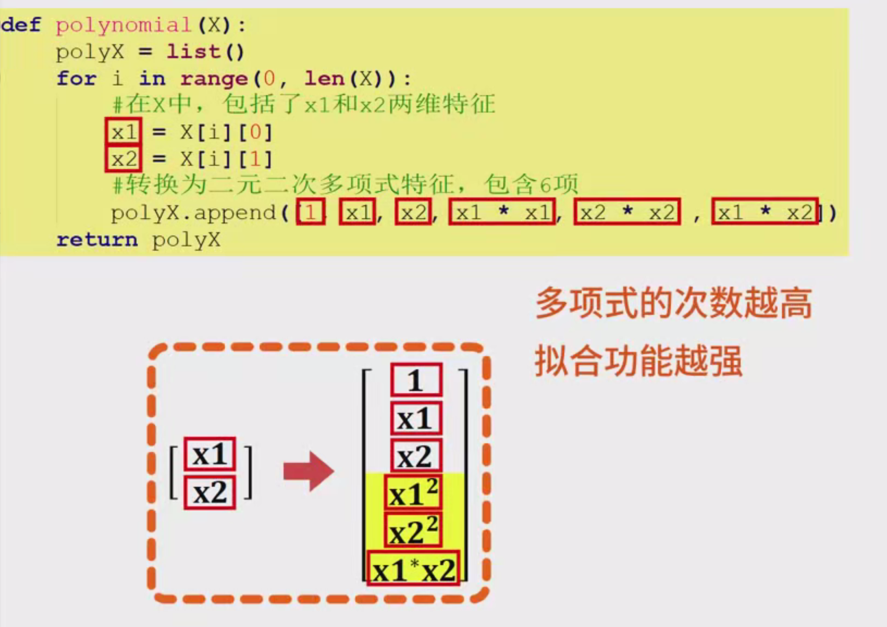
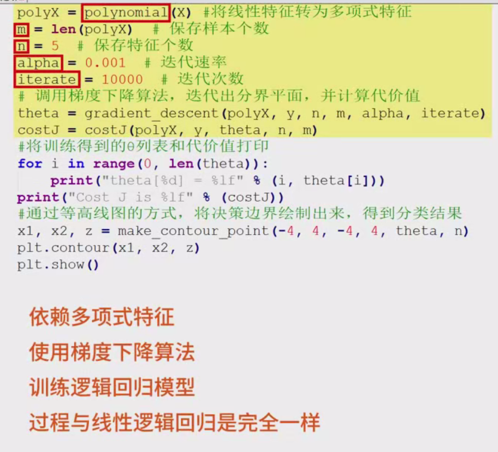
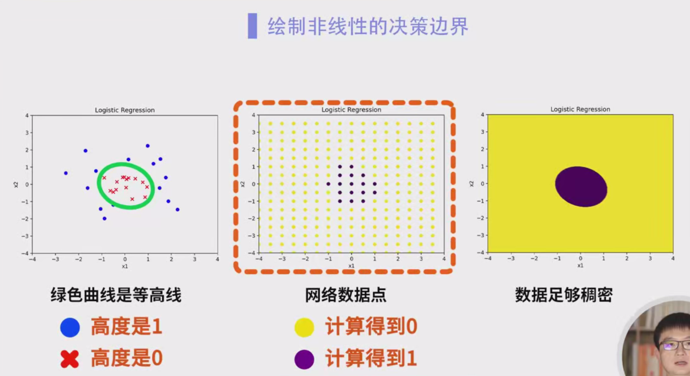
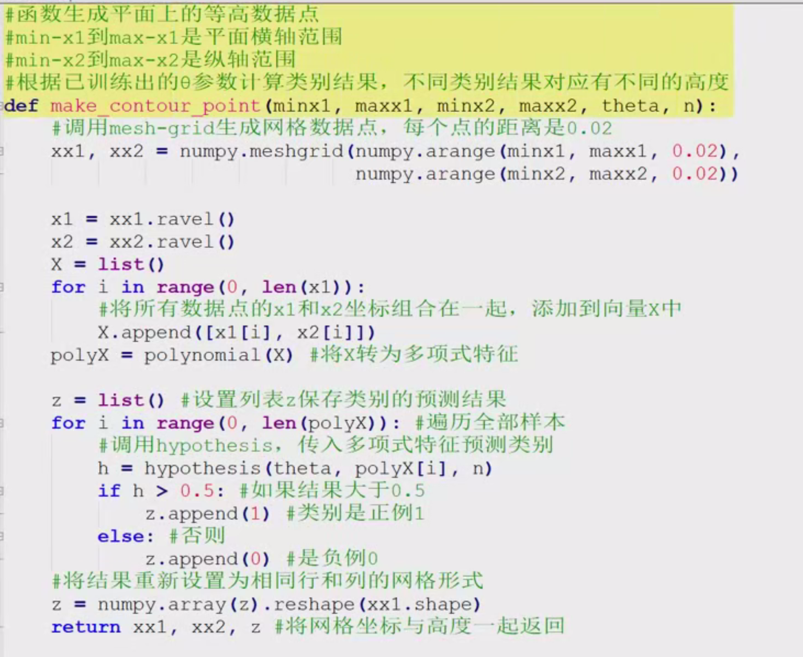
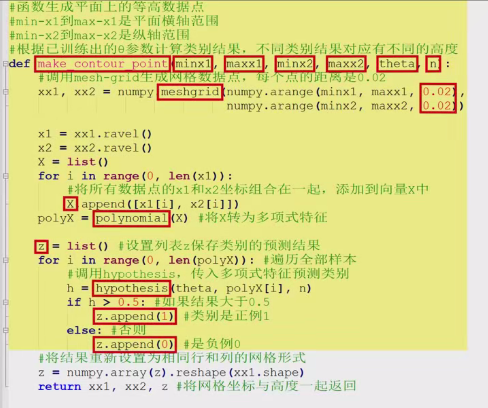
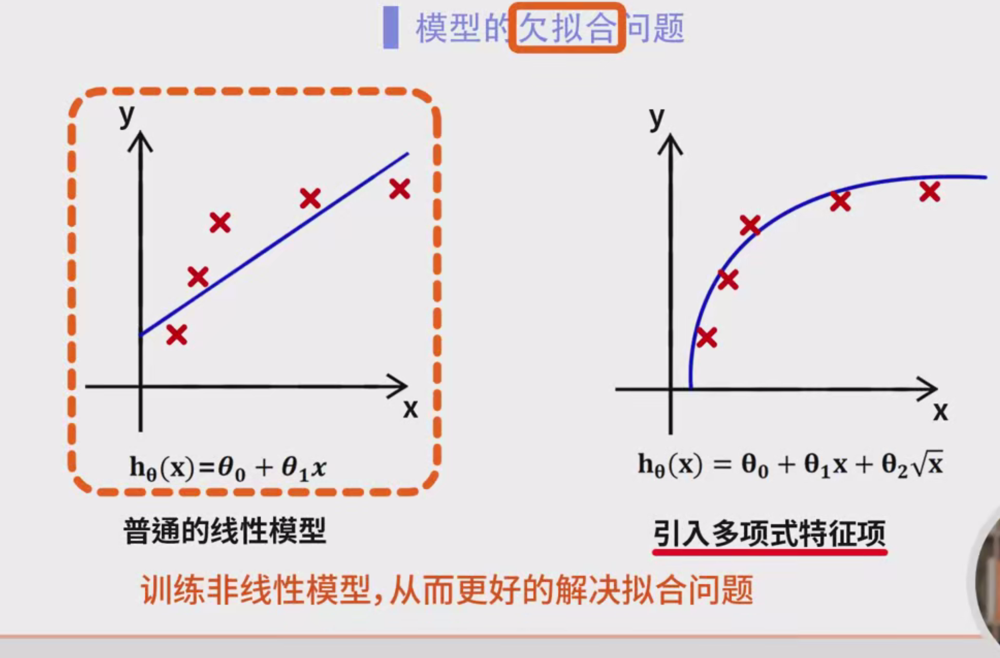
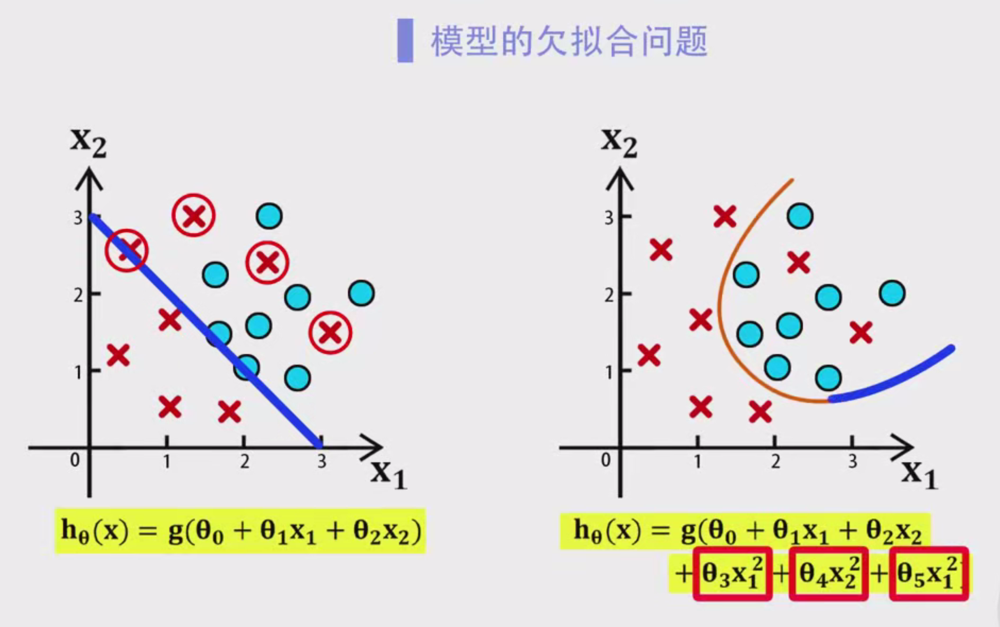
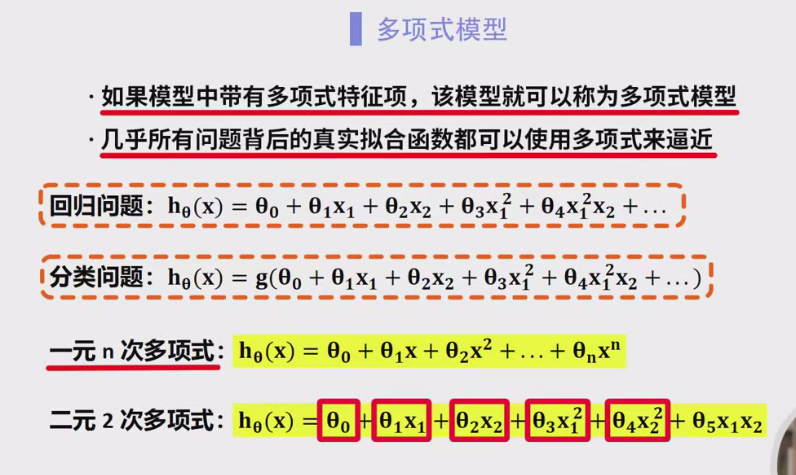

 









### 多项式特征的背景介绍






#### 2. 机器学习中的应用背景

在机器学习中，多项式特征是一种常用的特征工程方法，特别是在处理线性模型时。线性模型（如线性回归、逻辑回归等）在处理非线性数据时可能会出现欠拟合的情况。通过引入多项式特征，可以将线性模型扩展到非线性模型，从而更好地拟合数据。例如，在房价预测问题中，房子的价格与面积之间的关系并非严格的线性关系，仅使用线性模型可能无法准确预测房价。此时，引入多项式特征可以有效解决这一问题。

#### 3. 多项式特征的具体应用场景

- **线性模型**：对于线性模型（如线性回归、逻辑回归等），多项式特征可以扩展特征空间，使其能够拟合非线性数据。
- **特征工程**：在机器学习中，特征工程是提高模型性能的关键步骤之一。多项式特征是一种常用的特征工程方法。
- **图像处理**：在计算机视觉领域，多项式特征可以用于图像特征提取。通过对预处理后的图像进行多项式函数的拟合，提取图像的特征信息，然后对特征向量进行归一化处理，以便进行后续的图像识别、分类等应用。
- **其他领域**：多项式回归在经济学、工程学、生物学、环境科学、市场营销和金融学等领域都有广泛的应用。例如，预测经济指标、建模材料应力-应变关系、分析生物过程中的非线性关系、预测气候变化趋势、分析广告支出与销售额之间的非线性关系、建模股票价格与时间的关系等。

### 代码实现



#### 1. 数据准备

使用`make_gaussian_quantiles`函数生成非线性数据`xy`，该函数可以生成具有高斯分布的样本点。这里生成的数据包括30个样本，每个样本有两个特征，共分为两个类别。然后，将正样本和负样本的第一、二维特征分别保存到不同的列表中，以便后续处理。

Python复制

```python
from sklearn.datasets import make_gaussian_quantiles

# 生成非线性数据
xy, labels = make_gaussian_quantiles(n_samples=30, n_features=2, n_classes=2, random_state=1)

# 分别保存正样本和负样本的特征
pos_x1, pos_x2, neg_x1, neg_x2 = [], [], [], []
for i in range(len(labels)):
    if labels[i] == 1:
        pos_x1.append(xy[i][0])
        pos_x2.append(xy[i][1])
    else:
        neg_x1.append(xy[i][0])
        neg_x2.append(xy[i][1])
```

#### 2. 可视化数据

为了更好地观察数据的分布情况，可以使用`matplotlib`库绘制数据的散点图。创建一个画板对象，并设置坐标轴的范围，横轴和纵轴分别对应两个特征，长度从-4到4。将正例用蓝色圆圈表示，负例用红色叉子表示。

Python复制

```python
import matplotlib.pyplot as plt

# 创建画板对象并设置坐标轴
plt.figure(figsize=(8, 6))
plt.xlim(-4, 4)
plt.ylim(-4, 4)
plt.xlabel('x1')
plt.ylabel('x2')
plt.title('Logistic Regression')

# 绘制正例和负例
plt.scatter(pos_x1, pos_x2, c='blue', marker='o', label='Positive')
plt.scatter(neg_x1, neg_x2, c='red', marker='x', label='Negative')
plt.legend()
plt.show()
```

#### 3. 生成多项式特征

定义一个函数`polynomial`，将传入的线性特征向量`x`转换为多项式特征。这里以最高次为二的多项式为例，对于包含`x1`和`x2`两维特征的输入数据，将其转换为二元二次多项式，会包括六项：`1`、`x1`、`x2`、`x1^2`、`x2^2`和`x1*x2`。

Python复制

```python
import numpy as np

def polynomial(x):
    # 初始化多项式特征矩阵
    poly_features = np.ones((x.shape[0], 6))
    
    # 计算多项式特征
    poly_features[:, 1] = x[:, 0]  # x1
    poly_features[:, 2] = x[:, 1]  # x2
    poly_features[:, 3] = x[:, 0] ** 2  # x1^2
    poly_features[:, 4] = x[:, 1] ** 2  # x2^2
    poly_features[:, 5] = x[:, 0] * x[:, 1]  # x1*x2
    
    return poly_features
```

#### 4. 训练逻辑回归模型

将线性特征通过`polynomial`函数转换为多项式特征后，进行逻辑回归模型的训练。首先，设置样本个数`m`和特征个数`n`，以及迭代速率`alpha`和迭代次数`iterate`。然后，使用梯度下降算法训练模型，计算损失函数的梯度，并更新模型参数。由于引入了多项式特征，特征较为复杂，梯度下降迭代会耗费更多时间。

Python复制

```python
def sigmoid(z):
    return 1 / (1 + np.exp(-z))

def hypothesis(theta, x):
    return sigmoid(np.dot(x, theta))

def cost_function(theta, x, y):
    m = len(y)
    h = hypothesis(theta, x)
    cost = (-1 / m) * np.sum(y * np.log(h) + (1 - y) * np.log(1 - h))
    return cost

def gradient_descent(x, y, alpha, iterate):
    m, n = x.shape
    theta = np.zeros(n)
    
    for _ in range(iterate):
        h = hypothesis(theta, x)
        gradient = (1 / m) * np.dot(x.T, (h - y))
        theta -= alpha * gradient
    
    return theta

# 转换为多项式特征
poly_x = polynomial(xy)

# 训练逻辑回归模型
alpha = 0.01
iterate = 1000
theta = gradient_descent(poly_x, labels, alpha, iterate)

# 打印训练结果
print("Theta:", theta)
```

#### 5. 绘制决策边界

通过等高线图的方式绘制决策边界，得到分类结果。首先，生成网格数据点，然后将全部网格数据点带入到已训练好的模型中，生成不同的结果。最后，根据网格数据的坐标及其对应的高度绘制等高线。

Python复制

```python
def make_control_point(min_x1, max_x1, min_x2, max_x2):
    # 生成网格数据点
    xx1, xx2 = np.meshgrid(np.arange(min_x1, max_x1, 0.02), np.arange(min_x2, max_x2, 0.02))
    x = np.c_[xx1.ravel(), xx2.ravel()]
    
    # 转换为多项式特征并预测类别
    poly_x = polynomial(x)
    z = hypothesis(theta, poly_x)
    z = z.reshape(xx1.shape)
    
    return xx1, xx2, z

# 生成网格数据点并绘制决策边界
xx1, xx2, z = make_control_point(-4, 4, -4, 4)

plt.figure(figsize=(8, 6))
plt.xlim(-4, 4)
plt.ylim(-4, 4)
plt.xlabel('x1')
plt.ylabel('x2')
plt.title('Decision Boundary')

# 绘制正例和负例
plt.scatter(pos_x1, pos_x2, c='blue', marker='o', label='Positive')
plt.scatter(neg_x1, neg_x2, c='red', marker='x', label='Negative')

# 绘制决策边界
plt.contour(xx1, xx2, z, levels=[0.5], colors='green')
plt.legend()
plt.show()
```

### 注意事项

- **多项式次数的选择**：多项式的次数越高，模型的拟合能力越强，但也更容易出现过拟合。在实际应用中，需要根据数据的特点和问题的需求，合理