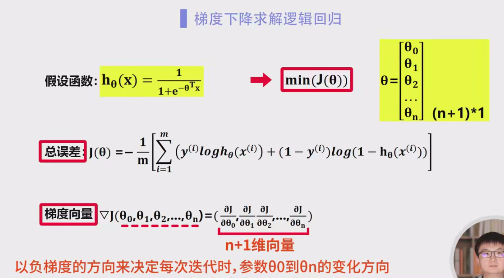
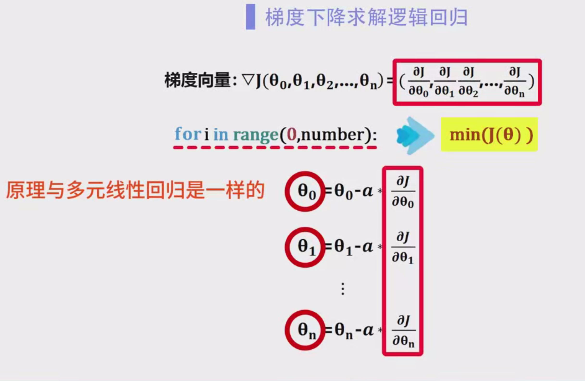
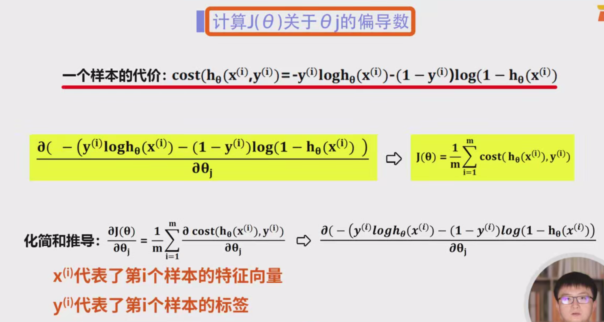
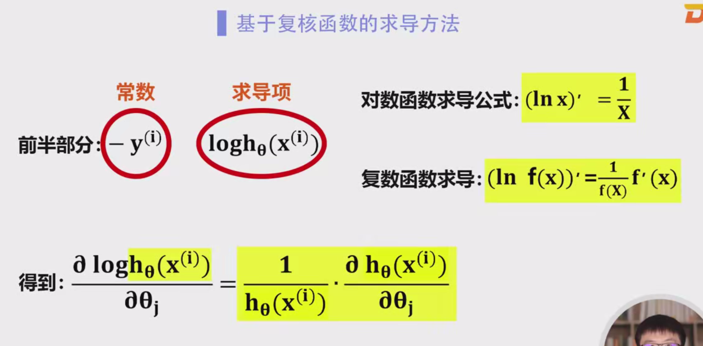
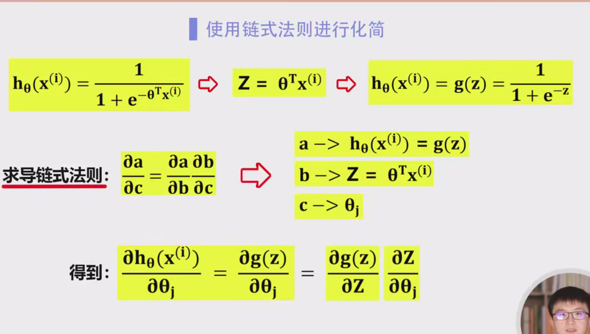
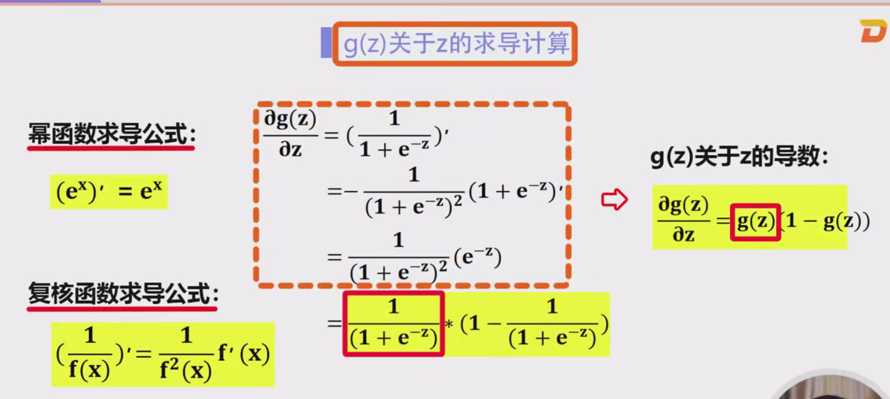
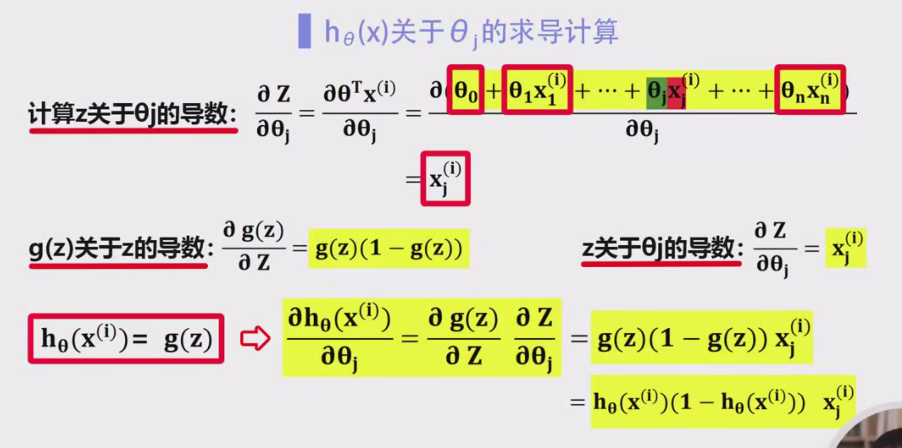
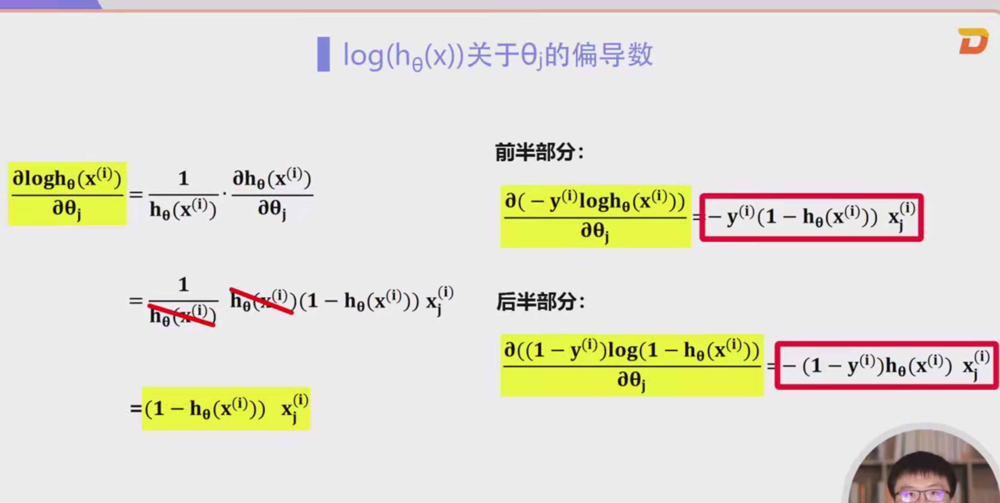
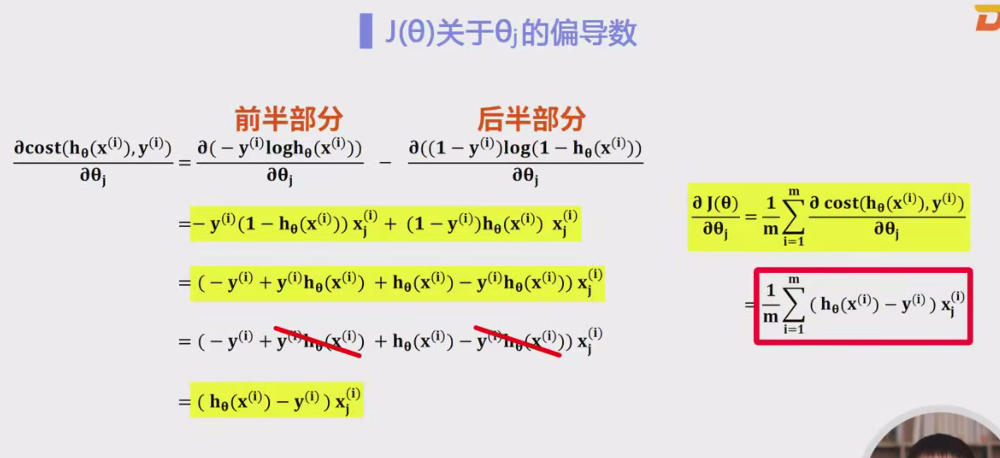

### 梯度下降求解逻辑回归

#### 1. 逻辑回归模型与目标

逻辑回归是一种用于分类问题的算法，它通过一个假设函数来预测某个样本属于某个类别的概率。

- 假设函数 $ h_\theta(x) $ 是一个 Sigmoid 函数，表示样本 $ x $ 属于正类的概率：
  $
  h_\theta(x) = \frac{1}{1 + e^{-\theta^T x}}
  $
  其中，$ \theta $ 是模型的参数向量，$ x $ 是输入特征向量。

- **目标：** 在逻辑回归中，我们的目标是通过训练数据来调整参数 $ \theta $ 使得模型的预测尽可能准确，即使代价函数 $ J(\theta) $ 最小化。

#### 2. 代价函数（Cost Function）

代价函数 $ J(\theta) $ 用来衡量模型预测与真实标签之间的差距。逻辑回归中的代价函数是基于交叉熵的。具体形式为：

$
J(\theta) = -\frac{1}{m} \sum_{i=1}^{m} \left[ y_i \ln(h_\theta(x_i)) + (1 - y_i) \ln(1 - h_\theta(x_i)) \right]
$
- $ m $ 是训练集的样本数。
- $ y_i $ 是第 $ i $ 个样本的真实标签（0 或 1）。
- $ h_\theta(x_i) $ 是第 $ i $ 个样本的预测概率。

代价函数的含义是：
- 如果预测结果 $ h_\theta(x_i) $ 越接近 $ y_i $，那么代价越小。
- 如果预测结果 $ h_\theta(x_i) $ 与真实标签 $ y_i $ 之间的差异较大，则代价较大。

#### 3. 梯度下降法的原理

梯度下降法是一种优化算法，用来通过不断调整参数，使代价函数 $ J(\theta) $ 最小化。其基本思想是根据代价函数的梯度（即偏导数），逐步调整参数，以达到最小值。

- **梯度：** 对代价函数 $ J(\theta) $ 关于参数 $ \theta_j $ 的偏导数，表示的是代价函数在当前点的变化趋势。梯度下降通过沿着梯度的反方向更新参数，从而使得代价函数逐步减少。

- **参数更新公式：**
  $
  \theta_j := \theta_j - \alpha \cdot \frac{\partial J(\theta)}{\partial \theta_j}
  $
  其中：
  - $ \alpha $ 是学习速率，控制每次更新的步长。

#### 4. 代价函数的梯度（偏导数）的推导

为了使用梯度下降法，我们需要计算代价函数 $ J(\theta) $ 关于每个参数 $ \theta_j $ 的偏导数。推导过程相对复杂，主要涉及链式法则和复合函数求导。下面详细讲解如何得到这些偏导数。

##### 4.1 计算单个样本的代价函数

每个样本的代价函数 $ \text{cost}_i $ 为：
$
\text{cost}_i = -y_i \ln(h_\theta(x_i)) - (1 - y_i) \ln(1 - h_\theta(x_i))
$

这里，$ h_\theta(x_i) $ 是使用模型预测得到的概率值。我们希望最小化该函数，因此代价函数的目标是最小化所有样本的代价函数的平均值。

##### 4.2 计算代价函数的梯度（偏导数）

代价函数 $ J(\theta) $ 是所有样本的代价函数的平均值。我们需要对 $ J(\theta) $ 关于 $ \theta_j $ 求偏导数：
$
\frac{\partial J(\theta)}{\partial \theta_j} = \frac{1}{m} \sum_{i=1}^{m} \frac{\partial \text{cost}_i}{\partial \theta_j}
$
首先，考虑单个样本的代价函数对 $ \theta_j $ 的偏导数。对于每个样本，代价函数的偏导数可以通过链式法则得到：

1. 对于 $ \ln(h_\theta(x_i)) $ 项：
   $
   \frac{\partial}{\partial \theta_j} \left( \ln(h_\theta(x_i)) \right) = \frac{1}{h_\theta(x_i)} \cdot \frac{\partial h_\theta(x_i)}{\partial \theta_j}
   $

2. 对于 $ \ln(1 - h_\theta(x_i)) $ 项：
   $
   \frac{\partial}{\partial \theta_j} \left( \ln(1 - h_\theta(x_i)) \right) = \frac{1}{1 - h_\theta(x_i)} \cdot \left( -\frac{\partial h_\theta(x_i)}{\partial \theta_j} \right)
   $

##### 4.3 求导过程：sigmoid函数的偏导数

Sigmoid 函数的形式是：
$
h_\theta(x) = \frac{1}{1 + e^{-\theta^T x}}
$
它的导数是：
$
\frac{\partial h_\theta(x)}{\partial \theta_j} = h_\theta(x) \cdot (1 - h_\theta(x)) \cdot x_j
$
其中，$ x_j $ 是第 $ j $ 个特征的值。

将这个结果带入到代价函数的偏导数中，我们得到每个样本对参数 $ \theta_j $ 的偏导数：
$
\frac{\partial \text{cost}_i}{\partial \theta_j} = (h_\theta(x_i) - y_i) \cdot x_{ij}
$
这是每个样本的梯度。

##### 4.4 代价函数的梯度

将所有样本的梯度求平均，得到整体代价函数的梯度：
$
\frac{\partial J(\theta)}{\partial \theta_j} = \frac{1}{m} \sum_{i=1}^{m} (h_\theta(x_i) - y_i) \cdot x_{ij}
$
这个公式就是梯度下降中需要计算的梯度，它描述了代价函数相对于每个参数 $ \theta_j $ 的变化趋势。

#### 5. 梯度下降法的实现

在每次迭代时，我们根据代价函数的梯度更新参数：
$
\theta_j := \theta_j - \alpha \cdot \frac{\partial J(\theta)}{\partial \theta_j}
$
通过不断迭代更新，最终使得代价函数趋于最小。

