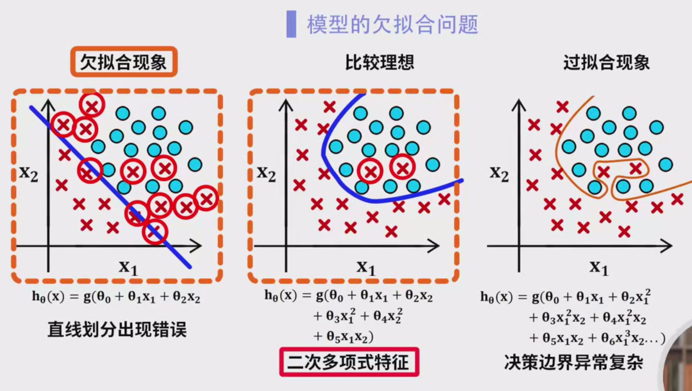
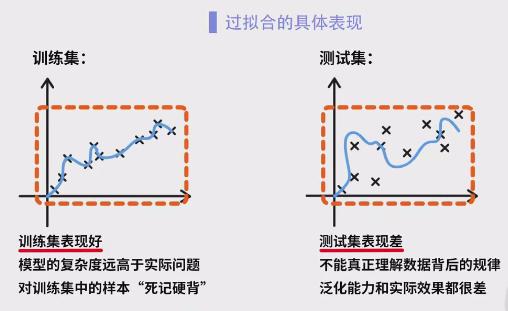
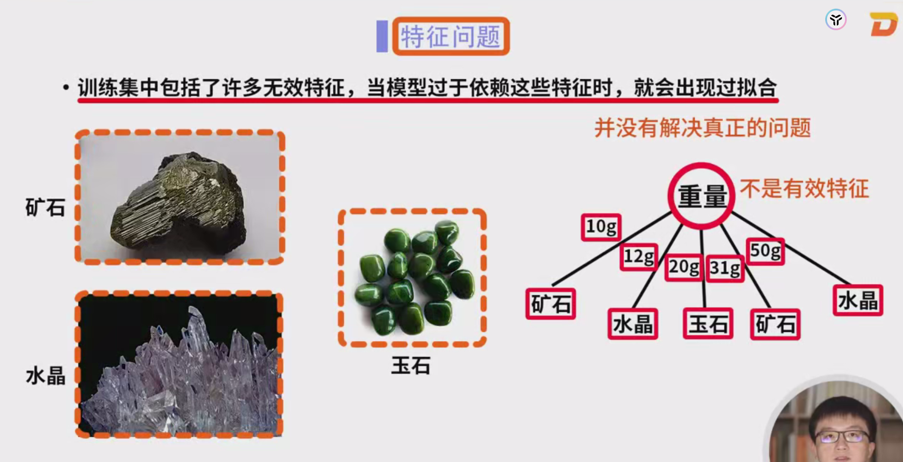
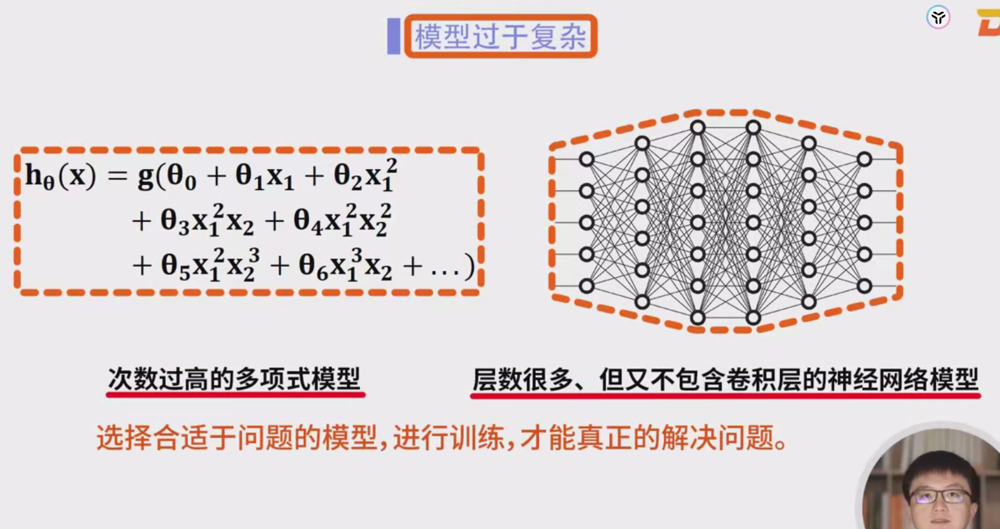
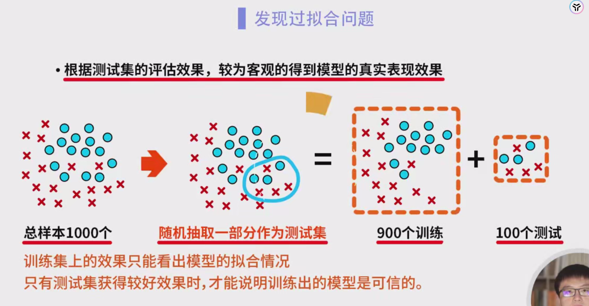

### 模型过拟合与解决方法

#### 1. **过拟合的定义与表现**

过拟合是指模型在训练集上表现良好，但在测试集或实际应用中的表现较差，原因通常是模型学习到训练数据中的噪声、异常点或过多的细节，而不是数据的普遍规律。

##### 1.1 **过拟合的表现**

- **训练集上的良好表现**：模型在训练集上几乎能够完美分类所有数据点。
- **测试集上的差表现**：在未见过的新数据（例如测试集或实际应用中的数据）上，模型的表现显著下降。

##### 1.2 **案例分析：正负样本分类**

假设我们有一组正负样本数据，分布在二维平面上，任务是通过模型对样本进行分类。

- **使用直线分类**：如果我们仅使用一个直线来划分正负样本，模型可能会出现欠拟合，无法正确区分所有样本。即使训练集中的数据较少，模型也无法找到合适的划分边界，从而出现较大的误差。
- **使用二次多项式特征**：当我们增加多项式的阶数（例如二次多项式）后，模型能够较好地拟合样本，能够识别大部分正负样本。这时模型不仅能准确分类，而且可能在个别数据点上出现小的错误，这些错误不会显著影响整体性能。因此，这是一个理想的分类模型。
- **使用更高次的多项式特征（如四次多项式）**：如果我们进一步提高多项式的阶数，模型会变得过于复杂，决策边界开始异常复杂，可能出现很多弯曲，试图拟合训练集中的每一个样本，即使这些样本仅是噪声或异常点。这种情况下，模型可能会将训练集中的一些噪声样本当作正确的样本来分类，从而导致模型在训练集上表现很好，但在测试集或实际应用中表现极差，这就是**过拟合**的表现。

#### 2. **过拟合的原因**

过拟合的产生通常是由于以下几种原因：

##### 2.1 **数据集问题**

- **样本数量不足**：例如，如果我们在训练老虎识别模型时，样本数量非常少，甚至某些图片被错误标注成了“猫”或“猎豹”。
- **错误标签或噪声**：假设训练集中有些图片中的老虎被标记为“猫”，或者“猎豹”错误地标记为“老虎”。这些错误会导致模型误学到错误的模式，最终导致过拟合。
- **数据不足和不均衡**：如果训练数据中正样本数量极少，模型会非常难以学习到老虎的特征，最终会在训练集上学到一些不稳定或特定的数据点。

##### 2.2 **特征问题**

- **无效特征**：假设在分类石头种类时，如果我们将石头的重量作为特征来训练模型，而石头的重量显然与其种类（如矿石、水晶或玉石）没有直接关系。模型可能会依赖这个无效特征，将石头分成不同种类，导致过拟合。
- **冗余特征**：如果训练数据中包含冗余特征（例如，多个特征描述相同的属性），模型可能会依赖这些冗余特征进行决策，导致其在训练集上做得很好，但无法泛化到新数据。

##### 2.3 **模型过于复杂**

- **过高次的多项式模型**：就像前面提到的案例，使用高次多项式（例如四次多项式）作为特征，模型会试图拟合每一个训练样本，包括噪声样本，这种做法会导致模型过于复杂，并且很难推广到新样本，最终导致过拟合。
- **深度神经网络**：如果我们使用一个层数很多、节点很多的神经网络来进行训练，而训练数据非常有限，网络会学到训练数据中的每一个细节，导致过拟合。

#### 3. **过拟合的解决方法**

##### 3.1 **增加优质样本数量**

- **样本数量增加**：假设在“老虎识别”问题中，我们增加了更多的真实标注的老虎图片，而这些图片来自不同的角度、不同的光照条件。这样，模型能够学习到更加普适的规律，从而提高泛化能力，减少过拟合的风险。

##### 3.2 **删除无效特征**

- **特征选择**：在“石头分类”的例子中，我们应该删除与石头种类无关的特征（如石头的重量），只保留与石头种类相关的特征（如矿物组成、颜色、硬度等）。这样可以避免模型过于依赖无效特征，减少过拟合的可能。

##### 3.3 **降低模型复杂度**

- **模型简化**：在“老虎识别”问题中，如果我们发现多项式模型的阶数过高，导致过拟合，可以考虑减少多项式的阶数（例如使用二次多项式）。此外，选择更简单的模型（如线性分类器或浅层神经网络）也有助于减少过拟合的风险。
- **神经网络架构简化**：减少神经网络的层数或每层的神经元数量，避免网络过于复杂，防止过拟合。

##### 3.4 **正则化**

正则化通过在损失函数中加入额外的惩罚项，来控制模型的复杂度，从而减少过拟合。

- **L1正则化（Lasso）**：在“石头分类”任务中，使用L1正则化可以通过减少无关特征的系数，将其强制变为零，从而自动进行特征选择。
- **L2正则化（Ridge）**：通过L2正则化，减少模型参数的幅度，避免过度依赖某些特定的训练数据点。

##### 3.5 **交叉验证**

通过交叉验证可以有效评估模型在不同数据集上的表现，帮助我们避免过拟合。

- **K折交叉验证**：例如，在训练“老虎识别”模型时，可以使用K折交叉验证，将训练数据分成K个子集，每次用K-1个子集训练模型，剩下的一个子集用来验证。这可以帮助我们评估模型的泛化能力，避免模型仅仅在某一部分数据上表现良好而出现过拟合。

##### 3.6 **早停法**

在训练过程中，监控验证集的误差变化，若验证误差开始增大，即使训练误差继续减小，也应该提前停止训练。

- **早停法应用**：例如，在训练神经网络时，如果验证集的误差在某个时刻开始上升，而训练误差继续下降，这意味着模型可能已经开始过拟合训练数据。这时可以停止训练，避免过拟合。

#### 4. **模型评估：训练集与测试集**

为了验证模型是否过拟合，我们通常将数据集划分为训练集和测试集，使用测试集来评估模型的泛化能力。

- **训练集与测试集划分**：例如，在“老虎识别”任务中，假设我们有1000张图片，随机将其中800张用于训练，剩下的200张用于测试。
- **评估泛化能力**：训练集上的表现好并不代表模型最终能应用于实际场景，只有测试集上的表现也足够好，才能证明模型具有良好的泛化能力。

#### 5. **总结**

- **增加样本数量**：更多的样本有助于提高模型的泛化能力。
- **删除无效特征**：去除不相关特征，确保模型聚焦于重要特征。
- **降低模型复杂度**：使用更简单的模型或减少模型的复杂度，防止模型过拟合。
- **正则化**：通过正则化技术控制模型的复杂度。
- **交叉验证与早停法**：使用交叉验证和早停法来进一步防止过拟合。
- **使用测试集验证**：通过测试集评估模型的泛化能力，确保模型在实际应用中具有良好的表现。

