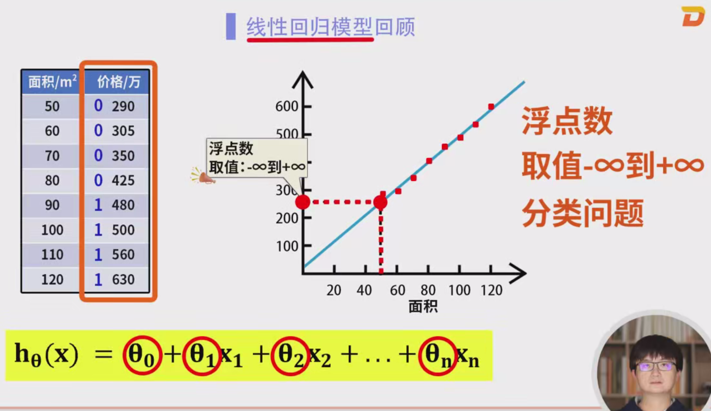
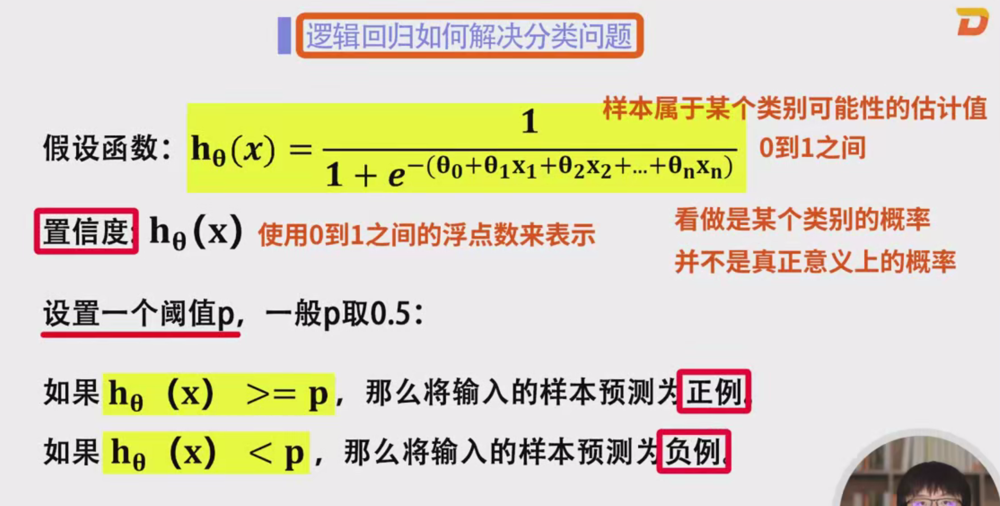
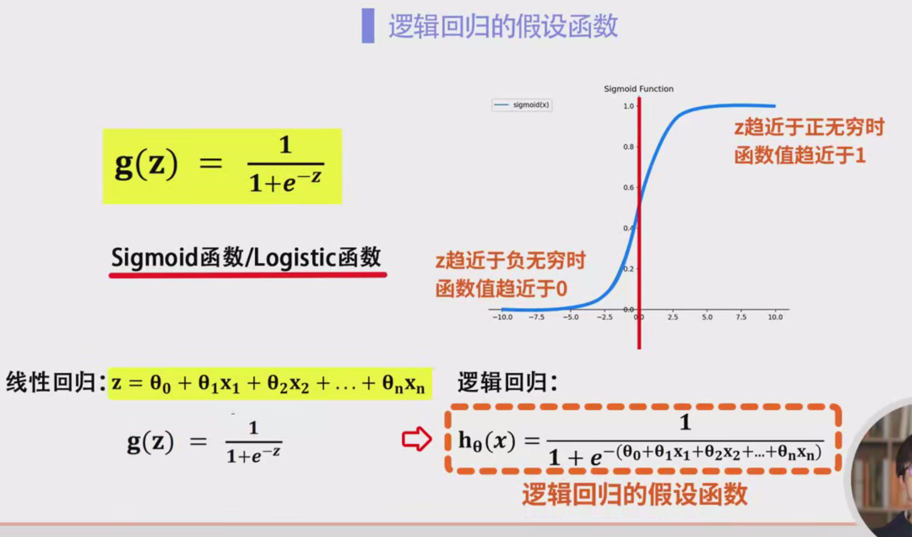
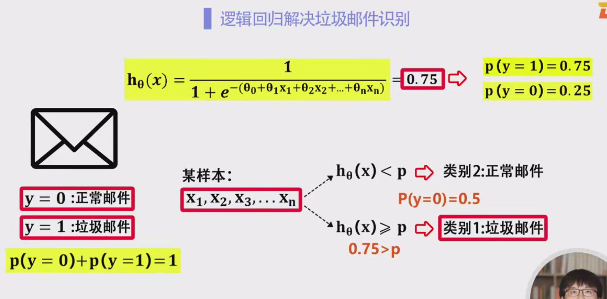

### 逻辑回归详细笔记

#### 1. 逻辑回归概述
逻辑回归（Logistic Regression）是一种广泛使用的分类模型，特别适合处理二分类问题。它在广告点击预测、垃圾邮件识别、金融贷款审批等领域有广泛应用。尽管其名字中带有“回归”二字，但逻辑回归其实是用于 **分类** 问题的模型，特别是二分类问题。

#### 2. 逻辑回归与线性回归的关系

逻辑回归与线性回归非常相似，二者都基于一个假设函数来预测输出。然而，逻辑回归的目标是分类，而线性回归的目标是回归（即预测连续数值）。关键的区别在于两者的 **输出** 范围：

- **线性回归**：输出是一个连续值，可以从负无穷到正无穷。
- **逻辑回归**：输出是一个概率值，范围在0到1之间，用于表示样本属于某个类别的“置信度”。

#### 3. 逻辑回归的假设函数

逻辑回归的核心是 **假设函数**（Hypothesis Function），它用于计算给定输入特征下样本属于某个类别的概率。

##### 3.1 线性回归的假设函数
线性回归的假设函数通常表示为：
$
h_\theta(x) = \theta_0 + \theta_1 x_1 + \theta_2 x_2 + \dots + \theta_n x_n
$
- 该函数的输出是一个实数，可以为负数、零或正数，范围没有限制。
- 对于一个样本 $ x = (x_1, x_2, \dots, x_n) $，该函数通过加权求和得到预测值。

##### 3.2 逻辑回归的假设函数
逻辑回归的目标是进行分类预测。与线性回归不同，逻辑回归通过引入 **Sigmoid函数** 将线性回归的输出转化为0到1之间的概率值，从而实现分类。

逻辑回归的假设函数为：
$
h_\theta(x) = g(\theta^T x) = \frac{1}{1 + e^{-(\theta_0 + \theta_1 x_1 + \theta_2 x_2 + \dots + \theta_n x_n)}}
$
- 这里，$ \theta_0, \theta_1, \dots, \theta_n $ 是模型的参数（权重），需要通过训练数据来学习。
- $ x = (x_1, x_2, \dots, x_n) $ 是输入特征向量，$ \theta^T x $ 是特征和参数的加权和，类似于线性回归的假设函数。

#### 4. Sigmoid函数
为了将线性回归的输出转化为0到1之间的概率，逻辑回归引入了 **Sigmoid函数**（又称为 **Logistic函数**）。Sigmoid函数的公式为：
$
g(z) = \frac{1}{1 + e^{-z}}
$
- **特点**：
  - 当 $ z \to -\infty $，$ g(z) \to 0 $。
  - 当 $ z \to +\infty $，$ g(z) \to 1 $。
  - 在 $ z = 0 $ 时，$ g(z) = 0.5 $。
  - 图像呈现 **S型** 曲线，这就是Sigmoid函数的形状。

Sigmoid函数的输出值总是介于0和1之间，这使得它非常适合用于概率预测。通过将线性回归的输出 $ \theta^T x $ 代入Sigmoid函数，我们将得到一个概率值，表示样本属于正类的可能性。

#### 5. 逻辑回归假设函数的作用
逻辑回归的假设函数通过将特征的加权和传入Sigmoid函数，输出一个概率值，表示样本属于某个类别的 **置信度**。该值在0和1之间，具有以下意义：

- $ h_\theta(x) = 0 $ 表示样本绝对不属于正类。
- $ h_\theta(x) = 1 $ 表示样本绝对属于正类。
- $ h_\theta(x) = 0.5 $ 表示模型对于样本属于正类与负类的判断没有偏向，即没有足够的信息来做决策。

通过这个输出，我们可以将样本分为两个类别：
- 如果 $ h_\theta(x) \geq 0.5 $，则预测为 **正类**（类别1）。
- 如果 $ h_\theta(x) < 0.5 $，则预测为 **负类**（类别0）。

#### 6. 训练逻辑回归模型

与线性回归类似，逻辑回归的训练也是通过 **最小化损失函数** 来优化参数 $ \theta_0, \theta_1, \dots, \theta_n $。不过，逻辑回归使用的损失函数是 **对数损失函数**（Log-Loss），而线性回归使用的是均方误差（MSE）。

##### 6.1 对数损失函数
对数损失函数（Log-Loss）是用来衡量逻辑回归模型的预测与实际标签之间的差异的损失函数。对于每个样本，其损失函数定义为：
$
\text{Log-Loss} = - \left[ y \cdot \log(h_\theta(x)) + (1 - y) \cdot \log(1 - h_\theta(x)) \right]
$
- 其中，$ y $ 是样本的实际标签，取值为0或1。
- $ h_\theta(x) $ 是模型预测的概率。

损失函数的意义是：当模型的预测值 $ h_\theta(x) $ 接近实际标签 $ y $ 时，损失小；而当预测值与实际标签差异较大时，损失较大。

##### 6.2 梯度下降法
通过最小化损失函数来优化参数 $ \theta $ 是逻辑回归的训练过程。常用的优化方法是 **梯度下降法**。梯度下降法通过不断计算损失函数相对于参数的梯度（即损失函数的导数），并更新参数，使得损失函数的值逐渐减小，直到收敛为最小值。

#### 7. 逻辑回归的分类过程

逻辑回归的输出是一个介于0和1之间的概率值，表示样本属于正类的“置信度”。根据这个概率值，我们可以将样本分类为正类或负类。

1. **输出值的解释**：假设 $ h_\theta(x) = 0.8 $，这意味着该样本属于正类的概率为80%，属于负类的概率为20%。
2. **分类判定**：根据设定的阈值 $ p $，我们可以决定样本的分类：
   - 如果 $ h_\theta(x) \geq p $，则预测为 **正类**（类别1）。
   - 如果 $ h_\theta(x) < p $，则预测为 **负类**（类别0）。

通常情况下，阈值 $ p $ 设置为 0.5，但在某些应用中可以根据实际需求进行调整，例如提高阈值 $ p $ 以减少假阳性（误将负类预测为正类）的情况。

#### 8. 示例：垃圾邮件识别

假设我们使用逻辑回归模型来进行垃圾邮件识别，邮件的标签 $ y = 0 $ 表示正常邮件，$ y = 1 $ 表示垃圾邮件。具体的步骤如下：

1. **输入特征**：每封邮件有一组特征（如是否包含特定的关键词、发件人是否可靠等）。
2. **假设函数输出**：逻辑回归模型根据邮件的特征计算得到一个输出值 $ h_\theta(x) $，表示该邮件是垃圾邮件的概率。例如，假设 $ h_\theta(x) = 0.85 $，则表示该邮件是垃圾邮件的概率为85%。
3. **分类判断**：根据设定的阈值 $ p = 0.5 $，判断邮件的类别：
   - 如果 $ h_\theta(x) = 0.85 \geq 0.5 $，则预测该邮件为垃圾邮件（类别1）。
   - 如果 $ h_\theta(x) = 0.2 < 0.5 $，则预测该邮件为正常邮件（类别0）。

#### 9. 总结

逻辑回归是一种简单且高效的二分类模型，通过引入Sigmoid函数将线性回归的输出转化为概率值。模型训练过程通过最小化对数损失函数

来优化参数，并通过设定阈值进行分类。逻辑回归广泛应用于各种实际问题，尤其是在二分类任务中，如垃圾邮件识别、广告点击预测等。