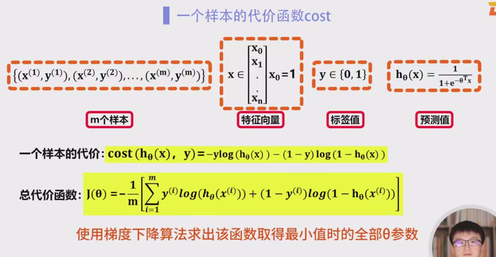

## 逻辑回归的代价函数

### 1. 逻辑回归概述
在逻辑回归中，我们的目标是根据给定特征值预测一个二分类问题的类别标签（如正例或负例）。假设样本的特征向量为 $ \mathbf{x} = (x_1, x_2, \dots, x_n) $，对应的类别标签为 $ y \in \{0, 1\} $，我们要寻找一个合适的模型参数 $ \theta = (\theta_0, \theta_1, \dots, \theta_n) $，使得模型能够有效预测样本的标签。

为了实现这一目标，我们定义了一个假设函数 $ h_{\theta}(x) $，其具体形式为：

$
h_{\theta}(x) = \sigma(\theta^T x)
$

其中 $ \sigma(z) $ 是sigmoid函数，定义为：

$
\sigma(z) = \frac{1}{1 + e^{-z}}
$

这表示样本属于类别1的概率。通过该函数，我们可以根据输入特征 $ x $ 和模型参数 $ \theta $ 预测一个概率值。

### 2. 为什么不能使用平方误差作为代价函数
在逻辑回归中，我们不能直接使用线性回归中常见的平方误差代价函数，因为逻辑回归的输出是一个概率值 $ h_{\theta}(x) $，其值始终在0和1之间。而平方误差代价函数在这个情境下表现不佳，原因如下：

- 假设我们直接使用平方误差作为代价函数，即：

$
J(\theta) = \frac{1}{m} \sum_{i=1}^{m} \left( h_{\theta}(x^{(i)}) - y^{(i)} \right)^2
$

- 这个代价函数不是凸的，可能导致在使用梯度下降算法时出现局部最优解，且收敛速度较慢。

因此，我们需要重新设计代价函数，以便能够准确、平滑地衡量预测值与真实值之间的差异。

### 3. 逻辑回归的代价函数设计
我们需要设计一个能够在样本标签为1时，激励模型预测值尽量接近1；在样本标签为0时，激励模型预测值尽量接近0的代价函数。这个代价函数需要能够反映出模型在每个样本上的预测误差。

对于每一个训练样本 $ (x^{(i)}, y^{(i)}) $，逻辑回归的代价函数定义如下：

- 如果真实标签 $ y^{(i)} = 1 $，代价函数应该惩罚模型在预测值 $ h_{\theta}(x^{(i)}) $ 越接近0时，代价越大；而预测值越接近1时，代价越小。
- 如果真实标签 $ y^{(i)} = 0 $，代价函数应该惩罚模型在预测值 $ h_{\theta}(x^{(i)}) $ 越接近1时，代价越大；而预测值越接近0时，代价越小。

这种惩罚可以通过对数损失函数（log loss）来实现：

$
\text{Cost}(h_{\theta}(x^{(i)}), y^{(i)}) = -y^{(i)} \log(h_{\theta}(x^{(i)})) - (1 - y^{(i)}) \log(1 - h_{\theta}(x^{(i)}))
$

该代价函数的解释：
- 当 $ y^{(i)} = 1 $ 时，代价函数简化为 $ -\log(h_{\theta}(x^{(i)})) $，如果 $ h_{\theta}(x^{(i)}) $ 越接近1，代价越小，若 $ h_{\theta}(x^{(i)}) $ 越接近0，代价则越大。
- 当 $ y^{(i)} = 0 $ 时，代价函数简化为 $ -\log(1 - h_{\theta}(x^{(i)})) $，如果 $ h_{\theta}(x^{(i)}) $ 越接近0，代价越小，若 $ h_{\theta}(x^{(i)}) $ 越接近1，代价则越大。

### 4. 总体代价函数
逻辑回归的总体代价函数是所有样本代价函数的平均值。设训练集共有 $ m $ 个样本，总体代价函数为：

$
J(\theta) = \frac{1}{m} \sum_{i=1}^{m} \left[ -y^{(i)} \log(h_{\theta}(x^{(i)})) - (1 - y^{(i)}) \log(1 - h_{\theta}(x^{(i)})) \right]
$

这个代价函数在数学上是一个凸函数，具有唯一的全局最小值，因此可以使用梯度下降法来优化参数 $ \theta $，找到使代价函数最小化的最优参数。

### 5. 梯度下降法优化代价函数
梯度下降法是最常用的优化方法，它通过不断调整模型参数 $ \theta $ 来最小化代价函数 $ J(\theta) $。在每次迭代中，我们通过计算代价函数对参数 $ \theta_j $ 的偏导数来更新参数：

$
\theta_j := \theta_j - \alpha \frac{\partial J(\theta)}{\partial \theta_j}
$

其中 $ \alpha $ 是学习率，控制每次参数更新的步长。

### 6. 代价函数的优点
- **凸性**：逻辑回归的代价函数是凸的，因此在优化过程中没有局部最优解，保证了梯度下降法能够找到全局最小值。
- **良好的误差度量**：代价函数通过对数损失，能够很好地衡量模型的预测误差，且对于误分类样本给予较大的代价。

### 1. 代价函数的推导背景

在逻辑回归中，我们通过假设函数 $ h_{\theta}(x) = \sigma(\theta^T x) $ 来预测样本属于某一类别的概率，其中 $ \sigma(z) $ 是sigmoid函数。对于二分类问题，目标是通过最小化代价函数，使得模型的预测概率尽可能接近实际的标签 $ y $（即标签为0或1）。

### 2. 为什么选择对数损失函数
在逻辑回归的框架下，假设我们得到的模型输出 $ h_{\theta}(x) $ 是样本属于类别1的概率。对于一个训练样本 $ (x^{(i)}, y^{(i)}) $，如果我们直接使用平方误差来度量模型的预测误差，会面临以下几个问题：
- 当预测值接近0或1时，平方误差仍然能够提供惩罚，但不能准确反映出模型错误的程度，因为模型的输出是概率值，应该基于概率分布的特性来进行评估。
- 如果预测概率 $ h_{\theta}(x) $ 很小而真实标签为1（即错误的预测），平方误差给出的惩罚过小；反之，如果预测概率 $ h_{\theta}(x) $ 很大而真实标签为0，平方误差也给出的惩罚过小。

因此，我们采用对数损失函数（log loss）来衡量预测与真实标签之间的差距，对模型的错误进行更精确的惩罚。

### 3. 推导代价函数

#### 3.1 对于标签 $ y = 1 $ 的情况

假设真实标签 $ y^{(i)} = 1 $，那么我们的目标是使得模型的预测概率 $ h_{\theta}(x^{(i)}) $ 尽可能接近1。若模型预测接近1，说明模型正确地预测了标签为1，因此应该赋予较小的代价；如果 $ h_{\theta}(x^{(i)}) $ 趋近于0，表示模型错误地预测了标签为0，代价应该很大。

因此，我们希望代价函数能够表现为：
- 当 $ h_{\theta}(x^{(i)}) $ 趋近1时，代价为0；
- 当 $ h_{\theta}(x^{(i)}) $ 趋近0时，代价趋近无穷大。

对数损失函数在 $ h_{\theta}(x^{(i)}) $ 趋近1时值为0，且 $ h_{\theta}(x^{(i)}) $ 趋近0时值为无穷大，因此适合用来衡量模型的预测误差。

具体地，如果 $ y^{(i)} = 1 $，代价为：
$
\text{Cost}(h_{\theta}(x^{(i)}), y^{(i)}) = - \log(h_{\theta}(x^{(i)}))
$

#### 3.2 对于标签 $ y = 0 $ 的情况
当真实标签 $ y^{(i)} = 0 $ 时，模型应该预测出一个接近0的概率。若 $ h_{\theta}(x^{(i)}) $ 趋近于0，则代价应该为0，表示模型的预测与实际值一致；若 $ h_{\theta}(x^{(i)}) $ 趋近于1，则代价应该趋近无穷大，表示模型错误地预测了标签为1。

为了达到这个目标，代价函数应该为：
- 当 $ h_{\theta}(x^{(i)}) $ 趋近0时，代价为0；
- 当 $ h_{\theta}(x^{(i)}) $ 趋近1时，代价趋近无穷大。

因此，对于 $ y^{(i)} = 0 $，代价函数是：
$
\text{Cost}(h_{\theta}(x^{(i)}), y^{(i)}) = - \log(1 - h_{\theta}(x^{(i)}))
$

#### 3.3 总结单个样本的代价函数
我们已经推导出对于单个样本 $ (x^{(i)}, y^{(i)}) $ 的代价函数：

- 当 $ y^{(i)} = 1 $ 时，代价函数为 $ -\log(h_{\theta}(x^{(i)})) $；
- 当 $ y^{(i)} = 0 $ 时，代价函数为 $ -\log(1 - h_{\theta}(x^{(i)})) $。

为了将这两种情况合并成一个通用的代价函数，我们可以使用如下形式：

$
\text{Cost}(h_{\theta}(x^{(i)}), y^{(i)}) = - y^{(i)} \log(h_{\theta}(x^{(i)})) - (1 - y^{(i)}) \log(1 - h_{\theta}(x^{(i)}))
$

### 4. 总体代价函数

对于整个训练集，有 $ m $ 个样本，总代价函数是所有样本代价函数的平均值：

$
J(\theta) = \frac{1}{m} \sum_{i=1}^{m} \left[ -y^{(i)} \log(h_{\theta}(x^{(i)})) - (1 - y^{(i)}) \log(1 - h_{\theta}(x^{(i)})) \right]
$

这个总代价函数度量了模型在训练集上的整体表现，即模型在所有样本上的预测误差的平均值。

### 5. 为什么这个代价函数有效
- **合理的惩罚**：代价函数会根据模型预测的概率与实际标签的差异进行惩罚。如果预测值 $ h_{\theta}(x) $ 很接近真实标签 $ y $，代价就会很小；反之，若预测错误，代价会非常大。
- **凸函数**：该代价函数是一个凸函数，意味着它只有一个全局最小值，这使得我们能够通过梯度下降法来有效地找到最优参数。
- **数值稳定性**：对数损失函数在数值上较为稳定，能够处理极端值，例如当 $ h_{\theta}(x) $ 接近0或1时，损失会趋向无穷大，从而加强对错误预测的惩罚。

### 6. 代价函数的直观理解
- **当 $ y^{(i)} = 1 $ 时**：如果模型的预测 $ h_{\theta}(x) $ 接近1，则代价较小（接近0），表示模型准确地预测了样本的类别；如果 $ h_{\theta}(x) $ 趋近于0，则代价很大，表示模型严重预测错误。
- **当 $ y^{(i)} = 0 $ 时**：如果模型的预测 $ h_{\theta}(x) $ 接近0，则代价较小（接近0），表示模型准确地预测了样本的类别；如果 $ h_{\theta}(x) $ 趋近于1，则代价很大，表示模型预测错误。

### 如何将 $ y = 1 $ 和 $ y = 0 $ 两种情况合并成一个通用的代价函数

我们在逻辑回归的代价函数推导中，先分别处理了两种情况：

- **当 $ y^{(i)} = 1 $ 时**：代价函数为 $ \text{Cost}(h_{\theta}(x^{(i)}), 1) = - \log(h_{\theta}(x^{(i)})) $，这表示当标签为1时，我们希望模型预测 $ h_{\theta}(x^{(i)}) $ 趋近于1。
- **当 $ y^{(i)} = 0 $ 时**：代价函数为 $ \text{Cost}(h_{\theta}(x^{(i)}), 0) = - \log(1 - h_{\theta}(x^{(i)})) $，这表示当标签为0时，我们希望模型预测 $ h_{\theta}(x^{(i)} ) $ 趋近于0。

为了将这两种情况合并成一个通用的代价函数，我们需要用一个函数来覆盖这两种情况，使得当 $ y = 1 $ 时，它使用第一个代价函数；当 $ y = 0 $ 时，它使用第二个代价函数。

### 代价函数的合并思路

我们可以观察到，在两种情况下，代价函数的形式具有相似性：
- 当 $ y^{(i)} = 1 $，代价函数是 $ -\log(h_{\theta}(x^{(i)})) $。
- 当 $ y^{(i)} = 0 $，代价函数是 $ -\log(1 - h_{\theta}(x^{(i)})) $。

可以通过引入 $ y^{(i)} $ 和 $ 1 - y^{(i)} $ 来合并这两种情况。具体方法如下：

1. **当 $ y^{(i)} = 1 $ 时**，我们希望代价函数只取 $ -\log(h_{\theta}(x^{(i)})) $，即：
   $
   \text{Cost}(h_{\theta}(x^{(i)}), 1) = - \log(h_{\theta}(x^{(i)}))
   $
2. **当 $ y^{(i)} = 0 $ 时**，我们希望代价函数只取 $ -\log(1 - h_{\theta}(x^{(i)})) $，即：
   $
   \text{Cost}(h_{\theta}(x^{(i)}), 0) = - \log(1 - h_{\theta}(x^{(i)}))
   $

为了合并这两种情况，可以通过如下方式进行：

- 当 $ y^{(i)} = 1 $ 时，代价函数应为 $ -\log(h_{\theta}(x^{(i)})) $，而 $ 1 - y^{(i)} = 0 $，所以第二项 $ (1 - y^{(i)}) \log(1 - h_{\theta}(x^{(i)})) $ 被消除。
- 当 $ y^{(i)} = 0 $ 时，代价函数应为 $ -\log(1 - h_{\theta}(x^{(i)})) $，而 $ y^{(i)} = 0 $，所以第一项 $ y^{(i)} \log(h_{\theta}(x^{(i)})) $ 被消除。

因此，我们可以将这两种情况合并成一个通用的形式，利用 $ y^{(i)} $ 和 $ 1 - y^{(i)} $ 的加权来决定哪个项生效。最终得到的通用代价函数为：

$
\text{Cost}(h_{\theta}(x^{(i)}), y^{(i)}) = - y^{(i)} \log(h_{\theta}(x^{(i)})) - (1 - y^{(i)}) \log(1 - h_{\theta}(x^{(i)}))
$

### 代价函数的解释
- **当 $ y^{(i)} = 1 $ 时**，代价函数变为：
  $
  \text{Cost}(h_{\theta}(x^{(i)}), 1) = - \log(h_{\theta}(x^{(i)}))
  $
  这就是我们前面推导的第一个情况。当模型预测 $ h_{\theta}(x^{(i)}) $ 越接近1时，代价越小；反之，当预测值越接近0时，代价越大。

- **当 $ y^{(i)} = 0 $ 时**，代价函数变为：
  $
  \text{Cost}(h_{\theta}(x^{(i)}), 0) = - \log(1 - h_{\theta}(x^{(i)}))
  $
  这就是我们前面推导的第二个情况。当模型预测 $ h_{\theta}(x^{(i)} ) $ 越接近0时，代价越小；反之，当预测值越接近1时，代价越大。

### 结论
通过引入 $ y^{(i)} $ 和 $ 1 - y^{(i)} $，我们成功地将两种不同的代价函数合并成了一个通用的代价函数。这种形式能够在实际应用中根据标签 $ y^{(i)} $ 的值自动选择适当的部分，从而衡量模型在每个样本上的误差，最终计算出整个训练集的总代价。